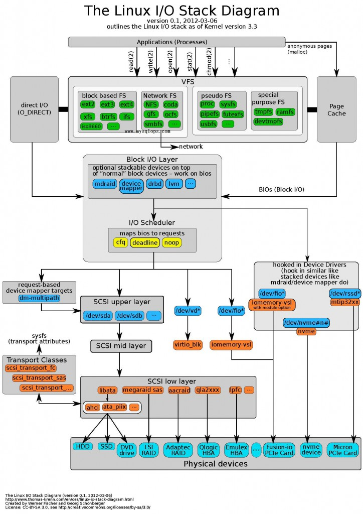

Dm-cache [23],a general block-level disk cache, for any storage systems,

## 带着问题和目标去学习

- 学习方法：

> 1. 阅读(输入：三天,万句   输出 笔记摘要就哪里，但是自己看不懂，别人看不懂 ) 
> 2. 发现问题（输入：技术文档 30分钟 百句，输出 ：一大堆东西不无法语言描述，反正就是他，自己回答不清楚，别人听不清楚）
> 3. 整理问题（输入：5分钟 10句 技术文档  输出：核心根本无法理解，至少说到重点，不管别人听不懂，至少自己理解极限了）
> 4. 回答问题（输入：60秒,2句 技术语言  输出：一个视频）

~~~shell

### 一、这个技术出现的背景、初衷和要达到什么样的目标或是要解决什么样的问题

### 二、这个技术的优势和劣势分别是什么 

### 三、这个技术适用的场景。任何技术都有其适用的场景，离开了这个场景

### 四、技术的组成部分和关键点。

### 五、技术的底层原理和关键实现

### 六、已有的实现和它之间的对比

- 第一次回答：青铜:自己知道回答了。怎么回答都抓不住重点。

- 第二次回答：白银:感觉有问题，把问题过度夸大。看到一点细节。不知道为什么

- 第三次回答：黄金：特意准备很多次，直接没秒杀，6步

- 第四次回答：王者  不是人人都经历通过压测模拟练习进行总结

文章地址：http://localhost:1313/post/2022/12_code_read_dm_cache/
~~~

## 第一天：青铜  这个技术出现的背景、初衷和要达到什么样的目标或是要解决什么样的问题

Dm-cache [23],a general block-level disk cache, for any storage systems,

《深入理解计算机系统》官网：http://csapp.cs.cmu.edu/3e/labs.html 

实验五Cache Lab的Writeup(cachelab.pdf) 原文：http://csapp.cs.cmu.edu/3e/cachelab.pdf

  说：内存是磁盘缓存。

### Dm-cache  提供了什么功能

- https://wikimili.com/en/Dm-cache

- https://baike.baidu.com/item/dm-cache/13207214

- https://github.com/mingzhao/dm-cache

- 打通IO栈：一次编译服务器性能优化实战

- ## Linux IO协议栈框图

- https://blog.yufeng.info/archives/2293

- [使用dm-cache组合SSD与HDD实现高性价比存储](https://www.cnblogs.com/xiaoyuxixi/p/12178380.html)

- https://en.wikipedia.org/wiki/Dm-cache

~~~~c
dm-cache is a component (more specifically, a target) of the Linux kernel's device mapper, which is a framework for mapping block devices onto higher-level virtual block devices. It allows one or more fast storage devices, such as flash-based solid-state drives (SSDs), to act as a cache for one or more slower storage devices such as hard disk drives (HDDs); this effectively creates hybrid volumes and provides secondary storage performance improvements.
 The design of dm-cache requires three physical storage devices for the creation of a single hybrid volume; dm-cache uses those storage devices to separately store actual data, cache data, and required metadata.
~~~~

- [linux I/O 栈 预习](https://blog.51cto.com/u_12580077/2310233)

- linux I/O栈 预习（下）

  

60秒思考，下面几个问题

- 什么是device mapper
- device mapper在linux I/O stack中的位置
- Block Layer

就是将ssd作为hdd的缓存，来提高hdd写的速度。

[使用dm-cache组合SSD与HDD实现高性价比存储](https://www.cnblogs.com/xiaoyuxixi/p/12178380.html)

dm-cache uses solid-state drives ([SSDs](https://en.wikipedia.org/wiki/SSD)) as an additional level of indirection while accessing hard disk drives ([HDDs](https://en.wikipedia.org/wiki/Hard_disk_drive)), improving the overall performance by using fast [flash](https://en.wikipedia.org/wiki/Flash_memory)-based SSDs as caches for the slower mechanical HDDs based on rotational [magnetic media](https://en.wikipedia.org/wiki/Magnetic_storage).

~~~
In dm-cache, creating a mapped virtual block device that acts as a hybrid volume requires three physical storage devices:[6]

Origin device – provides slow primary storage (usually an HDD)
Cache device – provides a fast cache (usually an SSD)
Metadata device – records the placement of blocks and their dirty flags, as well as other internal data required by a cache policy, including per-block hit counts; a metadata device cannot be shared between multiple cache devices, and it is recommended to be mirrored

理论架构如下：

dm-cache 设计成由 3 个物理存储设备来混合成一个逻辑卷的形式。操作模式和缓存策略决定了缓存数据的性能。这三个物理设备分别为：
原始设备：提供主要的慢速存储（通常是一个硬盘或者 SAN）
缓存设备：提供高速原始设备数据的缓存（通常是一个 SSD）
元数据设备：记录硬盘块在缓存中的位置，脏标志以及执行缓存策略所需的内部数据。
通常采用能够随机访问的 PRAM 作为其载体。
现有的 PRAM 有 BBU-DIMM,PCM,MRAM。NVDIMM 比起其他 PRAM，速度快，容量高，
是现今的最佳选择。

~~~

###  如何使用

### 操作步骤

dm-cache配置：

   为了给后端低速HDD盘做高速缓存，要对SSD开启cache，并虚拟出一个设备用来缓存。

1.查看cache的SSD大小

 blockdev --getsize64 /dev/sdb
480103981056

2。根据SSD大小计算metadata大小

4194304（4M）+（16 * 480103981056）= 7471104

7471104 / 512 = 14592

所以要从SSD中为metadata分配14592个block

#### help

【1】【没看懂】https://askubuntu.com/questions/847531/basic-set-up-of-dm-cache 

​      https://videos.cdn.redhat.com/summit2015/presentations/17856_getting-the-most-out-of-your-nvme-ssd.pdf

使用 LVM 新的缓存特性https://www.oschina.net/translate/using-lvms-new-cache-feature?print

【2】【没看懂】https://www.kernel.org/doc/Documentation/device-mapper/cache-policies.txt

 https://blog.csdn.net/Agoni_xiao/article/details/83151629

- 使用 Bcache 将 HDD 与 SSD 作为缓存的混合存储

【3】[转]Linux块设备加速缓存bcache和dm-cache：使用SSD来加速服务器

- https://www.kernel.org/doc/Documentation/device-mapper/cache.txt

  https://github.com/jthornber/device-mapper-test-suite

在 LSFMM 2013 峰会上，Mike Snitzer, Kent Overstreet, Alasdair Kergon, 和 Darrick Wong 共同主持了一个讨论，内容是关于两个彼此独立的块设备层缓存方案 —— **dm-cache** 和 **bcache**。

 cat /proc/version
Linux version 4.18.0-305.3.1.el8_4.x86_64 (mockbuild@ord1-prod-x86build003.svc.aws.rockylinux.org) (gcc version 8.4.1 20200928 (Red Hat 8.4.1-1) (GCC)) #1 SMP Thu Jun 17 07:52:48 UTC 2021

- https://blog.kylemanna.com/linux/ssd-caching-using-dmcache-tutorial/
- https://github.com/mingzhao/dm-cache
- https://access.redhat.com/documentation/zh-cn/red_hat_enterprise_linux/8/html/configuring_and_managing_logical_volumes/enabling-dm-cache-caching-for-a-logical-volume_enabling-caching-to-improve-logical-volume-performance

- blockdev - call block device ioctls from the command line
- blockdev命令 – 调用区块设备控制程序
- https://www.cnblogs.com/xiaoyuxixi/p/12178380.html使用 dm-cache 组合 SSD 与 HDD 实现高性价比存储
- dmsetup — low level logical volume managementhttps://www.cnblogs.com/yanling-coder/p/12971951.html
- lvm 所管理的逻辑卷

【4】【】

- https://people.redhat.com/mskinner/rhug/q1.2016/dm-cache.pdf
- https://blog.kylemanna.com/linux/ssd-caching-using-dmcache-tutorial/

~~~
● Oldest and most stable. Developed in 2006 by IBM research group, and merged

● 最古老、最稳定。2006年由IBM研究小组开发，并合并

into Linux kernel tree in version 3.9. Uses the device-mapper framework to

到3.9版的Linux内核树中。使用设备映射器框架

cache a slower device

缓存速度较慢的设备
~~~

### 第二天：白银  技术的组成部分和关键点

- [dm-cache源码浅析](http://it.taocms.org/02/2647.htm)

## 第四天：其他产品

https://www.modb.pro/db/444635

#### 1.1 lustre是什么？

lustre是通过内核的lustre客户端来访问文件对象。lustre的官网参考 `https://www.lustre.org/`

.lustre的官方的代码仓库 `git clone git://git.whamcloud.com/fs/lustre-release.gi`

#### 1.2 lustre提供哪些功能？

#### 1.3 lustre核心组件

3., 安装 Lustre 客户端

https://docs.aws.amazon.com/zh_cn/fsx/latest/LustreGuide/install-lustre-client.html

4.  mdt含义？

   [Lustre Metadata Service (MDS)](https://wiki.lustre.org/Lustre_Metadata_Service_(MDS))

   https://wiki.lustre.org/Data_on_MDT

5. [命名空间什么含义？]()

Distributed Namespace(DNE)能够提供将命名空间切分到多个不同的元数据服务节点上

6、 Lustre客户端持久高速缓存设计与：

- 只读模式RO-PCC的设计原理和实现；
- 基于规则的可定制的自动缓存机制；
- 缓存机制必须解决的一个问题即缓存的预取和淘汰策略；
- [RW-PCC的设计，它通过文件和客户端RW-PCC副本之间的一对一映射的关系来加速I/O密集型应用程序](https://blog.csdn.net/weixin_34455676/article/details/112648924)

​    https://blog.csdn.net/weixin_34455676/article/details/112648924 ！！！

7 . [FS-Cache 调研](https://www.cnblogs.com/xuyaowen/p/fs-cache.html)

- https://www.kernel.org/doc/Documentation/filesystems/caching/fscache.txt
- https://www.kernel.org/doc/Documentation/filesystems/caching/
- https://damonyi.cc/2021/02/19/cachefilesd%E7%BC%93%E5%AD%98%E9%A1%B9%E7%9B%AE%E4%BB%8B%E7%BB%8D/

FS-Cache是一种内核功能，网络文件系统或其他文件系统可以通过它来缓存数据到本地磁盘空间，减少网络传输的数据，从而提升性能。这在网络速度比较慢时会得到比较好的效果
