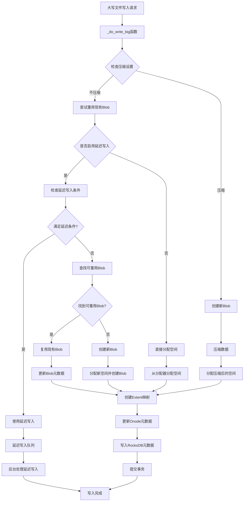
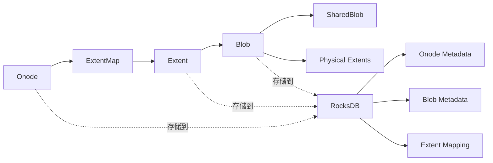

# BlueStore大写文件写入过程详解

## 概述

BlueStore是Ceph的下一代对象存储后端，使用RocksDB作为元数据存储引擎。本文详细描述了BlueStore处理大写文件写入的完整过程，包括元数据的存储机制。

## 大写文件写入流程



## 元数据存储机制

### 1. RocksDB键值存储结构

BlueStore使用以下前缀在RocksDB中存储不同类型的元数据：

- **PREFIX_OBJ ("O")**: 存储Onode元数据
- **PREFIX_SHARED_BLOB ("X")**: 存储共享Blob元数据  
- **PREFIX_ALLOC ("B")**: 存储分配器信息
- **PREFIX_STAT ("T")**: 存储统计信息
- **PREFIX_COLL ("C")**: 存储集合元数据

### 2. 核心数据结构关系



### 3. 大写文件写入的关键步骤

#### 3.1 空间分配策略

1. **目标Blob大小计算**: `max_bsize = std::max(target_blob_size, min_alloc_size)`
2. **延迟写入优化**: 对于小于`prefer_deferred_size * 2`的写入，优先使用延迟写入
3. **Blob重用**: 尝试在现有Blob中查找可重用的空间

#### 3.2 延迟写入机制

```cpp
if (prefer_deferred_size_snapshot && l <= prefer_deferred_size_snapshot * 2) {
    // 检查是否可以延迟写入到现有Blob
    bool will_defer = head_info.can_defer(...);
    if (will_defer) {
        _do_write_big_apply_deferred(txc, c, o, head_info, blp, wctx);
    }
}
```

#### 3.3 元数据更新

1. **Onode更新**: 更新对象大小、时间戳等元数据
2. **ExtentMap更新**: 创建新的逻辑到物理地址映射
3. **Blob元数据**: 更新Blob的使用跟踪器

### 4. 元数据序列化存储

#### 4.1 Onode元数据结构
```cpp
struct bluestore_onode_t {
    uint64_t nid;                    // 数字ID
    uint64_t size;                   // 对象大小
    uint64_t expected_object_size;   // 预期对象大小
    utime_t otime;                   // 对象时间
    utime_t mtime;                   // 修改时间
    // ... 其他字段
};
```

#### 4.2 Blob元数据结构
```cpp
struct bluestore_blob_t {
    PExtentVector extents;           // 物理地址范围
    uint32_t logical_length;         // 逻辑长度
    uint32_t flags;                  // 标志位
    // ... 其他字段
};
```

### 5. 写入优化机制

#### 5.1 零块检测
```cpp
if (!cct->_conf->bluestore_zero_block_detection || !t.is_zero()) {
    wctx->write(offset, b, l, b_off, t, b_off, l, false, new_blob);
}
```

#### 5.2 压缩处理
- 支持多种压缩算法
- 压缩后的数据单独存储
- 压缩标志存储在Blob元数据中

#### 5.3 校验和计算
- 每个Blob都有校验和
- 支持多种校验和算法(XXHASH32等)
- 校验和数据与Blob元数据一起存储

## 总结

BlueStore的大写文件写入过程是一个复杂的多阶段操作，涉及：

1. **智能空间管理**: 通过Blob重用和延迟写入优化性能
2. **元数据一致性**: 使用RocksDB事务确保元数据一致性
3. **多种优化策略**: 包括压缩、校验和、零块检测等
4. **分层存储架构**: Onode -> Extent -> Blob -> Physical Storage的清晰层次

这种设计使得BlueStore能够高效处理大规模数据写入，同时保证数据的一致性和可靠性。

