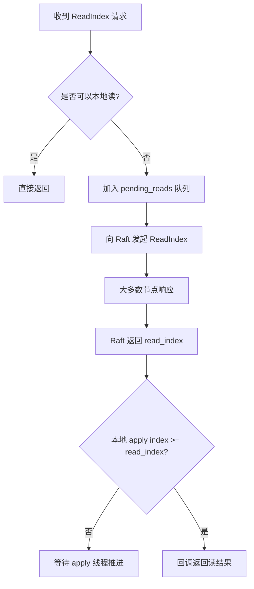

  
## 知识地图:并发

把面试陪练 你会越战越勇，
本文深入剖析大厂面试，
希望对你有帮助。
如果有任何疑问，欢迎留言提问。
  


### 第一题：线性一致性与顺序一致性区别


问题1我的回答：


正式开始


## 一、 为什么要回答，通过模拟面试驱动，提前练习。

  


  面试官： 分布式协议工程优化实践？

为了让激发你探索欲望，先拿出思考 60 秒下这个问题，期间。

- 暂停手机滑动

- 停敲击键盘

- 更不需要上网查询

- 这里上来不会直接给出答案
  

你可以趁着下面时间想一样

- 中午倒茶水时间

- 在中午吃饭路上

- 下午溜达时候

  

>想不出来没有任何关系，就当一60秒放松，

>这个不需要背诵，甚至花时间探索，**我帮助你研究一些没用知识**，


60 秒思考结束


先说什么公式，

- 如果2 个操A,B并发执行，

- 他们执行顺序执行不是唯一的，可能AB 或者 BA


就是这么简单，开始。


## 二、先定义清楚问题是什么，学习路径

### 1.1 目标与学习方法 ：

✅  <font color="#245bdb">目标：了解基本概念</font>

 1. 什么是顺序一致性

 2. 什么线程一致性

 3. 顺序一致性与线程一致性他们之间区别？

 4. 在工程实践中，做哪些优化（本章任务）

✅  <font color="#245bdb">学习方法</font>

1. 阅读 陈东明老师的<<分布式系统与一致性>>

  

2. 阅读唐伟志老师的 <<深入理解分布式存储系统>>

  

3. 了解TiKV/Etcd源码实现过程，先模仿在创造。


  


  


4. 动手练习 写无锁LRU 队列

    阅读：C++并发编程实战，java并发编程实战


  
  

5. 提交 pr,提交 pr（最关键关键一步）


  ##  三. TiKV如何实现线性一致性
#### 2.1  ReadIndex 解决什问题：


<font color="#ff0000">小青提问：采用共识算法，就一定保证线性一致性？</font>

小义回答: 一个分布式系统正确实现了共识算法并不意味着能线性一致.

如图上面一个写操作分为12 34 个步骤

以 TiKV 为例整体架构如下图所示，
consensus 就是 Raft 模块，
state machine 就是 RocksDB 模块，
两者通过 Log 进行交互

一致性算法的任务是保证复制日志的一致性 解决2和3的问题

以 Raft 为例，它只能保证不同节点对 Raft Log（以下简称 Log）能达成一致。

那么 Log 后面的状态机（state machine）的一致性呢？

并没有做详细规定，用户可以自由实现

##### <font color="#ff0000">小青提问：ReadIndex 用于在 Raft 协议中实现线性一致性的读请求？如何理解</font>


线性一致性 即，确保读取操作看到的日志状态至少与最新提交的状态一致

readIndex read ：是一种读的请求，获取当前时刻能保证线性一致的 Raft log index，保证线性一致性


参考资料：
- TiKV 源码解析系列文章（十九）read index 和 local read 情景分析
https://cn.pingcap.com/blog/tikv-source-code-reading-19/

**ReadIndex 的流程本质是：用 commit index 作为读点，通过大多数节点确认 Leader 身份，并等待 apply index ≥ commit index，确保线性一致性。**

##### <font color="#ff0000">小青提问2： raft算法日志复制过程中的applied和committed的区别</font>

资料：https://github.com/maemual/raft-zh_cn

- committed状态是什么呢【步骤2】

论文原始定义就是一个entry完成了在大多数节点上，也就是超半数节点上完成了复制就可以称作为committed状态。

 - applied 状态是什么？【步骤3】

就是当commitIndex大于lastApplied的时候，自增lastApplied,然后将日志应用到状态机

All Servers: 
If commitIndex > lastApplied: increment lastApplied, 
apply log[lastApplied] to state machine (§5.3)

- **commit index** 只保证“日志不会丢”，但还没被真正执行。
- **apply index** 才保证“数据已经对外可见”，可以安全地读


 1. **被大多数节点确认（commit index）**

- 指的是：**某条日志已经被 Raft 集群大多数节点写入本地日志文件**，Leader 就可以把它标记为“已提交”（commit）。
- 这个过程只保证了“日志数据已经安全地分发到大多数节点”，但还没有保证这些日志已经被状态机（比如 RocksDB）真正执行。

2. **本地应用（apply index）**

- 指的是：**本地状态机已经把这条日志真正执行了**（比如写入 RocksDB）。
- 只有 apply index ≥ commit index，才能保证你读到的数据是“线性一致”的。

---
 例子

假设有一条日志 index=10：

- Leader 把日志 10 发送给 Follower，等大多数 Follower 都写入了日志文件，Leader 的 commit index 就可以推进到 10。
- 但此时，Follower 可能还没来得及 apply 这条日志到 RocksDB（状态机），它的 apply index 还是 9。
- 只有 apply 线程把日志 10 应用到 RocksDB 后，apply index 才变成 10。


在标准 Raft 协议中, ReadIndex 操作用于确保线性一致性读取(linearizable read). 这个操作要求 Leader 在处理读请求前, 
- 确认自己的 leadership 是仍然合法的,
- 且任何已被读到的 log (不论是在当前 node 还是在其他 node 上读到的)仍能被读到.

##### <font color="#ff0000">小青提问3： 具体流程是什么，怎么保证，在任何一个节点上读到都是正确的</font>

小义：

在 Raft 中 ReadIndex 的标准处理步骤如下：

- **步骤-1**. Leader 检查自己当前 Term 的 log 是否已提交. 如果没有, 放弃读, 返回, 等待当前 Term 的 log 提交.
- **步骤-2**. Leader 取当前的 CommitIndex 作为 ReadIndex .
- **步骤-3**. 向 quorum 发送 heartbeat , 确认自己是唯一的 Leader.
- **步骤-4**. 等待 AppliedIndex 达到或超过 ReadIndex 再对 StateMachine 进行读取操作.
- 
 标准 Raft 实现的 ReadIndex 流程

1. **Leader 记录当前 commit index（ReadIndex**
    - Leader 收到 ReadIndex 请求时，先记录当前 commit index，作为本次读请求的 ReadIndex。
2. **Leader 向集群广播心跳（MsgReadIndex）**
    - Leader 向所有 Follower 发送带有 context 的心跳（MsgReadIndex），请求大多数节点响应。
3. **大多数节点响应，确认 Leader 身份**
    - 只有当大多数节点回复，Leader 才能确认自己仍然是合法 Leader，避免脑裂。
4. **等待状态机应用到 ReadIndex**
    - Leader 必须等待本地状态机（即 Region 的 apply index）至少应用到 ReadIndex 位置，确保所有已提交日志都已被应用。
5. **执行读请求并返回结果**
    
    - 一旦状态机应用到 ReadIndex，Leader 执行读请求，将结果返回给客户端。 的数据也一定能在这次 read 中被读到, 也就是 Linearizable read

Raft 中为了保证线性一致性，有个安全原则叫：

> “Leader 必须在当前任期提交过日志，才能安全提供只读请求”。

这是为了防止脑裂或 Leader 回退，避免数据不一致
tikv-raft 的 ReadIndex 实现

```
https://github.com/tikv/raft-rs/blob/65a00620d80a89603c3358fd4b90265a692ae767/src/raft.rs#L2108-L2145

// 当收到 MsgReadIndex 类型的消息时（即客户端发起只读请求）
MessageType::MsgReadIndex => {
    // 检查当前 Leader 是否已经提交了当前任期（current_term）内的至少一条日志
    if !self.commit_to_current_term() {
        // 如果当前 Leader 尚未提交过任何属于当前任期的日志，
        // 说明它可能是一个“未经确认的 Leader”（可能是网络分区后孤立产生的）
        // 此时不能安全地处理只读请求，因为返回的数据可能不是线性一致的。
        
        // 因此，拒绝该只读请求，直接返回，不做处理
        return Ok(());
    }

    // 否则，将继续处理 MsgReadIndex 请求（后续逻辑未展示）
}
在 Rust 中，`=>` 是 `match` 表达式中的语法符号
```


<font color="#ff0000">小青提问4： 只有本地 apply index ≥ read_index 时，才会真正回调返回结果，保证线性一致性</font>

从节点可以读吗？

在etcd-raft的实现中，​**​从节点（Follower）是可以读取数据的​**​，但需要注意以下几点：

1. ​**​读取的数据可能不是最新的​**​  
    由于Follower的状态总是落后于Leader，Follower上的数据可能不是最新的。因此，如果不做特殊处理，从Follower读取的数据可能与从Leader读取的数据不一致。
    
2. ​**​线性一致性读的要求​**​  
    如果需要保证线性一致性读（即读取的数据是最新的，并且满足一致性要求），etcd-raft通过​**​ReadIndex​**​机制来实现。即使是从Follower读取数据，也需要通过ReadIndex机制来确保读取的数据是最新的。
    
3. ​**​ReadIndex机制的工作原理​**​
    
    - 当Follower收到读请求时，它会将请求转发给Leader，询问当前的Commit Index（即已经被应用到状态机的最新数据的索引）。
    - Leader通过心跳机制确认自己仍然是Leader，并获取当前的Commit Index。
    - Follower在收到Leader的响应后，会等待状态机将数据应用到Commit Index之后，才返回读取结果给客户端。
4. ​**​总结​**​  
    从节点（Follower）可以读取数据，但如果需要保证线性一致性读，必须通过ReadIndex机制来确保读取的数据是最新的。否则，从Follower读取的数据可能会落后于Leader上的数据。
## 四. TiKv源码阅读

 
 TiKV 线性一致读（ReadIndex）流程与核心代码

## 一、ReadIndex 流程简述

1. **客户端发起强一致读请求**

    - 客户端发送需要线性一致性的读请求（如 GET）。
2. **Peer 判断处理方式**
    - 如果可以本地读（如 Leader 持有有效 lease），直接返回。
    - 否则，走 ReadIndex 流程。
3. **ReadIndex 请求入队**

    - Peer 把请求加入 `pending_reads` 队列，等待一致性确认。
4. **向 Raft 发起 ReadIndex**
    - Peer 调用 `raft_group.read_index(...)`，Raft Leader 向集群广播心跳，确认自己还是 Leader，并记录当前 commit index（即 ReadIndex）。
5. **Raft 返回 read_states**
    
    - Raft 层把 read_index 结果返回给 Peer，Peer 把结果写到 `pending_reads` 队列对应请求上。
6. **等待本地 apply index ≥ read_index**
    
    - Peer 检查本地状态机的 apply index 是否已经应用到 read_index。
    - 如果还没追上，继续等待。
7. **返回读结果**
    
    - 一旦 apply index ≥ read_index，Peer 执行读操作，回调返回结果给客户端。
8. **线性一致性保证**
    
    - 只有 apply index ≥ read_index 时才返回，确保所有已提交写入都可见，保证线性一致

  
好的，下面将**TiKV 线性一致读（ReadIndex）流程**与相关核心代码实现（以 `peer.rs` 和 peer_storage.rs 为主）整理到一个文件说明，适合初学者理解和查阅。

---

# TiKV 线性一致读（ReadIndex）流程与核心代码

## 一、ReadIndex 流程简述

1. **客户端发起强一致读请求**
   - 客户端发送需要线性一致性的读请求（如 GET）。

2. **Peer 判断处理方式**
   - 如果可以本地读（如 Leader 持有有效 lease），直接返回。
   - 否则，走 ReadIndex 流程。

3. **ReadIndex 请求入队**
   - Peer 把请求加入 `pending_reads` 队列，等待一致性确认。

4. **向 Raft 发起 ReadIndex**
   - Peer 调用 `raft_group.read_index(...)`，Raft Leader 向集群广播心跳，确认自己还是 Leader，并记录当前 commit index（即 ReadIndex）。

5. **Raft 返回 read_states**
   - Raft 层把 read_index 结果返回给 Peer，Peer 把结果写到 `pending_reads` 队列对应请求上。

6. **等待本地 apply index ≥ read_index**
   - Peer 检查本地状态机的 apply index 是否已经应用到 read_index。
   - 如果还没追上，继续等待。

7. **返回读结果**
   - 一旦 apply index ≥ read_index，Peer 执行读操作，回调返回结果给客户端。

8. **线性一致性保证**
   - 只有 apply index ≥ read_index 时才返回，确保所有已提交写入都可见，保证线性一致。

---

## 二、核心代码位置与实现

### 1. 入口：Peer 处理 ReadIndex 请求（peer.rs）

```rust
fn read_index<T: Transport>(
    &mut self,
    poll_ctx: &mut PollContext<EK, ER, T>,
    mut req: RaftCmdRequest,
    mut err_resp: RaftCmdResponse,
    cb: Callback<EK::Snapshot>,
) -> bool {
    // ...省略前置检查...
    let now = monotonic_raw_now();
    // 1. Leader 检查是否可以复用已有 pending_read，否则发起新的 ReadIndex
    if self.is_leader() {
        let lease_state = self.inspect_lease();
        if can_amend_read::<Callback<EK::Snapshot>>(
            self.pending_reads.back(),
            &req,
            lease_state,
            poll_ctx.cfg.raft_store_max_leader_lease(),
            now,
        ) {
            // 复用已有 pending_read
            let commit_index = self.get_store().commit_index();
            if let Some(read) = self.pending_reads.back_mut() {
                read.push_command(req, cb, commit_index);
                return false;
            }
        }
    }
    // 2. 发起新的 ReadIndex 请求
    let (id, dropped) = self.propose_read_index(request.as_ref());
    let mut read = ReadIndexRequest::with_command(id, req, cb, now);
    read.addition_request = request.map(Box::new);
    self.push_pending_read(read, self.is_leader());
    self.should_wake_up = true;
    // ...
    true
}
```

---

### 2. pending_reads 队列推进与回调（peer.rs）

```rust
// Follower 路径
fn post_pending_read_index_on_replica<T>(&mut self, ctx: &mut PollContext<EK, ER, T>) {
    while let Some(mut read) = self.pending_reads.pop_front() {
        let read_index = read.read_index.unwrap();
        if self.ready_to_handle_unsafe_replica_read(read_index) {
            self.response_read(&mut read, ctx, true);
        } else if self.get_store().applied_index() + ctx.cfg.follower_read_max_log_gap() <= read_index {
            // 落后太多，报错
            self.respond_replica_read_error(&mut read, response);
        } else {
            // 还没追上，放回队列
            self.pending_reads.push_front(read);
            break;
        }
    }
}
```

- 只有 `applied_index >= read_index` 时才会真正回调返回结果，保证线性一致性。

---

### 3. apply index 与 commit index 的来源（peer_storage.rs）

```rust
// 获取 apply index
pub fn applied_index(&self) -> u64 {
    self.apply_state().get_applied_index()
}

// 获取 commit index
pub fn commit_index(&self) -> u64 {
    self.raft_state().get_hard_state().get_commit()
}
```

---

### 4. 相关元数据结构体（kvproto）

```rust
// kvproto::raft_serverpb
message RaftApplyState {
    uint64 applied_index = 1;
    TruncatedState truncated_state = 2;
    // ...
}
message RaftLocalState {
    HardState hard_state = 1;
    uint64 last_index = 2;
    // ...
}
```

---

### 5. 线性一致性保证的关键

- **只有 apply index ≥ read_index 时才返回读结果**，这样可以确保所有已提交的写都已经被本地状态机应用，读请求不会漏掉任何已提交的数据，保证线性一致性。

---

## 三、流程图（Mermaid）



---

## 四、总结

- TiKV 的 ReadIndex 线性一致读流程，核心是“Leader 确认身份，记录一致性点，等待本地状态机追上后再返回读结果”。
- 代码实现围绕 `pending_reads` 队列、apply index、commit index 以及 Raft 状态推进展开。
- 只有 apply index ≥ read_index 时才返回，确保线性一致。


  ### 参考
  - 可视化演示 https://thesecretlivesofdata.com/raft/
  - https://blog.openacid.com/
  -  TiKV 源码阅读三部曲（二）读流程

  
  

我在寻找一位积极上进的小伙伴，

一起参与**神奇早起 30 天改变人生计划**，发展个人事情，不妨 试试

1️⃣ 加入我的技术交流群Offer 来碗里 (回复“面经”获取），一起抱团取暖


2️⃣ 关注公众号:后端开发成长指南(回复“面经”获取）获取过去我**全部面试录音**和大厂面试复盘攻略


3️⃣ **感兴趣的读者可以通过公众号获取老王的联系方式。**