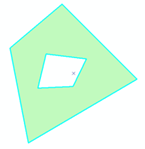
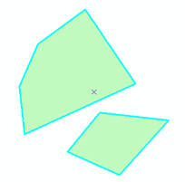

# #一、Overview 


大家好， 本文主要描述是如何OceanBase 社区版实现一个 MySQL 5.7 新增的系统内建函数。

通过https://github.com/oceanbase/oceanbase/issues/1400 实践


开始时间：2023-6-8号--

思考 60秒，可能会产生下面几个疑问。

> 微行动：拆分到自己可用完成的步骤


- 新增一个表达式 ，需要修改parser模块吗？ done

- 参考 https://github.com/boostorg/geometry/tree/develop 写一个 Boost.Geometry ExteriorRing 例子  done

- todo-3:如何为Boost.Geometry ExteriorRing写一个单元测试。

- 了解boost库ExteriorRing 例子https://github.com/boostorg/geometry/blob/develop/test/core/ring.cpp，但是 ObGeoFuncAreaImpl 中这么多OB_GEO_GEOG_BINARY_FUNC_DEFAULT 宏是做用的。

  
  
  
  
  


# 二、 Solutions


> 通过例子学习
>
> 可以参考当前已有的实现，比如ST_area。
>
> 主要参考代码文件 
>
> ob_expr_st_area.cpp.h 
>
> ob_expr_st_area.h
>
> ob_geo_func_area.cpp/.h
>
> ob_geo_func_register.h

涉及文件：

- ob_sql.cpp:2425
- ob_dml_resolver.cpp:1589
- ob_select_resolver.cpp:1859
- ob_select_resolver.cpp:1274

### sql 客户端


| ST_Area({poly | mpoly}) | 计算多边形的面积，参数可以是Polygon或者MultiPolygon，MultiPolygon的面积是其中所有多边形面积的和 |
| ------------- | ------- | ------------------------------------------------------------ |
|               |         |                                                              |

~~~sql


https://dev.mysql.com/doc/refman/5.7/en/gis-polygon-property-functions.html#function_area
mysql> SET @poly =
       'Polygon((0 0,0 3,3 0,0 0),(1 1,1 2,2 1,1 1))';
mysql> SELECT ST_Area(ST_GeomFromText(@poly));
+---------------------------------+
| ST_Area(ST_GeomFromText(@poly)) |
+---------------------------------+
|                               4 |
+---------------------------------+

mysql> SET @mpoly =
       'MultiPolygon(((0 0,0 3,3 3,3 0,0 0),(1 1,1 2,2 2,2 1,1 1)))';
mysql> SELECT ST_Area(ST_GeomFromText(@mpoly));
+----------------------------------+
| ST_Area(ST_GeomFromText(@mpoly)) |
+----------------------------------+
|                                8 |
+----------------------------------+
~~~


### parser模块

>  表达式是如何被解析的

Parser 是整个 SQL 执行引擎的词法或语法解析器。通过flex（ 词法分析器生成工具） 和bison(语法分析器生成器) 通过把 SQL 字符串解析为一个 ParseNode 组成的抽象语法树。

用法参考：miniob-sql-parser.md

相关代码：

- ob_parser.cpp

- sql_parser_mysql_mode.l
- sql_parser_mysql_mode.y


### resolver模块 

ObDMLResolver::resolve_sql_expr

`ObDMLResolver::resolve_sql_expr`函数：	

- 功能：该函数用于解析SQL表达式并生成对应的`ObRawExpr`对象，同时进行一系列的解析和分析操作，

  ​     包括解析函数、解析列、解析系统变量等。

- 输入参数：

  - `const ParseNode &node`：要解析的 SQL 表达式的语法节点。
  - `ObRawExpr *&expr`：解析后的表达式树的指针，通过该参数返回。
  - `ObArray<ObQualifiedName> *output_columns`：可选参数，用于存储解析过程中发现的列名信息。


### resolver模块 

> 判断st_area函数是否存在

表达式解析类是位于sql/resolver/expr 的ObRawExprResolver，它输入ObParseNode 树，输出表达式树 ObRawExpr 。

这个 ObRawExpr 仅用于优化器阶段的语义分析优化，在生成物理执行计划后会被转换为为执行效率优化的 ObExpr 。

文件：D:\db\oceanbase\src\sql\resolver\expr\ob_raw_expr_resolver_impl.cpp


1. 根据节点的类型：case T_FUN_SYS:，执行process_fun_sys_node和process_dll_udf_node(udf其他特殊类型的函数这里跳过)

- ObRawExprResolverImpl::process_fun_sys_node(const ParseNode *node, ObRawExpr *&expr)

​    在递归解析参数列表之前, 先检查下当前函数是否存在, 这是因为如果该函数报错          OB_ERR_FUNCTION_UNKNOWN, 外部会继续尝试是否是UDF、


2. 根据函数名字查找类型type = ObExprOperatorFactory::get_type_by_name(func_name);

- ObExprOperatorType ObExprOperatorFactory::get_type_by_name(const ObString &name)

  

### 表达式注册

> ob_expr_operator_factory.cpp  ObExprSTArea函数是如何被注册的？

执行过程分析

1. ObExprSTArea op(alloc) //构造函数，虽然只有一个参数，但是继承关系，默认 函数名字和类型写死了。


2. 表达式名字： st_area，表达式类型 T_FUN_SYS_ST_AREA 1676

\#define N_ST_AREA                           "st_area"

T_FUN_SYS_ST_AREA = 1676,

sql 命令 关联函数执行

1. REG_OP 实现是一个 lambda表达式，通过引用的方式捕获 获取外部变量：

​     其中 i ,alloc,NAME_TYPES 含义 表达式个数，分配器类型和全局静态数组

​      ObExprOperatorFactory::register_expr_operators()


- 对照代码 ObExprOperatorFactory::register_expr_operators()

```c++
void ObExprOperatorFactory::register_expr_operators()
{
  memset(NAME_TYPES, 0, sizeof(NAME_TYPES));
  ObArenaAllocator alloc;
  int64_t i = 0; //
  REG_OP(ObExprSTArea);//注册表达式，这里面是lambda表达式
}
    
ObExprOperatorFactory::NameType ObExprOperatorFactory::NAME_TYPES[EXPR_OP_NUM] = { };

#define REG_OP(OpClass)                             \
  do { //lambda 语法，[&] 按引用的方式捕获所有外部变量。                                             \
    [&]() {                                         \
      OpClass op(alloc);  // ObExprSTArea(common::ObIAllocator &alloc);                        \
      if (OB_UNLIKELY(i >= EXPR_OP_NUM)) {          \
        LOG_ERROR("out of the max expr");           \
      } else {                                      \
        NAME_TYPES[i].name_ = op.get_name();        \   //外部变量   位置register_expr_operators 
        NAME_TYPES[i].type_ = op.get_type();        \
        NAME_TYPES[i].is_internal_ = op.is_internal_for_mysql(); \
        OP_ALLOC[op.get_type()] = ObExprOperatorFactory::alloc<OpClass>; \
        i++;  //外部变量   位置register_expr_operators                                     \
      }                                             \
    }();                                            \
  } while(0) //只执行一次就结束 理解成if

```


> 旁白：

- lambda本质就是 函数对象，在stl源码解析book有解释 函数对象：opeartor ()的一个类. 
- lambda 语法，**[&]** 按引用的方式捕获所有外部变量。
- **define是在预处理中进行替换，const语句是实实在在的编译器处理的**
- 

####  engine/expr 

#### ObExprSTArea::eval_st_area是如何实现的

1. 在ObExpr::EvalFunc g_expr_eval_functions 添加新的计算函数

​       ObExprSTArea::eval_st_area,                                         /* 557 */

2. ObExprSTArea::eval_st_area 函数 
3.    调用 Making Use of Boost Geometry in MySQL GIS

- https://www.boost.org/doc/libs/1_78_0/libs/geometry/doc/html/index.html

  

~~~~
#define REG_SER_FUNC_ARRAY(id, array, size) \
  static_assert(id >= 0 && id < OB_SFA_MAX, "too big id" #id); \
  bool g_reg_ser_func_##id = ObFuncSerialization::reg_func_array( \
      id, reinterpret_cast<void **>(array), size);

} // end namespace sql
~~~~


### geometry

1. Why Boost.Geometry in MySQL?
~~~~
computational geometry is not our field of expertise。
We evaluated multiple geometry libraries, and Boost.Geometry proved to fit our needs best.
http://mysql.taobao.org/monthly/2021/07/06/
~~~~

2. GIS数据类型
   ~~~~
       GEOMETRY：不可实例化的数据类型，但是可以作为一个列的类型，存储任何一种其他类型的数据
       POINT：点
       LINESTRING：线
       POLYGON：多边形，由多条闭合的线构成的图形
       MULTIPOINT：点集合
       MULTILINESTRING：线集合
       MULTIPOLYGON：多边形集合
       GEOMCOLLECTION：空间对象集合

3. GIS对象属性
      MySQL中每个GIS对象都具有一些属性，MySQL中有一系列函数来获取GIS对象的属性，
       类型(type)：每个GIS对象都会有一个类型，表示了该对象是上述八种类型中的哪一种。

4. GIS数据格式

     

     MySQL中支持WKT以及WKB两种格式来操作GIS数据，同时在内部以另外一种格式存储GIS数据。

 WKT

即文本格式，在用户操作GIS类型的数据时可以使用直观的文本进行插入或查询，

MySQL支持OpenGIS定义的语法来写WKT数据，

- 在用户进行插入时可以使用ST_GeomFromText等函数来将WKT格式的GIS数据转换成内部格式进行插入，

- 在进行查询时可以使用ST_AsText函数来将内部数据转换为更直观的WKT结果格式。

示例如下：


WKT用文本的方式来表达Geometry，便于人的阅读。

WKT的格式为：Geometry类型(坐标数据)


Point：POINT(15 20)

LineString：LINESTRING(0 0, 10 10, 20 25, 50 60)

Polygon ：POLYGON((0 0,10 0,10 10,0 10,0 0),(5 5,7 5,7 7,5 7, 5 5))

MultiPoint：MULTIPOINT(0 0, 20 20, 60 60)

MultiLineString：MULTILINESTRING((10 10, 20 20), (15 15, 30 15))

MultiPolygon：MULTIPOLYGON(((0 0,10 0,10 10,0 10,0 0)),((5 5,7 5,7 7,5 7, 5 5))) //？？和Polygon  区别是？

参考：[矢量空间数据格式](https://www.cnblogs.com/marsprj/archive/2013/02/08/2909452.html)


Polygon和MultiPolygon的结构较为复杂，概念相也容易混淆。Polygon和MultiPolygon都由多个环(Ring)构成的封闭的面状实体。




- Polygon具有1个外环和0个或n个内环构成。

  MultiPoylgon由多个Plygon构成，Plygon之间的空间关系是相离，因此MultiPolygon并没有外环。


多面(MultiPolygon)

  由多个相离的Polygon构成，并没有一个外环。




​	

GeometryCollection：GEOMETRYCOLLECTION(POINT(1 -1), POINT(10 10), POINT(30 30), LINESTRING(15 15, 20 20))


 WKB

该格式时OpenGIS定义的一个格式，使用二进制数据来保存信息，

例如平面坐标系下的点(1,-1)的WKB格式为：
0101000000000000000000F03F000000000000F0BF`

5.GIS函数

https://www.boost.org/doc/libs/1_63_0/libs/geometry/doc/html/geometry/reference/algorithms/area/area_2_with_strategy.html

GIS函数

MySQL提供了一系列的空间数据分析计算函数，大部分空间数据计算函数是基于Boost.Geometry库实现的，选择Boost的原因可以参考Manyi Lu的博客。

空间数据计算函数主要分为空间对象构造、空间数据格式转换、空间对象属性、空间对象关系计算，空间对象生成等等几大类

MySQL中GIS函数的实现定义在sql/item_geofunc*等文件中，其中大部分定义在sql/item_geofunc.h和sql/item_geofunc.cc文件中。


### to_do 

> 参考 https://github.com/boostorg/geometry/tree/develop 写一个 Boost.Geometry ExteriorRing 例子   下面是记录过程

| ST_ExteriorRing(poly) | 返回一个多边形对象的外圈，返回值是linestring（一条线），参数只能是polygon，否则报错或返回NULL |
| --------------------- | ------------------------------------------------------------ |
|                       |                                                              |


~~~
https://github.com/boostorg/geometry/blob/develop/include/boost/geometry/core/exterior_ring.hpp

https://github.com/boostorg/geometry/blob/develop/test/core/ring.cpp
https://github.com/boostorg/geometry/blob/develop/include/boost/geometry/core/ring_type.hpp //type_traits
https://github.com/boostorg/geometry/blob/develop/include/boost/geometry/core/tags.hpp //GIS数据类型 是类标识，不是枚举值作用是什么？参考stl中的设计。
/workspaces/oceanbase/unittest/share/test_geo_func_difference.cpp


~~~


~~~
brief：该函数返回多边形的外环。
ingroup：该函数属于 exterior_ring 组。
note：该函数符合 OGC 标准，即符合开放地理空间联盟的标准。与 "ExteriorRing" 不同，该函数使用 "exterior ring"。
tparam：这是一个模板参数。Polygon 是将要从中获取外环的多边形的类型。
param：这是函数的参数。polygon 是将要从中获取外环的多边形的引用。
return：该函数返回一个指向外环的常量引用。

/*!
\brief Function to get the exterior ring of a polygon (const version)
\ingroup exterior_ring
\note OGC compliance: instead of ExteriorRing
\tparam Polygon polygon type
\param polygon the polygon to get the exterior ring from
\return a const reference to the exterior ring

\qbk{distinguish,const version}
*/
template <typename Polygon>
inline typename ring_return_type<Polygon const>::type exterior_ring(
        Polygon const& polygon)
{
    return core_dispatch::exterior_ring
        <
            typename tag<Polygon>::type,
            Polygon const
        >::apply(polygon);
}


~~~


> 小贴士：还是没看明白可用参考 看msyql 如何实现 


-------------------------------------------

# 第三部分：ST_ExteriorRing实现过程

#### 新增一个函数相关文件


1. **表达式和geo函数之间关系**
   - D:\db\oceanbase\deps\oblib\src\lib\geo\ob_geo_func_register.h
   - deps/oblib/src/lib/geo/ob_geo_func_exterior_ring.cpp
   


2. **geo函数实现**

- D:\db\oceanbase\deps\oblib\src\lib\CMakeLists.txt

- D:\db\oceanbase\deps\oblib\src\lib\geo\ob_geo_func_exterior_ring.cpp

- D:\db\oceanbase\deps\oblib\src\lib\geo\ob_geo_func_exterior_ring.h

  

   3. **新增一个函数实现**

- D:\db\oceanbase\src\sql\CMakeLists.txt

- D:\db\oceanbase\src\sql\engine\expr\ob_expr_operator_factory.cpp

- D:\db\oceanbase\src\sql\engine\expr\ob_expr_st_exterior_ring.cpp

- D:\db\oceanbase\src\objit\include\objit\common\ob_item_type.h

- D:\db\oceanbase\deps\oblib\src\lib\ob_name_def.h

- D:\db\oceanbase\src\sql\resolver\expr\ob_raw_expr.h

- D:\db\oceanbase\src\sql\engine\expr\ob_expr_eval_functions.cpp

   

   **单元测试**

- D:\db\oceanbase\unittest\share\CMakeLists.txt

  

  

  


#### 如何提交pr

- 方法1 ： 自己提交，利用github提交

~~~shell
# 1. 关联远程仓库，保证代码可以和远程更新和提交
git remote add oceanbase https://github.com/oceanbase/oceanbase.git
git remote -v

# 2. oceanbase代码更新后更新自己仓库 

自己在github 界面上 同步 然后pull

# 3. 提交分支到远程自己仓库
 git push <远程主机名> <本地分支名>:<远程分支名>
# 从将本地的分支版本上传到远程参考(这里不是pr提交)
git push origin issue_1400:issue_1400

# 4. 界面上 提交pr
# 5. 可选
git push --set-upstream origin issue_1400
origin 是默认的远程版本库名称
等价于git push origin issue_1400:issue_1400 

如果你用Windows就设置全局变量 
git config --global core.autocrlf true 
如果是mac/linux则设置 
git config --global core.autocrlf input 
 如果使用 set list 显示隐藏字符 : set nolist ：不显示


合并到master
git checkout master
#把本地分支合并到master
git merge issue_1400

手工修改
当Git无法自动合并分支时，就必须首先解决冲突。解决冲突后，再提交，合并完成
git add xxx
git commit -m "merged from main"
继续
git merge issue_1400
已经是最新的。


~~~


### 如何测试

~~~shell

# DEBUG 构建
bash build.sh debug --init

# 这里没有制作镜像，之间覆盖4.0版本的
echo 3 > /proc/sys/vm/drop_caches
tiup cluster stop watchpoints //关闭其他的
tiup cluster disable watchpoints  //关闭其他的
# 制作本地镜像
make DESTDIR=./ install && 
obd mirror create -n oceanbase-ce -V 4.2.0.1 -p ./usr/local -t my-oceanbase
Package ok
name: oceanbase-ce
version: 4.2.0.1
release:20230615110800
arch: x86_64
md5: dd828bcc94f6f4257d212bc73f7cbc42
Trace ID: d5ee1980-0b29-11ee-a4c9-000c29378c15

# 离线安装部署，禁用远程仓库
obd mirror disable remote

配置文件：


[root@localhost oceanbase]# cat mini-local-example.yaml
oceanbase-ce:
  tag: my-oceanbase
  servers:
    # Please don't use hostname, only IP can be supported
    - 127.0.0.1
  global:
    #  The working directory for OceanBase Database. OceanBase Database is started under this directory. This is a required field.
    home_path: /mnt/ob/observer
    # The directory for data storage. The default value is $home_path/store.
    data_dir: /mnt/ob/data
    # The directory for clog, ilog, and slog. The default value is the same as the data_dir value.
    redo_dir: /mnt/ob/redo
    # Please set devname as the network adaptor's name whose ip is  in the setting of severs.
    # if set severs as "127.0.0.1", please set devname as "lo"
    # if current ip is 192.168.1.10, and the ip's network adaptor's name is "eth0", please use "eth0"
    devname: lo
    mysql_port: 2881 # External port for OceanBase Database. The default value is 2881. DO NOT change this value after the cluster is started.
    rpc_port: 2882 # Internal port for OceanBase Database. The default value is 2882. DO NOT change this value after the cluster is started.
    zone: zone1
    cluster_id: 1
    # please set memory limit to a suitable value which is matching resource.
    memory_limit: 6G # The maximum running memory for an observer
    system_memory: 1G # The reserved system memory. system_memory is reserved for general tenants. The default value is 30G.
    datafile_size: 15G # Size of the data file.
    log_disk_size: 10G # The size of disk space used by the clog files.
    cpu_count: 4
    production_mode: false
    enable_syslog_wf: false # Print system logs whose levels are higher than WARNING to a separate log file. The default value is true.
    enable_syslog_recycle: true # Enable auto system log recycling or not. The default value is false.
    max_syslog_file_count: 4 # The maximum number of reserved log files before enabling auto recycling. The default value is 0.
    # root_password: # root user password, can be empty
---------------------------------------------------------------

obd cluster destroy watchpoints //删除之前的，不要轻易执行

# 创建 
obd cluster deploy watchpoints -c ./mini-local-example.yaml

obd cluster start watchpoints 
Wait for observer init ok
+---------------------------------------------+
|                   observer                  |
+-----------+---------+------+-------+--------+
| ip        | version | port | zone  | status |
+-----------+---------+------+-------+--------+
| 127.0.0.1 | 4.2.0.0 | 2881 | zone1 | ACTIVE |
+-----------+---------+------+-------+--------+
obclient -h127.0.0.1 -P2881 -uroot -p'GC29IoH3V9NQk8hIM2yr' -Doceanbase -A


obd cluster edit-config watchpoints 
obd cluster start watchpoints // 启动不了怎么办？


https://dev.mysql.com/doc/refman/5.7/en/gis-polygon-property-functions.html#function_area
mysql> SET @poly =
       'Polygon((0 0,0 3,3 0,0 0),(1 1,1 2,2 1,1 1))';
mysql> SELECT ST_Area(ST_GeomFromText(@poly));
+---------------------------------+
| ST_Area(ST_GeomFromText(@poly)) |
+---------------------------------+
|                               4 |
+---------------------------------+


SELECT ST_ExteriorRing(ST_GeomFromText(@poly));

obclient [oceanbase]> SELECT ST_ExteriorRing(ST_GeomFromText(@poly));
+-----------------------------------------+
| ST_ExteriorRing(ST_GeomFromText(@poly)) |
+-----------------------------------------+
|                                       4 |
+-----------------------------------------+

> 画外音：走到这里说明 ST_ExteriorRing生效了，执行结果和ST_Area一样，是因为完全copy了ST_Area代码，下一步就是调用boost实现

mysql> SET @poly =
       'Polygon((0 0,0 3,3 3,3 0,0 0),(1 1,1 2,2 2,2 1,1 1))';
mysql> SELECT ST_AsText(ST_ExteriorRing(ST_GeomFromText(@poly)));
+----------------------------------------------------+
| ST_AsText(ST_ExteriorRing(ST_GeomFromText(@poly))) |
+----------------------------------------------------+
| LINESTRING(0 0,0 3,3 3,3 0,0 0)                    |
+----------------------------------------------------+

 
~~~

### 单元测试

> todo-3:如何为Boost.Geometry ExteriorRing写一个单元测试？ 参考：test_geo_func_difference.cpp


~~~

1. cp test_geo_func_difference.cpp test_geo_func_exterior_ring.cpp 
2. unittest\share\CMakeLists.txt 添加 
3. 替换
 sed -i 's/TestGeoFuncDifference/TestGeoFuncExte
 riorRring/g' test_geo_func_exterior_ring.cpp 

4. unittest/share/test_geo_func_exterior_ring.cpp

//
发现 ob 提供外环函数计算是不是不用boost提供接口了 bWkbGeogLinearRing& ObWkbGeogPolygon::exterior_ring() ，发现boost 返回的不是简单值，是一个对象的化，bWkbGeogLinearRing& ObWkbGeogPolygon::exterior_ring()用的模板，不行2个都试试吧


这个得做一些测试吧。boost肯定是对的吧，经过那么多测试。如果返回的数据类型跟预期不符，是否可以转换一下？


~~~


### task3 ST_ExteriorRing(poly) 

> 参考 https://github.com/boostorg/geometry/tree/develop 写一个 Boost.Geometry ExteriorRing 例子   下面是记录过程

| ST_ExteriorRing(poly) | 返回一个多边形对象的外圈，返回值是linestring（一条线），参数只能是polygon，否则报错或返回NULL |
| --------------------- | ------------------------------------------------------------ |
|                       |                                                              |

#### boost::geometry

~~~~
brief：该函数返回多边形的外环。
ingroup：该函数属于 exterior_ring 组。
note：该函数符合 OGC 标准，即符合开放地理空间联盟的标准。与 "ExteriorRing" 不同，该函数使用 "exterior ring"。
tparam：这是一个模板参数。Polygon 是将要从中获取外环的多边形的类型。
param：这是函数的参数。polygon 是将要从中获取外环的多边形的引用。
return：该函数返回一个指向外环的常量引用。

/*!
\brief Function to get the exterior ring of a polygon (const version)
\ingroup exterior_ring
\note OGC compliance: instead of ExteriorRing
\tparam Polygon polygon type
\param polygon the polygon to get the exterior ring from
\return a const reference to the exterior ring

\qbk{distinguish,const version}
*/
template <typename Polygon>
inline typename ring_return_type<Polygon const>::type exterior_ring(
        Polygon const& polygon)
{
    return core_dispatch::exterior_ring
        <
            typename tag<Polygon>::type,
            Polygon const
        >::apply(polygon);
}

https://github.com/boostorg/geometry/blob/develop/include/boost/geometry/core/exterior_ring.hpp

https://github.com/boostorg/geometry/blob/develop/test/core/ring.cpp
https://github.com/boostorg/geometry/blob/develop/include/boost/geometry/core/ring_type.hpp //type_traits
https://github.com/boostorg/geometry/blob/develop/include/boost/geometry/core/tags.hpp //GIS数据类型 是类标识，不是枚举值作用是什么？参考stl中的设计。
/workspaces/oceanbase/unittest/share/test_geo_func_difference.cpp

https://github.com/watchpoints/master-cpp/blob/main/example/Boost/demo.cpp

https://github.com/boostorg/geometry/blob/develop/test/core/ring.cpp
~~~~


我在编译过程中遇到下面问题，看例子：为什么可用编译通过


~~~~
// geography
    OB_GEO_UNARY_FUNC_BEGIN(ObGeoFuncAreaImpl, ObWkbGeogPolygon, double)
    {
      INIT_SUCC(ret);
      const ObSrsItem *srs = context.get_srs();
      if (OB_ISNULL(srs))
      {
        ret = OB_ERR_NULL_VALUE;
        LOG_WARN("srs is null", K(ret), K(g->get_srid()), K(g));
      }
      else
      {
        boost::geometry::srs::spheroid<double> geog_sphere(srs->semi_major_axis(), srs->semi_minor_axis());
        boost::geometry::strategy::area::geographic<> area_strategy(geog_sphere);
        const ObWkbGeogPolygon *geo = reinterpret_cast<const ObWkbGeogPolygon *>(g->val());
        result = boost::geometry::area(*geo, area_strategy);
      }
      return ret;
    }
    https://www.boost.org/doc/libs/1_65_0/libs/geometry/doc/html/geometry/reference/algorithms/area/area_1.html
    
    template<typename Geometry>
    default_area_result<Geometry>::type area(Geometry const & geometry)
    
    
~~~~


> 画外音：自己想很多原因，但是 没有想到结果是 boost::geometry::area(geo） 看走眼了，
>
> 但是很奇怪，明明是2个不同类型没有报错
>
> ```
> ype area(Geometry const & geometry)
> class ObWkbGeomMultiPolygon
> 这个通过带代码没有看清楚。
> ```


编译错误2：


~~~
mnt/oceanbase/oceanbase/deps/oblib/src/lib/geo/ob_geo_func_exterior_ring.cpp:10                                                                                                                     8:64: error: non-const lvalue reference to type 'double' cannot bind to a value                                                                                                                      of unrelated type 'oceanbase::common::ObGeometry *'
  return ObGeoFuncExteriorRingImpl::eval_geo_func(gis_context, result);
                                                               ^~~~~~
/mnt/oceanbase/oceanbase/deps/oblib/src/lib/geo/ob_geo_dispatcher.h:34:85: note:                                                                                                                      passing argument to parameter 'result' here
  static inline int eval_geo_func(const common::ObGeoEvalCtx &gis_context, RetTy                                                                                                                     pe &result);
                                                                                                                                                                                                         ^
/mnt/oceanbase/oceanbase/deps/oblib/src/lib/geo/ob_geo_dispatcher.h:66:79: error                                                                                                                     : non-const lvalue reference to type 'oceanbase::common::ObGeometry *' cannot bi                                                                                                                     nd to a value of unrelated type 'double'
      ret = Functype::template EvalTree<ObCartesianPoint> :: eval(g, context, re                                                                                                                     sult);
                                               
~~~


- 原因分析：

~~~】
int ObExprSTExteriorRing::calc_result_type1

~~~


##  参考
[1] http://mysql.taobao.org/monthly/2021/07/06/

[2] https://www.boost.org/doc/libs/1_55_0/libs/geometry/doc/html/geometry/reference/algorithms/area/area_1.html

[3] https://desktop.arcgis.com/zh-cn/arcmap/latest/manage-data/using-sql-with-gdbs/st-exteriorring.htm

- https://www.ibm.com/docs/en/db2/11.5?topic=sf-st-exteriorring

     - https://www.boost.org/doc/libs/1_76_0/libs/geometry/doc/html/geometry/reference/access/exterior_ring/exterior_ring_1.html

【4】 https://monica.im/s/f3b3dbfc

- https://dev.mysql.com/doc/refman/5.7/en/gis-polygon-property-functions.html#function_st-exteriorring
- https://help.aliyun.com/document_detail/417061.html done

【5】侯捷系列视频

https://github.com/ZachL1/Bilibili-plus

[6] https://blog.csdn.net/iLuoPu/article/details/124034790  阅读中----阅读完成

[7] https://www.boost.org/doc/libs/1_55_0/libs/geometry/doc/html/geometry/reference/algorithms/sym_difference.html

 https://www.boost.org/doc/libs/1_64_0/libs/geometry/doc/html/geometry/reference/access/exterior_ring/exterior_ring_1.html

阅读中-


# 慢慢来，多看、多问、多总结，肯定是可以攻克的。

文章地址：

http://localhost:1313/post/oceanbase/1-2023-05-28-add-fun

https://wangcy6.github.io/post/oceanbase/1-2023-05-28-add-fun

https://wangcy6.github.io/post/oceanbase/2022/oceanbase_day2/


### 沟通步骤

1. 准备好一个ppt，在写代码之前演示最终目标 和架构设计 就是如何去实现的 【不要说公司部门环境不对 着就是最终结果，不要试着看看，一定是可以完全上线的项目，非demo和一个知识点。自己认为真的 不是闹着玩的。。】

   一、这个技术出现的背景、初衷和要达到什么样的目标或是要解决什么样的问题

   二、这个技术的优势和劣势分别是什么

   三、这个技术适用的场景。任何技术都有其适用的场景，离开了这个场景

   四、技术的组成部分和关键点。

   五、技术的底层原理和关键实现

   六、已有的实现和它之间的对比


2. 经过领导，专家 进行鸡蛋里挑骨头。【自己做好了别人路了胡扯，不会对别人产生任何影响，做事和做人一样，无论熟悉人，还是老师，领导，不相关人 反对 他们反馈信号，接受质疑，经过九九八十一难考验，并且你还在坚持认为对的。】

3. 最后融合别人建议，然后完善你项目。【不听老人言，吃亏在眼前，不敢接受别人批评，说明自己完全没有把握，才去否定 愤怒方式】

## 遇到的坑

编译1

~~~~

/mnt/oceanbase/oceanbase/deps/3rd/usr/local/oceanbase/deps/devel/include/boost/geometry/core/interior_type.hpp:95:68: error: no type named 'type' in 'boost::geometry::traits::interior_const_type<const oceanbase::common::ObWkbGeomPolygon *>'
            typename traits::interior_const_type<nc_polygon_type>::type,
            ~~~~~~~~~~~~~~~~~~~~~~~~~~~~~~~~~~~~~~~~~~~~~~~~~~~~~~~^~~~
/mnt/oceanbase/oceanbase/deps/3rd/usr/local/oceanbase/deps/devel/include/boost/geometry/core/interior_type.hpp:153:37: note: in instantiation of template class 'boost::geometry::core_dispatch::interior_return_type<boost::geometry::polygon_tag, const oceanbase::common::ObWkbGeomPolygon *const>' requested here
    typedef typename core_dispatch::interior_return_type
                                    ^
/mnt/oceanbase/oceanbase/deps/3rd/usr/local/oceanbase/deps/devel/include/boost/geometry/core/interior_rings.hpp:135:17: note: in instantiation of template class 'boost::geometry::interior_return_type<const oceanbase::common::ObWkbGeomPolygon *const>' requested here
inline typename interior_return_type<Polygon const>::type interior_rings(
                ^
/mnt/oceanbase/oceanbase/deps/oblib/src/lib/geo/ob_geo_func_exterior_ring.cpp:81:10: note: while substituting deduced template arguments into function template 'interior_rings' [with Polygon = const oceanbase::common::ObWkbGeomPolygon *]
 result= bg::interior_rings(geo);
         ^
/mnt/oceanbase/oceanbase/deps/oblib/src/lib/geo/ob_geo_func_exterior_ring.cpp:81:10: error: no matching function for call to 'interior_rings'
 result= bg::interior_rings(geo);
         ^~~~~~~~~~~~~~~~~~
/mnt/oceanbase/oceanbase/deps/3rd/usr/local/oceanbase/deps/devel/include/boost/geometry/core/interior_rings.hpp:114:53: note: candidate template ignored: substitution failure [with Polygon = const oceanbase::common::ObWkbGeomPolygon *]
inline typename interior_return_type<Polygon>::type interior_rings(Polygon& polygon)
                                                    ^
/mnt/oceanbase/oceanbase/deps/3rd/usr/local/oceanbase/deps/devel/include/boost/geometry/core/interior_rings.hpp:135:59: note: candidate template ignored: substitution failure [with Polygon = const oceanbase::common::ObWkbGeomPolygon *]
inline typename interior_return_type<Polygon const>::type interior_rings(
                                                          ^
In file included from /mnt/oceanbase/oceanbase/build_debug/deps/oblib/src/lib/CMakeFiles/oblib_lib.dir/Unity/unity_oblib_lib_geo/1_cxx.cxx:51:
/mnt/oceanbase/oceanbase/deps/oblib/src/lib/geo/ob_geo_func_exterior_ring.cpp:99:19: error: assigning to 'oceanbase::common::ObGeometry *' from incompatible type 'const oceanbase::common::ObWkbGeogLinearRing'
    result = geo->exterior_ring();
             ~~~~~^~~~~~~~~~~~~~~
/mnt/oceanbase/oceanbase/deps/oblib/src/lib/geo/ob_geo_func_exterior_ring.cpp:106:28: error: out-of-line definition of 'eval' does not match any declaration in 'oceanbase::common::ObGeoFuncExteriorRing'
int ObGeoFuncExteriorRing::eval(const ObGeoEvalCtx &gis_context, ObGeometry *&result)
                           ^~~~
/mnt/oceanbase/oceanbase/deps/oblib/src/lib/geo/ob_geo_func_exterior_ring.cpp:108:64: error: non-const lvalue reference to type 'double' cannot bind to a value of unrelated type 'oceanbase::common::ObGeometry *'
  return ObGeoFuncExteriorRingImpl::eval_geo_func(gis_context, result);
                                                               ^~~~~~
/mnt/oceanbase/oceanbase/deps/oblib/src/lib/geo/ob_geo_dispatcher.h:34:85: note: passing argument to parameter 'result' here
  static inline int eval_geo_func(const common::ObGeoEvalCtx &gis_context, RetType &result);

~~~~

