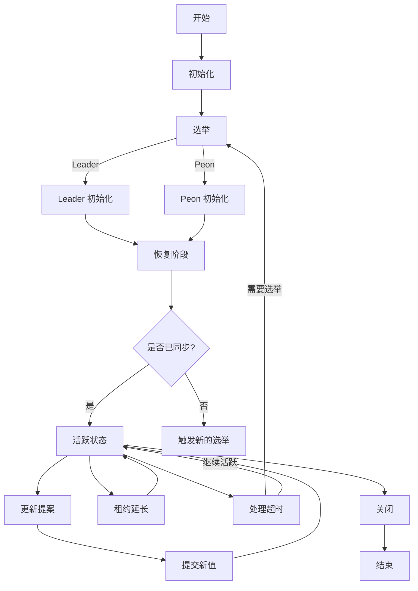

洞悉技术的本质，享受科技的乐趣 ，技术好的前提必然会高效沟通

# #一、Overview 

### 第一问题：你期望解决什么问题，核心问题是什么？

对于paxos小白来说就是高可用 三个节点，遇到故障，然后选出可用节点，然后使用相关产品足够用使用做项目了。

- 网上都说难，具体难何处不直到，到底解决什么问题不知道
- 网上都说好，具体好在哪里不清除，类似产品宣传都是99999然后不任何说明。
- 到这里根本看不下去了，根本不知道怎么用，解决什么问题。

### 第二个问题：通过看什么文章，阅读什么代码，经过真实cey

- *左耳朵耗子*  提供分布式入门相关资料

1. 首先，推荐的是 [@连城](https://www.zhihu.com/people/ab4aef6d6f80a7ccad3fd17da571edbd) 推荐的知行学社的《[分布式系统](https://zhida.zhihu.com/search?q=分布式系统&zhida_source=entity&is_preview=1)与Paxos算法视频课程》： ，视频讲的非常好，很适合入门，循序渐进慢慢推导，我自己看了不下5遍，视频讲解理解更深，推荐大家都看看，视频末尾说有后续介绍，一直没有找到，如果有哪位大侠找到了通知下我，不胜感激。

https://www.bilibili.com/video/BV1Lt411m7cW/

2. 推荐刘杰的《[分布式系统原理介绍](https://lrita.github.io/images/posts/distribution/%E5%88%86%E5%B8%83%E5%BC%8F%E5%8E%9F%E7%90%86%E4%BB%8B%E7%BB%8D.pdf)》 ，里面有关于paxos的详细介绍，例子非常多，也有包括paxos协议的证明过程，大而全，质量相当高的一份学习资料！

   

   

3. [@吴镝](https://www.zhihu.com/people/1353072704fa0f414d4c01068d5ec57d) 推荐的一份高质量ppt《可靠分布式系统基础 Paxos 的直观解释》，虽然是只是一份ppt没有讲解视频，但看ppt也能理解整个的paxos介绍和推导过程，写的很具体，配图很清晰明了；

   https://blog.openacid.com/algo/paxos/

https://drmingdrmer.github.io/tech/distributed/2015/11/11/paxos-slide.html

4. 微信的几篇公众号文章：《微信PaxosStore：深入浅出Paxos算法协议》（[微信PaxosStore：深入浅出Paxos算法协议](https://link.zhihu.com/?target=https%3A//mp.weixin.qq.com/s/aJoXSQo9-zmukN2RsiZ3_g) ）、《微信开源：生产级paxos类库PhxPaxos实现原理介绍》（[微信自研生产级paxos类库PhxPaxos实现原理介绍](https://link.zhihu.com/?target=https%3A//mp.weixin.qq.com/s/6VWUA5EDV2UIq4NqmQYWUA) ），文章写的都挺好，但是博文有个缺点是知识比较零散，不适合入门，需要有一定基础才好理解；

5. 技术类的东西怎么能只停留在看上面，肯定要看代码啊，推荐微信开源的phxpaxos：[https://github.com/tencent-wechat/phxpaxos，结合代码对协议理解更深，很多时候说了一大堆看代码就是一个if或者for循环，看了代码豁然开朗。](https://link.zhihu.com/?target=https%3A//github.com/tencent-wechat/phxpaxos%EF%BC%8C%E7%BB%93%E5%90%88%E4%BB%A3%E7%A0%81%E5%AF%B9%E5%8D%8F%E8%AE%AE%E7%90%86%E8%A7%A3%E6%9B%B4%E6%B7%B1%EF%BC%8C%E5%BE%88%E5%A4%9A%E6%97%B6%E5%80%99%E8%AF%B4%E4%BA%86%E4%B8%80%E5%A4%A7%E5%A0%86%E7%9C%8B%E4%BB%A3%E7%A0%81%E5%B0%B1%E6%98%AF%E4%B8%80%E4%B8%AAif%E6%88%96%E8%80%85for%E5%BE%AA%E7%8E%AF%EF%BC%8C%E7%9C%8B%E4%BA%86%E4%BB%A3%E7%A0%81%E8%B1%81%E7%84%B6%E5%BC%80%E6%9C%97%E3%80%82)

6. 如果英文可以的话，一定要看看paxos作者Lamport《paxos made simple》的论文

   

# 二 ceph 猜想验证

### ceph mon协调高可用方案 ：Paxos + Leveldb

 

Monitor基本上是由三类结构支撑起来的，

- 第一类是管理各种map和相关内容的PaxosService实例

- 第二类是Paxos实例，

- 第三类是对k/v store的封装，即MonitorDBStore实例。

   MonitorDBStore是处理数据存储相关的封装，用来将update的数据进行持久化。

Ceph Monitor的结构如上图所示，总体上分为PaxosService、Paxos、Leveldb三层，

- 其中PaxosService层将不同的元信息封装成单条kv，Leveldb层则作为最终的数据和log存储。
- 本文的关注重点在Paxos层，Paxos层对上层提供一致性的数据访问逻辑，在其看来所有的数据都是kv，上层的不同的元信息在这里共用同一个Paxos实例。基于Paxos算法，通过一系列的节点间通信来实现集群间一致性的读写以及故障检测和恢复。
- Paxos将整个过程分解为多个阶段，每个阶段达成一定的目的进而进入不同的状态。通过分层的思路使得整个实现相对简单清晰。

文件：Paxos.h Paxos.cc

~~~
void Paxos::dispatch(MonOpRequestRef op)
{
  ceph_assert(op->is_type_paxos());
  op->mark_paxos_event("dispatch");

  if (op->get_req()->get_type() != MSG_MON_PAXOS) {
    dout(0) << "Got unexpected message type " << op->get_req()->get_type()
	    << " in Paxos::dispatch, aborting!" << dendl;
    ceph_abort();
  }
  
  auto *req = op->get_req<MMonPaxos>();

  // election in progress?
  if (!mon.is_leader() && !mon.is_peon()) {
    dout(5) << "election in progress, dropping " << *req << dendl;
    return;    
  }

  // check sanity
  ceph_assert(mon.is_leader() || 
	      (mon.is_peon() && req->get_source().num() == mon.get_leader()));  

  // NOTE: these ops are defined in messages/MMonPaxos.h
  switch (req->op) {
    // learner
  case MMonPaxos::OP_COLLECT:
    handle_collect(op);
    break;
  case MMonPaxos::OP_LAST:
    handle_last(op);
    break;
  case MMonPaxos::OP_BEGIN:
    handle_begin(op);
    break;
  case MMonPaxos::OP_ACCEPT:
    handle_accept(op);
    break;		
  case MMonPaxos::OP_COMMIT:
    handle_commit(op);
    break;
  case MMonPaxos::OP_LEASE:
    handle_lease(op);
    break;
  case MMonPaxos::OP_LEASE_ACK:
    handle_lease_ack(op);
    break;
  default:
    ceph_abort();
  }
}

uncommitted_value
~~~

~~~
在 Paxos 协议的实现中，`uncommitted_value` 是一个重要的变量，它用于存储已经被接受但尚未提交的提案值（Proposal value）。这个变量在 Paxos 算法的不同阶段扮演着关键角色，特别是在领导者（Leader）和追随者（Peon）之间的通信和状态同步过程中。以下是 `uncommitted_value` 的主要作用和使用场景：

1. **存储已接受但未提交的值**：
   - 在 Paxos 的第二阶段（接受阶段），如果一个提案获得了多数追随者（Quorum）的接受，那么该提案的值会被存储在 `uncommitted_value` 中。此时，该值尚未被提交，因为 Paxos 协议要求在提交之前确保没有更高编号的提案存在。

2. **领导者恢复过程中的值同步**：
   - 在领导者的恢复过程中（例如，在 `collect` 和 `handle_last` 函数中），领导者会询问追随者是否有任何已接受但未提交的值。如果追随者返回了一个这样的值，领导者会更新自己的 `uncommitted_value`，以便在必要时提出这个值。

3. **处理提案超时和重新选举**：
   - 如果领导者在等待足够多的追随者接受其提案时超时（例如，在 `accept_timeout` 函数中），它可能会重新启动选举。在此过程中，`uncommitted_value` 可以确保即使在重新选举之后，先前被接受的值也不会丢失。

4. **提交已接受的值**：
   - 一旦领导者获得了多数追随者的接受，它会调用 `commit_start` 函数来提交提案。在提交过程中，`uncommitted_value` 中的值会被正式写入稳定存储，并更新 `last_committed` 版本号。

5. **保持系统状态的一致性**：
   - `uncommitted_value` 确保了即使在系统故障或领导者更换的情况下，已接受的值也不会丢失，从而保持了系统状态的一致性。当系统恢复时，可以通过 `uncommitted_value` 继续处理这些值，确保它们最终被提交。

6. **优化系统性能**：
   - 通过在 `uncommitted_value` 中存储已接受的值，Paxos 算法可以减少不必要的通信和提案重试，从而优化系统的性能。当系统恢复或重新选举后，可以直接使用 `uncommitted_value` 中的值，而不需要从头开始新的提案过程。

总之，`uncommitted_value` 在 Paxos 协议中起到了至关重要的作用，它不仅确保了提案值在系统故障或领导者更换时不会丢失，还有助于维护系统状态的一致性和优化系统性能。

~~~

### Paxos 算法在 Ceph 中的主要流程：

1. **初始化（Init）**：
   - 从稳定存储中加载 Paxos 变量。
   - 初始化性能计数器。

2. **选举（Election）**：

   - 确定 Leader 和 Peon。
   - Leader 初始化并开始恢复（Recovery）过程。

3. **恢复（Recovery）**：

   Ceph Paxos限制提案的发起按version顺序，前一条提案被commit后才能发起后一条，也就是说Recovery的时候最多只能有一条uncommitted数据，这种做法虽然牺牲了性能，但却很大程度的简化了Recovery阶段及整个一致性算法的实现，而这种性能的牺牲可以由Ceph层的聚合提交而弥补。

   

   - Leader 发起 `collect` 阶段，向所有 Peon 发送 `OP_COLLECT` 消息。
   - Peon 响应 `OP_COLLECT` 消息，发送 `OP_LAST` 回复。
   - Leader 处理 `OP_LAST` 消息，同步数据，可能触发新的选举或进入活跃状态。

4. **活跃状态（Active State）**：

   - Leader 和 Peon 处理读写请求。
   - 定期延长租约（Lease）。

5. **更新（Updating）**：
   - Leader 提出新的值，进入 `STATE_UPDATING`。
   - Peon 接受新值，如果接受成功，发送 `OP_ACCEPT` 消息。
   - Leader 收到足够的 `OP_ACCEPT` 消息后，进入 `commit` 阶段。

6. **提交（Commit）**：

   - Leader 将新值提交到存储，并通知所有 Peon。
   - Peon 收到 `OP_COMMIT` 消息后，更新本地状态。

7. **租约延长（Lease Renewal）**：
   - Leader 定期发送 `OP_LEASE` 消息给 Peon，延长租约。
   - Peon 确认租约延长，发送 `OP_LEASE_ACK`。

8. **处理超时（Handle Timeouts）**：
   - 如果在预定时间内未收到足够的响应，可能触发新的选举。

9. **关闭（Shutdown）**：

   - 取消所有事件，释放资源。

### 流程图：

mermaid(美人鱼)，用文本语法来描述文档图形的工具

请注意，这个流程图是一个高层次的概述，实际的 Paxos 算法实现要复杂得多，涉及许多细节和错误处理。此外，Ceph 的 Paxos 实现还包括对日志截断、成员变化处理、数据同步和一致性检查的高级处理。 

## 资料：

【1】 点击链接查看和 Kimi 智能助手的对话 https://kimi.moonshot.cn/share/crfbm8u0atp9b0sffim0

https://catkang.github.io/2016/07/17/ceph-monitor-and-paxos.html

https://tracker.ceph.com/issues/2805

https://tracker.ceph.com/issues/2622

文件：Paxos.h Paxos.cc

庖丁解Ceph之Paxos

https://www.jianshu.com/p/7302e79ab534

点击链接查看和 Kimi 智能助手的对话 https://kimi.moonshot.cn/share/cr7shc3df0jbga8amn50

- 
- 点击链接查看和 Kimi 智能助手的对话 https://kimi.moonshot.cn/share/crfbd3hivtdfjeis0ojg

### 沟通步骤

1. 准备一个图片，一段话，可以放在三页doc，三页ppt 描述你方案

   一、这个技术出现的背景、初衷和要达到什么样的目标或是要解决什么样的问题

   二、这个技术的优势和劣势分别是什么

   三、这个技术适用的场景。任何技术都有其适用的场景，离开了这个场景

   四、技术的组成部分和关键点。

   五、技术的底层原理和关键实现

   六、已有的实现和它之间的对比

2. 反馈：鸡蛋里挑骨头，经过客户，领导 ，公司认证，做事情价值和意义。听到否定愤怒反对 说明自己对这个事情还不了解。

3. 最后融合别人建议，然后完善你项目

## 三 参考

【1】 [Ceph剖析：Paxos算法实现](https://www.cnblogs.com/shanno/p/4011920.html)

