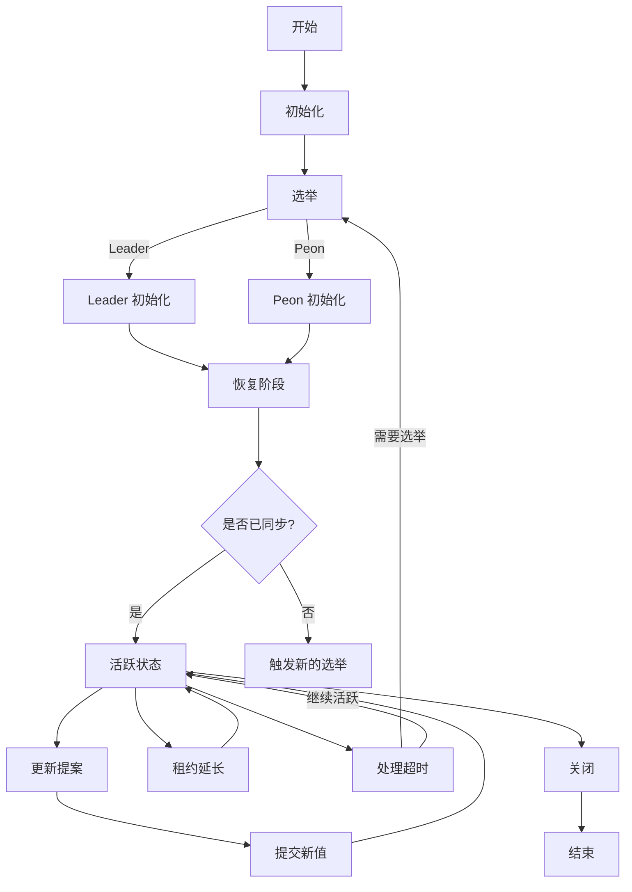

洞悉技术的本质，享受科技的乐趣 ，技术好的前提必然会高效沟通

# #一、Overview 

### 第一问题：你期望解决什么问题，核心问题是什么？

对于paxos小白来说就是高可用 三个节点，遇到故障，然后选出可用节点，然后使用相关产品足够用使用做项目了。

- 网上都说难，具体难何处不直到，到底解决什么问题不知道
- 网上都说好，具体好在哪里不清除，类似产品宣传都是99999然后不任何说明。
- 到这里根本看不下去了，根本不知道怎么用，解决什么问题。

### 第二个问题：通过看什么文章，阅读什么代码，经过真实cey

- *左耳朵耗子*  提供分布式入门相关资料

1. 首先，推荐的是 [@连城](https://www.zhihu.com/people/ab4aef6d6f80a7ccad3fd17da571edbd) 推荐的知行学社的《[分布式系统](https://zhida.zhihu.com/search?q=分布式系统&zhida_source=entity&is_preview=1)与Paxos算法视频课程》： ，视频讲的非常好，很适合入门，循序渐进慢慢推导，我自己看了不下5遍，视频讲解理解更深，推荐大家都看看，视频末尾说有后续介绍，一直没有找到，如果有哪位大侠找到了通知下我，不胜感激。

https://www.bilibili.com/video/BV1Lt411m7cW/

2. 推荐刘杰的《[分布式系统原理介绍](https://lrita.github.io/images/posts/distribution/%E5%88%86%E5%B8%83%E5%BC%8F%E5%8E%9F%E7%90%86%E4%BB%8B%E7%BB%8D.pdf)》 ，里面有关于paxos的详细介绍，例子非常多，也有包括paxos协议的证明过程，大而全，质量相当高的一份学习资料！

   

   

3. [@吴镝](https://www.zhihu.com/people/1353072704fa0f414d4c01068d5ec57d) 推荐的一份高质量ppt《可靠分布式系统基础 Paxos 的直观解释》，虽然是只是一份ppt没有讲解视频，但看ppt也能理解整个的paxos介绍和推导过程，写的很具体，配图很清晰明了；

   https://blog.openacid.com/algo/paxos/

https://drmingdrmer.github.io/tech/distributed/2015/11/11/paxos-slide.html

4. 微信的几篇公众号文章：《微信PaxosStore：深入浅出Paxos算法协议》（[微信PaxosStore：深入浅出Paxos算法协议](https://link.zhihu.com/?target=https%3A//mp.weixin.qq.com/s/aJoXSQo9-zmukN2RsiZ3_g) ）、《微信开源：生产级paxos类库PhxPaxos实现原理介绍》（[微信自研生产级paxos类库PhxPaxos实现原理介绍](https://link.zhihu.com/?target=https%3A//mp.weixin.qq.com/s/6VWUA5EDV2UIq4NqmQYWUA) ），文章写的都挺好，但是博文有个缺点是知识比较零散，不适合入门，需要有一定基础才好理解；
5. 技术类的东西怎么能只停留在看上面，肯定要看代码啊，推荐微信开源的phxpaxos：[https://github.com/tencent-wechat/phxpaxos，结合代码对协议理解更深，很多时候说了一大堆看代码就是一个if或者for循环，看了代码豁然开朗。](https://link.zhihu.com/?target=https%3A//github.com/tencent-wechat/phxpaxos%EF%BC%8C%E7%BB%93%E5%90%88%E4%BB%A3%E7%A0%81%E5%AF%B9%E5%8D%8F%E8%AE%AE%E7%90%86%E8%A7%A3%E6%9B%B4%E6%B7%B1%EF%BC%8C%E5%BE%88%E5%A4%9A%E6%97%B6%E5%80%99%E8%AF%B4%E4%BA%86%E4%B8%80%E5%A4%A7%E5%A0%86%E7%9C%8B%E4%BB%A3%E7%A0%81%E5%B0%B1%E6%98%AF%E4%B8%80%E4%B8%AAif%E6%88%96%E8%80%85for%E5%BE%AA%E7%8E%AF%EF%BC%8C%E7%9C%8B%E4%BA%86%E4%BB%A3%E7%A0%81%E8%B1%81%E7%84%B6%E5%BC%80%E6%9C%97%E3%80%82)
6. 如果英文可以的话，一定要看看paxos作者Lamport《paxos made simple》的论文
7. 

# 二 ceph 猜想验证

Ceph 的 Paxos 算法在实际应用中遇到了哪些挑战，又是如何克服这些挑战的？

Ceph 的 Paxos 算法在实际应用中遇到的挑战主要包括：

1. **成员变化（Membership Change）**：Ceph Paxos 需要处理集群成员的变化，包括节点的加入和移除。这需要一个称为 Probing 的阶段来发现并更新集群节点信息，同时处理节点之间的数据差异。在 Probing 状态下，Monitor 节点会相互发送 prob 消息来探测对方存在并生成交互 Monmap 信息。这个过程可能会影响服务的连续性，因为整个 Paxos 集群在 Probing 过程中会停止对外提供服务。

2. **日志截断（Log compaction）**：随着集群服务的进行，Paxos 的日志数据会不断增加，这不仅占用存储资源，还会增加日志回放的时间。为了解决这个问题，Ceph 引入了日志截断机制，通过删除旧的日志数据来节省空间。这个过程由参数 `paxos_min` 控制，默认保留的日志长度为 500。在需要恢复数据时，如果请求的数据版本小于 `first_committed`，则会在 Synchronizing 过程中进行数据的全同步。

3. **数据同步（Data Synchronization）**：当 Leader 和 Peon 之间的日志差距较大时，拉取并重放 Log 的时间会很长。为了减少这种延迟，Ceph Monitor 在选主之前通过 Synchronizing 阶段将所有参与 Paxos 节点的日志信息差距缩小到一个较小的区间，这个区间的长度由 `paxos_max_join_drift` 参数配置，默认为 10。

4. **性能与一致性的平衡**：Ceph Paxos 的实现中，为了简化 Recovery 逻辑，每次只能有一个提案在执行中，这可能会影响性能。但是，Ceph 通过上层的聚合提交等机制来减少对一致性协议执行的频率，从而在一定程度上弥补了性能的牺牲。

5. **容错和恢复（Fault Tolerance and Recovery）**：在分布式系统中，节点故障是常见问题。Ceph Paxos 需要能够在节点故障后正确恢复，同时保持数据的一致性。这涉及到复杂的 Recovery 逻辑，包括从 Peon 到 Leader 和 Leader 到 Peon 的双向数据恢复。

6. **网络分区和分区恢复**：在网络分区发生时，Ceph Paxos 需要能够处理这种情况，并在分区恢复后继续提供一致性服务。这可能需要额外的机制来检测分区并采取适当的恢复措施。

为了克服这些挑战，Ceph Paxos 采取了一系列措施，包括使用 Lease 机制来优化只读请求，以及在 Leader 和 Peon 之间进行存活检测，以确保在 Lease 超时或 Leader 收不到 Lease Ack 时触发新的 Election。此外，Ceph 还通过 State Machine System 来处理幂等操作，并在 commit 后真正写入到状态机，从而简化了一致性算法的实现。

文件：Paxos.h Paxos.cc

庖丁解Ceph之Paxos

https://www.jianshu.com/p/7302e79ab534

点击链接查看和 Kimi 智能助手的对话 https://kimi.moonshot.cn/share/cr7shc3df0jbga8amn50

User: 阅读代码 分析实现原理 推荐相关文章或者数据 // -*- mode:C++; tab-width:8; c-basic-offset:2; indent-tabs-mode:t -*- 
// vim: ts=8 sw=2 smarttab
/*
 * Ceph - scalable distributed file system
 *
 * Copyright (C) 2004-2006 Sage Weil <sage@newdream.net>
 *
 * This is free software; you can redistribute it and/or
 * modify it under the terms of the GNU Lesser General Public
 * License version 2.1, as published by the Free Software 
 * Foundation.  See file COPYING.
 * 
 */

/*
time---->

cccccccccccccccccca????????????????????????????????????????
cccccccccccccccccca????????????????????????????????????????
cccccccccccccccccca???????????????????????????????????????? leader
cccccccccccccccccc????????????????????????????????????????? 
ccccc?????????????????????????????????????????????????????? 

last_committed

pn_from
pn

a 12v 
b 12v
c 14v
d
e 12v
*/

/**
 * Paxos storage layout and behavior
 *
 * Currently, we use a key/value store to hold all the Paxos-related data, but
 * it can logically be depicted as this:
 *
 *  paxos:
 *    first_committed -> 1
 *     last_committed -> 4
 *		    1 -> value_1
 *		    2 -> value_2
 *		    3 -> value_3
 *		    4 -> value_4
 *
 * Since we are relying on a k/v store supporting atomic transactions, we can
 * guarantee that if 'last_committed' has a value of '4', then we have up to
 * version 4 on the store, and no more than that; the same applies to
 * 'first_committed', which holding '1' will strictly meaning that our lowest
 * version is 1.
 *
 * Each version's value (value_1, value_2, ..., value_n) is a blob of data,
 * incomprehensible to the Paxos. These values are proposed to the Paxos on
 * propose_new_value() and each one is a transaction encoded in a ceph::buffer::list.
 *
 * The Paxos will write the value to disk, associating it with its version,
 * but will take a step further: the value shall be decoded, and the operations
 * on that transaction shall be applied during the same transaction that will
 * write the value's encoded ceph::buffer::list to disk. This behavior ensures that
 * whatever is being proposed will only be available on the store when it is
 * applied by Paxos, which will then be aware of such new values, guaranteeing
 * the store state is always consistent without requiring shady workarounds.
 *
 * So, let's say that FooMonitor proposes the following transaction, neatly
 * encoded on a ceph::buffer::list of course:
 *
 *  Tx_Foo
 *    put(foo, last_committed, 3)
 *    put(foo, 3, foo_value_3)
 *    erase(foo, 2)
 *    erase(foo, 1)
 *    put(foo, first_committed, 3)
 *
 * And knowing that the Paxos is proposed Tx_Foo as a ceph::buffer::list, once it is
 * ready to commit, and assuming we are now committing version 5 of the Paxos,
 * we will do something along the lines of:
 *
 *  Tx proposed_tx;
 *  proposed_tx.decode(Tx_foo_ceph::buffer::list);
 *
 *  Tx our_tx;
 *  our_tx.put(paxos, last_committed, 5);
 *  our_tx.put(paxos, 5, Tx_foo_ceph::buffer::list);
 *  our_tx.append(proposed_tx);
 *
 *  store_apply(our_tx);
 *
 * And the store should look like this after we apply 'our_tx':
 *
 *  paxos:
 *    first_committed -> 1
 *     last_committed -> 5
 *		    1 -> value_1
 *		    2 -> value_2
 *		    3 -> value_3
 *		    4 -> value_4
 *		    5 -> Tx_foo_ceph::buffer::list
 *  foo:
 *    first_committed -> 3
 *     last_committed -> 3
 *		    3 -> foo_value_3
 *
 */

#ifndef CEPH_MON_PAXOS_H
#define CEPH_MON_PAXOS_H

#include "include/types.h"
#include "mon_types.h"
#include "include/buffer.h"
#include "msg/msg_types.h"
#include "include/Context.h"
#include "common/perf_counters.h"
#include <errno.h>

#include "MonitorDBStore.h"
#include "mon/MonOpRequest.h"

class Monitor;
class MMonPaxos;

enum {
  l_paxos_first = 45800,
  l_paxos_start_leader,
  l_paxos_start_peon,
  l_paxos_restart,
  l_paxos_refresh,
  l_paxos_refresh_latency,
  l_paxos_begin,
  l_paxos_begin_keys,
  l_paxos_begin_bytes,
  l_paxos_begin_latency,
  l_paxos_commit,
  l_paxos_commit_keys,
  l_paxos_commit_bytes,
  l_paxos_commit_latency,
  l_paxos_collect,
  l_paxos_collect_keys,
  l_paxos_collect_bytes,
  l_paxos_collect_latency,
  l_paxos_collect_uncommitted,
  l_paxos_collect_timeout,
  l_paxos_accept_timeout,
  l_paxos_lease_ack_timeout,
  l_paxos_lease_timeout,
  l_paxos_store_state,
  l_paxos_store_state_keys,
  l_paxos_store_state_bytes,
  l_paxos_store_state_latency,
  l_paxos_share_state,
  l_paxos_share_state_keys,
  l_paxos_share_state_bytes,
  l_paxos_new_pn,
  l_paxos_new_pn_latency,
  l_paxos_last,
};

// i am one state machine.
/**
 * This library is based on the Paxos algorithm, but varies in a few key ways:
 *  1- Only a single new value is generated at a time, simplifying the recovery logic.
 *  2- Nodes track "committed" values, and share them generously (and trustingly)
 *  3- A 'leasing' mechanism is built-in, allowing nodes to determine when it is 
 *     safe to "read" their copy of the last committed value.
 *
 * This provides a simple replication substrate that services can be built on top of.
 * See PaxosService.h
 */
  class Paxos {
    /**
   * @defgroup Paxos_h_class Paxos
   * @{
     */
    /**
   * The Monitor to which this Paxos class is associated with.
     */
    Monitor &mon;

  /// perf counter for internal instrumentations
  PerfCounters *logger;

  void init_logger();

  // my state machine info
  const std::string paxos_name;

  friend class Monitor;
  friend class PaxosService;

  std::list<std::string> extra_state_dirs;

  // LEADER+PEON

  // -- generic state --
public:
  /**
   * @defgroup Paxos_h_states States on which the leader/peon may be.
   * @{
      */
    enum {

    /**
     * Leader/Peon is in Paxos' Recovery state
     */
    STATE_RECOVERING,
    /**
     * Leader/Peon is idle, and the Peon may or may not have a valid lease.
     */
    STATE_ACTIVE,
    /**
     * Leader/Peon is updating to a new value.
     */
    STATE_UPDATING,
    /*
     * Leader proposing an old value
     */
    STATE_UPDATING_PREVIOUS,
    /*
     * Leader/Peon is writing a new commit.  readable, but not
     * writeable.
     */
    STATE_WRITING,
    /*
     * Leader/Peon is writing a new commit from a previous round.
     */
    STATE_WRITING_PREVIOUS,
    // leader: refresh following a commit
    STATE_REFRESH,
    // Shutdown after WRITING or WRITING_PREVIOUS
    STATE_SHUTDOWN
  };

  /**
   * Obtain state name from constant value.
      *
   * @note This function will raise a fatal error if @p s is not
   *	   a valid state value.
      *
   * @param s State value.
   * @return The state's name.
      */
    static const std::string get_statename(int s) {

    switch (s) {
    case STATE_RECOVERING:
      return "recovering";
    case STATE_ACTIVE:
      return "active";
    case STATE_UPDATING:
      return "updating";
    case STATE_UPDATING_PREVIOUS:
      return "updating-previous";
    case STATE_WRITING:
      return "writing";
    case STATE_WRITING_PREVIOUS:
      return "writing-previous";
    case STATE_REFRESH:
      return "refresh";
    case STATE_SHUTDOWN:
      return "shutdown";
    default:
      return "UNKNOWN";
    }
  }

private:
  /**
   * The state we are in.
      */
    int state;
    /**
   * @}
      */
    int commits_started = 0;

  ceph::condition_variable shutdown_cond;

public:
  /**
   * Check if we are recovering.
      *
   * @return 'true' if we are on the Recovering state; 'false' otherwise.
      */
    bool is_recovering() const { return (state == STATE_RECOVERING); }
    /**
   * Check if we are active.
      *
   * @return 'true' if we are on the Active state; 'false' otherwise.
      */
    bool is_active() const { return state == STATE_ACTIVE; }
    /**
   * Check if we are updating.
      *
   * @return 'true' if we are on the Updating state; 'false' otherwise.
      */
    bool is_updating() const { return state == STATE_UPDATING; }

  /**
   * Check if we are updating/proposing a previous value from a
   * previous quorum
      */
    bool is_updating_previous() const { return state == STATE_UPDATING_PREVIOUS; }

  /// @return 'true' if we are writing an update to disk
  bool is_writing() const { return state == STATE_WRITING; }

  /// @return 'true' if we are writing an update-previous to disk
  bool is_writing_previous() const { return state == STATE_WRITING_PREVIOUS; }

  /// @return 'true' if we are refreshing an update just committed
  bool is_refresh() const { return state == STATE_REFRESH; }

  /// @return 'true' if we are in the process of shutting down
  bool is_shutdown() const { return state == STATE_SHUTDOWN; }

private:
  /**
   * @defgroup Paxos_h_recovery_vars Common recovery-related member variables
   * @note These variables are common to both the Leader and the Peons.
   * @{
      */
    /**
      *
      */
    version_t first_committed;
    /**
   * Last Proposal Number
      *
   * @todo Expand description
      */
    version_t last_pn;
    /**
   * Last committed value's version.
      *
   * On both the Leader and the Peons, this is the last value's version that 
   * was accepted by a given quorum and thus committed, that this instance 
   * knows about.
      *
   * @note It may not be the last committed value's version throughout the
   *	   system. If we are a Peon, we may have not been part of the quorum
   *	   that accepted the value, and for this very same reason we may still
   *	   be a (couple of) version(s) behind, until we learn about the most
   *	   recent version. This should only happen if we are not active (i.e.,
   *	   part of the quorum), which should not happen if we are up, running
   *	   and able to communicate with others -- thus able to be part of the
   *	   monmap and trigger new elections.
      */
    version_t last_committed;
    /**
   * Last committed value's time.
      *
   * When the commit finished.
      */
    utime_t last_commit_time;
    /**
   * The last Proposal Number we have accepted.
      *
   * On the Leader, it will be the Proposal Number picked by the Leader 
   * itself. On the Peon, however, it will be the proposal sent by the Leader
   * and it will only be updated if its value is higher than the one
   * already known by the Peon.
      */
    version_t accepted_pn;
    /**
   * The last_committed epoch of the leader at the time we accepted the last pn.
      *
   * This has NO SEMANTIC MEANING, and is there only for the debug output.
      */
    version_t accepted_pn_from;
    /**
   * Map holding the first committed version by each quorum member.
      *
   * The versions kept in this map are updated during the collect phase.
   * When the Leader starts the collect phase, each Peon will reply with its
   * first committed version, which will then be kept in this map.
      */
    std::map<int,version_t> peer_first_committed;
    /**
   * Map holding the last committed version by each quorum member.
      *
   * The versions kept in this map are updated during the collect phase.
   * When the Leader starts the collect phase, each Peon will reply with its
   * last committed version, which will then be kept in this map.
      */
    std::map<int,version_t> peer_last_committed;
    /**
   * @}
      */

  // active (phase 2)
  /**
   * @defgroup Paxos_h_active_vars Common active-related member variables
   * @{
      */
    /**
   * When does our read lease expires.
      *
   * Instead of performing a full commit each time a read is requested, we
   * keep leases. Each lease will have an expiration date, which may or may
   * not be extended. 
      */
    ceph::real_clock::time_point lease_expire;
    /**
   * List of callbacks waiting for our state to change into STATE_ACTIVE.
      */
    std::list<Context*> waiting_for_active;
    /**
   * List of callbacks waiting for the chance to read a version from us.
      *
   * Each entry on the list may result from an attempt to read a version that
   * wasn't available at the time, or an attempt made during a period during
   * which we could not satisfy the read request. The first case happens if
   * the requested version is greater than our last committed version. The
   * second scenario may happen if we are recovering, or if we don't have a
   * valid lease.
      *
   * The list will be woken up once we change to STATE_ACTIVE with an extended
   * lease -- which can be achieved if we have everyone on the quorum on board
   * with the latest proposal, or if we don't really care about the remaining
   * uncommitted values --, or if we're on a quorum of one.
      */
    std::list<Context*> waiting_for_readable;
    /**
   * @}
      */

  // -- leader --
  // recovery (paxos phase 1)
  /**
   * @defgroup Paxos_h_leader_recovery Leader-specific Recovery-related vars
   * @{
      */
    /**
   * Number of replies to the collect phase we've received so far.
      *
   * This variable is reset to 1 each time we start a collect phase; it is
   * incremented each time we receive a reply to the collect message, and
   * is used to determine whether or not we have received replies from the
   * whole quorum.
      */
    unsigned   num_last;
    /**
   * Uncommitted value's version.
      *
   * If we have, or end up knowing about, an uncommitted value, then its
   * version will be kept in this variable.
      *
   * @note If this version equals @p last_committed+1 when we reach the final
   *	   steps of recovery, then the algorithm will assume this is a value
   *	   the Leader does not know about, and trustingly the Leader will 
   *	   propose this version's value.
      */
    version_t  uncommitted_v;
    /**
   * Uncommitted value's Proposal Number.
      *
   * We use this variable to assess if the Leader should take into consideration
   * an uncommitted value sent by a Peon. Given that the Peon will send back to
   * the Leader the last Proposal Number it accepted, the Leader will be able
   * to infer if this value is more recent than the one the Leader has, thus
   * more relevant.
      */
    version_t  uncommitted_pn;
    /**
   * Uncommitted Value.
      *
   * If the system fails in-between the accept replies from the Peons and the
   * instruction to commit from the Leader, then we may end up with accepted
   * but yet-uncommitted values. During the Leader's recovery, it will attempt
   * to bring the whole system to the latest state, and that means committing
   * past accepted but uncommitted values.
      *
   * This variable will hold an uncommitted value, which may originate either
   * on the Leader, or learnt by the Leader from a Peon during the collect
   * phase.
      */
    ceph::buffer::list uncommitted_value;
    /**
   * Used to specify when an on-going collect phase times out.
      */
    Context    *collect_timeout_event;
    /**
   * @}
      */

  // active
  /**
   * @defgroup Paxos_h_leader_active Leader-specific Active-related vars
   * @{
      */
    /**
   * Set of participants (Leader & Peons) that have acked a lease extension.
      *
   * Each Peon that acknowledges a lease extension will have its place in this
   * set, which will be used to account for all the acks from all the quorum
   * members, guaranteeing that we trigger new elections if some don't ack in
   * the expected timeframe.
      */
    std::set<int>   acked_lease;
    /**
   * Callback responsible for extending the lease periodically.
      */
    Context    *lease_renew_event;
    /**
   * Callback to trigger new elections once the time for acks is out.
      */
    Context    *lease_ack_timeout_event;
    /**
   * @}
      */
    /**
   * @defgroup Paxos_h_peon_active Peon-specific Active-related vars
   * @{
      */
    /**
   * Callback to trigger new elections when the Peon's lease times out.
      *
   * If the Peon's lease is extended, this callback will be reset (i.e.,
   * we cancel the event and reschedule a new one with starting from the
   * beginning).
      */
    Context    *lease_timeout_event;
    /**
   * @}
      */

  // updating (paxos phase 2)
  /**
   * @defgroup Paxos_h_leader_updating Leader-specific Updating-related vars
   * @{
      */
    /**
   * New Value being proposed to the Peons.
      *
   * This ceph::buffer::list holds the value the Leader is proposing to the Peons, and
   * that will be committed if the Peons do accept the proposal.
      */
    ceph::buffer::list new_value;
    /**
   * Set of participants (Leader & Peons) that accepted the new proposed value.
      *
   * This set is used to keep track of those who have accepted the proposed
   * value, so the leader may know when to issue a commit (when a majority of
   * participants has accepted the proposal), and when to extend the lease
   * (when all the quorum members have accepted the proposal).
      */
    std::set<int>   accepted;
    /**
   * Callback to trigger a new election if the proposal is not accepted by the
   * full quorum within a given timeframe.
      *
   * If the full quorum does not accept the proposal, then it means that the
   * Leader may no longer be recognized as the leader, or that the quorum has
   * changed, and the value may have not reached all the participants. Thus,
   * the leader must call new elections, and go through a recovery phase in
   * order to propagate the new value throughout the system.
      *
   * This does not mean that we won't commit. We will commit as soon as we
   * have a majority of acceptances. But if we do not have full acceptance
   * from the quorum, then we cannot extend the lease, as some participants
   * may not have the latest committed value.
      */
    Context    *accept_timeout_event;

  /**
   * List of callbacks waiting for it to be possible to write again.
      *
   * @remarks It is not possible to write if we are not the Leader, or we are
   *	      not on the active state, or if the lease has expired.
      */
    std::list<Context*> waiting_for_writeable;

  /**
   * Pending proposal transaction
      *
   * This is the transaction that is under construction and pending
   * proposal.  We will add operations to it until we decide it is
   * time to start a paxos round.
      */
    MonitorDBStore::TransactionRef pending_proposal;

  /**
   * Finishers for pending transaction
      *
   * These are waiting for updates in the pending proposal/transaction
   * to be committed.
      */
    std::list<Context*> pending_finishers;

  /**
   * Finishers for committing transaction
      *
   * When the pending_proposal is submitted, pending_finishers move to
   * this list.  When it commits, these finishers are notified.
      */
    std::list<Context*> committing_finishers;
    /**
   * This function re-triggers pending_ and committing_finishers
   * safely, so as to maintain existing system invariants. In particular
   * we maintain ordering by triggering committing before pending, and
   * we clear out pending_finishers prior to any triggers so that
   * we don't trigger asserts on them being empty. You should
   * use it instead of sending -EAGAIN to them with finish_contexts.
      */
    void reset_pending_committing_finishers();

  /**
   * @defgroup Paxos_h_sync_warns Synchronization warnings
   * @todo Describe these variables
   * @{
      */
    utime_t last_clock_drift_warn;
    int clock_drift_warned;
    /**
   * @}
      */

  /**
   * Should be true if we have proposed to trim, or are in the middle of
   * trimming; false otherwise.
      */
    bool trimming;

  /**
   * true if we want trigger_propose to *not* propose (yet)
      */
    bool plugged = false;

  /**
   * @defgroup Paxos_h_callbacks Callback classes.
   * @{
      */
    /**
   * Callback class responsible for handling a Collect Timeout.
      */
    class C_CollectTimeout;
    /**
   * Callback class responsible for handling an Accept Timeout.
      */
    class C_AcceptTimeout;
    /**
   * Callback class responsible for handling a Lease Ack Timeout.
      */
    class C_LeaseAckTimeout;

  /**
   * Callback class responsible for handling a Lease Timeout.
      */
    class C_LeaseTimeout;

  /**
   * Callback class responsible for handling a Lease Renew Timeout.
      */
    class C_LeaseRenew;

  class C_Trimmed;
  /**
   *
   */
public:
  class C_Proposal : public Context {
    Context *proposer_context;
  public:
    ceph::buffer::list bl;
    // for debug purposes. Will go away. Soon.
    bool proposed;
    utime_t proposal_time;

    C_Proposal(Context *c, ceph::buffer::list& proposal_bl) :
    proposer_context(c),
    bl(proposal_bl),
    proposed(false),
    proposal_time(ceph_clock_now())
      { }
    
    void finish(int r) override {
      if (proposer_context) {
    proposer_context->complete(r);
    proposer_context = NULL;
      }
    }
  };
  /**
   * @}
      */
  private:
    /**
   * @defgroup Paxos_h_election_triggered Steps triggered by an election.
      *
   * @note All these functions play a significant role in the Recovery Phase,
   *	   which is triggered right after an election once someone becomes
   *	   the Leader.
   * @{
      */
    /**
   * Create a new Proposal Number and propose it to the Peons.
      *
   * This function starts the Recovery Phase, which can be directly mapped
   * onto the original Paxos' Prepare phase. Basically, we'll generate a
   * Proposal Number, taking @p oldpn into consideration, and we will send
   * it to a quorum, along with our first and last committed versions. By
   * sending these information in a message to the quorum, we expect to
   * obtain acceptances from a majority, allowing us to commit, or be
   * informed of a higher Proposal Number known by one or more of the Peons
   * in the quorum.
      *
   * @pre We are the Leader.
   * @post Recovery Phase initiated by sending messages to the quorum.
      *
   * @param oldpn A proposal number taken as the highest known so far, that
   *		  should be taken into consideration when generating a new 
   *		  Proposal Number for the Recovery Phase.
      */
    void collect(version_t oldpn);
    /**
   * Handle the reception of a collect message from the Leader and reply
   * accordingly.
      *
   * Once a Peon receives a collect message from the Leader it will reply
   * with its first and last committed versions, as well as information so
   * the Leader may know if its Proposal Number was, or was not, accepted by
   * the Peon. The Peon will accept the Leader's Proposal Number if it is
   * higher than the Peon's currently accepted Proposal Number. The Peon may
   * also inform the Leader of accepted but uncommitted values.
      *
   * @invariant The message is an operation of type OP_COLLECT.
   * @pre We are a Peon.
   * @post Replied to the Leader, accepting or not accepting its PN.
      *
   * @param collect The collect message sent by the Leader to the Peon.
      */
    void handle_collect(MonOpRequestRef op);
    /**
   * Handle a response from a Peon to the Leader's collect phase.
      *
   * The received message will state the Peon's last committed version, as 
   * well as its last proposal number. This will lead to one of the following
   * scenarios: if the replied Proposal Number is equal to the one we proposed,
   * then the Peon has accepted our proposal, and if all the Peons do accept
   * our Proposal Number, then we are allowed to proceed with the commit;
   * however, if a Peon replies with a higher Proposal Number, we assume he
   * knows something we don't and the Leader will have to abort the current
   * proposal in order to retry with the Proposal Number specified by the Peon.
   * It may also occur that the Peon replied with a lower Proposal Number, in
   * which case we assume it is a reply to an older value and we'll simply
   * drop it.
   * This function will also check if the Peon replied with an accepted but
   * yet uncommitted value. In this case, if its version is higher than our
   * last committed value by one, we assume that the Peon knows a value from a
   * previous proposal that has never been committed, and we should try to
   * commit that value by proposing it next. On the other hand, if that is
   * not the case, we'll assume it is an old, uncommitted value, we do not
   * care about and we'll consider the system active by extending the leases.
      *
   * @invariant The message is an operation of type OP_LAST.
   * @pre We are the Leader.
   * @post We initiate a commit, or we retry with a higher Proposal Number, 
   *	   or we drop the message.
   * @post We move from STATE_RECOVERING to STATE_ACTIVE.
      *
   * @param last The message sent by the Peon to the Leader.
      */
    void handle_last(MonOpRequestRef op);
    /**
   * The Recovery Phase timed out, meaning that a significant part of the
   * quorum does not believe we are the Leader, and we thus should trigger new
   * elections.
      *
   * @pre We believe to be the Leader.
   * @post Trigger new elections.
      */
    void collect_timeout();
    /**
   * @}
      */

  /**
   * @defgroup Paxos_h_updating_funcs Functions used during the Updating State
   * 
   * These functions may easily be mapped to the original Paxos Algorithm's 
   * phases. 
      *
   * Taking into account the algorithm can be divided in 4 phases (Prepare,
   * Promise, Accept Request and Accepted), we can easily map Paxos::begin to
   * both the Prepare and Accept Request phases; the Paxos::handle_begin to
   * the Promise phase; and the Paxos::handle_accept to the Accepted phase.
   * @{
      */
    /**
   * Start a new proposal with the intent of committing @p value.
      *
   * If we are alone on the system (i.e., a quorum of one), then we will
   * simply commit the value, but if we are not alone, then we need to propose
   * the value to the quorum.
      *
   * @pre We are the Leader
   * @pre We are on STATE_ACTIVE
   * @post We commit, if we are alone, or we send a message to each quorum 
   *	   member
   * @post We are on STATE_ACTIVE, if we are alone, or on 
   *	   STATE_UPDATING otherwise
      *
   * @param value The value being proposed to the quorum
      */
    void begin(ceph::buffer::list& value);
    /**
   * Accept or decline (by ignoring) a proposal from the Leader.
      *
   * We will decline the proposal (by ignoring it) if we have promised to
   * accept a higher numbered proposal. If that is not the case, we will
   * accept it and accordingly reply to the Leader.
      *
   * @pre We are a Peon
   * @pre We are on STATE_ACTIVE
   * @post We are on STATE_UPDATING if we accept the Leader's proposal
   * @post We send a reply message to the Leader if we accept its proposal
      *
   * @invariant The received message is an operation of type OP_BEGIN
      *
   * @param begin The message sent by the Leader to the Peon during the
   *		  Paxos::begin function
      *
      */
    void handle_begin(MonOpRequestRef op);
    /**
   * Handle an Accept message sent by a Peon.
      *
   * In order to commit, the Leader has to receive accepts from a majority of
   * the quorum. If that does happen, then the Leader may proceed with the
   * commit. However, the Leader needs the accepts from all the quorum members
   * in order to extend the lease and move on to STATE_ACTIVE.
      *
   * This function handles these two situations, accounting for the amount of
   * received accepts.
      *
   * @pre We are the Leader
   * @pre We are on STATE_UPDATING
   * @post We are on STATE_ACTIVE if we received accepts from the full quorum
   * @post We extended the lease if we moved on to STATE_ACTIVE
   * @post We are on STATE_UPDATING if we didn't received accepts from the
   *	   full quorum
   * @post We have committed if we received accepts from a majority
      *
   * @invariant The received message is an operation of type OP_ACCEPT
      *
   * @param accept The message sent by the Peons to the Leader during the
   *		   Paxos::handle_begin function
      */
    void handle_accept(MonOpRequestRef op);
    /**
   * Trigger a fresh election.
      *
   * During Paxos::begin we set a Callback of type Paxos::C_AcceptTimeout in
   * order to limit the amount of time we spend waiting for Accept replies.
   * This callback will call Paxos::accept_timeout when it is fired.
      *
   * This is essential to the algorithm because there may be the chance that
   * we are no longer the Leader (i.e., others don't believe in us) and we
   * are getting ignored, or we dropped out of the quorum and haven't realised
   * it. So, our only option is to trigger fresh elections.
      *
   * @pre We are the Leader
   * @pre We are on STATE_UPDATING
   * @post Triggered fresh elections
      */
    void accept_timeout();
    /**
   * @}
      */

  utime_t commit_start_stamp;
  friend struct C_Committed;

  /**
   * Commit a value throughout the system.
      *
   * The Leader will cancel the current lease (as it was for the old value),
   * and will store the committed value locally. It will then instruct every
   * quorum member to do so as well.
      *
   * @pre We are the Leader
   * @pre We are on STATE_UPDATING
   * @pre A majority of quorum members accepted our proposal
   * @post Value locally stored
   * @post Quorum members instructed to commit the new value.
      */
    void commit_start();
    void commit_finish();   ///< finish a commit after txn becomes durable
    void abort_commit();    ///< Handle commit finish after shutdown started
    /**
   * Commit the new value to stable storage as being the latest available
   * version.
      *
   * @pre We are a Peon
   * @post The new value is locally stored
   * @post Fire up the callbacks waiting on waiting_for_commit
      *
   * @invariant The received message is an operation of type OP_COMMIT
      *
   * @param commit The message sent by the Leader to the Peon during
   *		   Paxos::commit
      */
    void handle_commit(MonOpRequestRef op);
    /**
   * Extend the system's lease.
      *
   * This means that the Leader considers that it should now safe to read from
   * any node on the system, since every quorum member is now in possession of
   * the latest version. Therefore, the Leader will send a message stating just
   * this to each quorum member, and will impose a limited timeframe during
   * which acks will be accepted. If there aren't as many acks as expected
   * (i.e, if at least one quorum member does not ack the lease) during this
   * timeframe, then we will force fresh elections.
      *
   * @pre We are the Leader
   * @pre We are on STATE_ACTIVE
   * @post A message extending the lease is sent to each quorum member
   * @post A timeout callback is set to limit the amount of time we will wait
   *	   for lease acks.
   * @post A timer is set in order to renew the lease after a certain amount
   *	   of time.
      */
    void extend_lease();
    /**
   * Update the lease on the Peon's side of things.
      *
   * Once a Peon receives a Lease message, it will update its lease_expire
   * variable, reply to the Leader acknowledging the lease update and set a
   * timeout callback to be fired upon the lease's expiration. Finally, the
   * Peon will fire up all the callbacks waiting for it to become active,
   * which it just did, and all those waiting for it to become readable,
   * which should be true if the Peon's lease didn't expire in the mean time.
      *
   * @pre We are a Peon
   * @post We update the lease accordingly
   * @post A lease timeout callback is set
   * @post Move to STATE_ACTIVE
   * @post Fire up all the callbacks waiting for STATE_ACTIVE
   * @post Fire up all the callbacks waiting for readable if we are readable
   * @post Ack the lease to the Leader
      *
   * @invariant The received message is an operation of type OP_LEASE
      *
   * @param lease The message sent by the Leader to the Peon during the
   *	    Paxos::extend_lease function
      */
    void handle_lease(MonOpRequestRef op);
    /**
   * Account for all the Lease Acks the Leader receives from the Peons.
      *
   * Once the Leader receives all the Lease Acks from the Peons, it will be
   * able to cancel the Lease Ack timeout callback, thus avoiding calling
   * fresh elections.
      *
   * @pre We are the Leader
   * @post Cancel the Lease Ack timeout callback if we receive acks from all
   *	   the quorum members
      *
   * @invariant The received message is an operation of type OP_LEASE_ACK
      *
   * @param ack The message sent by a Peon to the Leader during the
   *		Paxos::handle_lease function
      */
    void handle_lease_ack(MonOpRequestRef op);
    /**
   * Call fresh elections because at least one Peon didn't acked our lease.
      *
   * @pre We are the Leader
   * @pre We are on STATE_ACTIVE
   * @post Trigger fresh elections
      */
    void lease_ack_timeout();
    /**
   * Extend lease since we haven't had new committed values meanwhile.
      *
   * @pre We are the Leader
   * @pre We are on STATE_ACTIVE
   * @post Go through with Paxos::extend_lease
      */
    void lease_renew_timeout();
    /**
   * Call fresh elections because the Peon's lease expired without being
   * renewed or receiving a fresh lease.
      *
   * This means that the Peon is no longer assumed as being in the quorum
   * (or there is no Leader to speak of), so just trigger fresh elections
   * to circumvent this issue.
      *
   * @pre We are a Peon
   * @post Trigger fresh elections
      */
    void lease_timeout();        // on peon, if lease isn't extended

  /// restart the lease timeout timer
  void reset_lease_timeout();

  /**
   * Cancel all of Paxos' timeout/renew events. 
      */
    void cancel_events();
    /**
   * Shutdown this Paxos machine
      */
    void shutdown();

  /**
   * Generate a new Proposal Number based on @p gt
      *
   * @todo Check what @p gt actually means and what its usage entails
   * @param gt A hint for the geration of the Proposal Number
   * @return A globally unique, monotonically increasing Proposal Number
      */
    version_t get_new_proposal_number(version_t gt=0);

  /**
   * @todo document sync function
      */
    void warn_on_future_time(utime_t t, entity_name_t from);

  /**
   * Begin proposing the pending_proposal.
      */
    void propose_pending();

  /**
   * refresh state from store
      *
   * Called when we have new state for the mon to consume.  If we return false,
   * abort (we triggered a bootstrap).
      *
   * @returns true on success, false if we are now bootstrapping
      */
    bool do_refresh();

  void commit_proposal();
  void finish_round();

public:
  /**
   * @param m A monitor
   * @param name A name for the paxos service. It serves as the naming space
   * of the underlying persistent storage for this service.
      */
    Paxos(Monitor &m, const std::string &name) 
		 : mon(m),
		   logger(NULL),
		   paxos_name(name),
		   state(STATE_RECOVERING),
		   first_committed(0),
		   last_pn(0),
		   last_committed(0),
		   accepted_pn(0),
		   accepted_pn_from(0),
		   num_last(0),
		   uncommitted_v(0), uncommitted_pn(0),
		   collect_timeout_event(0),
		   lease_renew_event(0),
		   lease_ack_timeout_event(0),
		   lease_timeout_event(0),
		   accept_timeout_event(0),
		   clock_drift_warned(0),
		   trimming(false) { }

  ~Paxos() {
    delete logger;
  }

  const std::string get_name() const {
    return paxos_name;
  }

  void dispatch(MonOpRequestRef op);

  void read_and_prepare_transactions(MonitorDBStore::TransactionRef tx,
				     version_t from, version_t last);

  void init();

  /**
   * dump state info to a formatter
      */
    void dump_info(ceph::Formatter *f);

  /**
   * This function runs basic consistency checks. Importantly, if
   * it is inconsistent and shouldn't be, it asserts out.
      *
   * @return True if consistent, false if not.
      */
    bool is_consistent();

  void restart();
  /**
   * Initiate the Leader after it wins an election.
      *
   * Once an election is won, the Leader will be initiated and there are two
   * possible outcomes of this method: the Leader directly jumps to the active
   * state (STATE_ACTIVE) if it believes to be the only one in the quorum, or
   * will start recovering (STATE_RECOVERING) by initiating the collect phase. 
      *
   * @pre Our monitor is the Leader.
   * @post We are either on STATE_ACTIVE if we're the only one in the quorum,
   *	   or on STATE_RECOVERING otherwise.
      */
    void leader_init();
    /**
   * Initiate a Peon after it loses an election.
      *
   * If we are a Peon, then there must be a Leader and we are not alone in the
   * quorum, thus automatically assume we are on STATE_RECOVERING, which means
   * we will soon be enrolled into the Leader's collect phase.
      *
   * @pre There is a Leader, and it?s about to start the collect phase.
   * @post We are on STATE_RECOVERING and will soon receive collect phase's 
   *	   messages.
      */
    void peon_init();

  /**
   * Include an incremental state of values, ranging from peer_first_committed
   * to the last committed value, on the message m
      *
   * @param m A message
   * @param peer_first_committed Lowest version to take into account
   * @param peer_last_committed Highest version to take into account
      */
    void share_state(MMonPaxos *m, version_t peer_first_committed,
		   version_t peer_last_committed);
    /**
   * Store on disk a state that was shared with us
      *
   * Basically, we received a set of version. Or just one. It doesn't matter.
   * What matters is that we have to stash it in the store. So, we will simply
   * write every single ceph::buffer::list into their own versions on our side (i.e.,
   * onto paxos-related keys), and then we will decode those same ceph::buffer::lists
   * we just wrote and apply the transactions they hold. We will also update
   * our first and last committed values to point to the new values, if need
   * be. All this is done tightly wrapped in a transaction to ensure we
   * enjoy the atomicity guarantees given by our awesome k/v store.
      *
   * @param m A message
   * @returns true if we stored something new; false otherwise
      */
    bool store_state(MMonPaxos *m);
    void _sanity_check_store();

  /**
   * Helper function to decode a ceph::buffer::list into a transaction and append it
   * to another transaction.
      *
   * This function is used during the Leader's commit and during the
   * Paxos::store_state in order to apply the ceph::buffer::list's transaction onto
   * the store.
      *
   * @param t The transaction to which we will append the operations
   * @param bl A ceph::buffer::list containing an encoded transaction
      */
    static void decode_append_transaction(MonitorDBStore::TransactionRef t,
					ceph::buffer::list& bl) {

    auto vt(std::make_shared<MonitorDBStore::Transaction>());
    auto it = bl.cbegin();
    vt->decode(it);
    t->append(vt);
  }

  /**
   * @todo This appears to be used only by the OSDMonitor, and I would say
   *	   its objective is to allow a third-party to have a "private"
   *	   state dir. -JL
      */
    void add_extra_state_dir(std::string s) {

    extra_state_dirs.push_back(s);
  }

  // -- service interface --
  /**
   * Add c to the list of callbacks waiting for us to become active.
      *
   * @param c A callback
      */
    void wait_for_active(MonOpRequestRef op, Context *c) {

    if (op)
      op->mark_event("paxos:wait_for_active");
    waiting_for_active.push_back(c);
  }
  void wait_for_active(Context *c) {
    MonOpRequestRef o;
    wait_for_active(o, c);
  }

  /**
   * Trim the Paxos state as much as we can.
      */
    void trim();

  /**
   * Check if we should trim.
      *
   * If trimming is disabled, we must take that into consideration and only
   * return true if we are positively sure that we should trim soon.
      *
   * @returns true if we should trim; false otherwise.
      */
    bool should_trim() {

    int available_versions = get_version() - get_first_committed();
    int maximum_versions = g_conf()->paxos_min + g_conf()->paxos_trim_min;
    
    if (trimming || (available_versions <= maximum_versions))
      return false;
    
    return true;
  }

  bool is_plugged() const {
    return plugged;
  }
  void plug() {
    ceph_assert(plugged == false);
    plugged = true;
  }
  void unplug() {
    ceph_assert(plugged == true);
    plugged = false;
  }

  // read
  /**
   * @defgroup Paxos_h_read_funcs Read-related functions
   * @{
      */
    /**
   * Get latest committed version
      *
   * @return latest committed version
      */
    version_t get_version() { return last_committed; }
    /**
   * Get first committed version
      *
   * @return the first committed version
      */
    version_t get_first_committed() { return first_committed; }
    /**
   * Check if a given version is readable.
      *
   * A version may not be readable for a myriad of reasons:
   *  @li the version @e v is higher that the last committed version
   *  @li we are not the Leader nor a Peon (election may be on-going)
   *  @li we do not have a committed value yet
   *  @li we do not have a valid lease
      *
   * @param seen The version we want to check if it is readable.
   * @return 'true' if the version is readable; 'false' otherwise.
      */
    bool is_readable(version_t seen=0);
    /**
   * Read version @e v and store its value in @e bl
      *
   * @param[in] v The version we want to read
   * @param[out] bl The version's value
   * @return 'true' if we successfully read the value; 'false' otherwise
      */
    bool read(version_t v, ceph::buffer::list &bl);
    /**
   * Read the latest committed version
      *
   * @param[out] bl The version's value
   * @return the latest committed version if we successfully read the value;
   *	     or 0 (zero) otherwise.
      */
    version_t read_current(ceph::buffer::list &bl);
    /**
   * Add onreadable to the list of callbacks waiting for us to become readable.
      *
   * @param onreadable A callback
      */
    void wait_for_readable(MonOpRequestRef op, Context *onreadable) {

    ceph_assert(!is_readable());
    if (op)
      op->mark_event("paxos:wait_for_readable");
    waiting_for_readable.push_back(onreadable);
  }
  void wait_for_readable(Context *onreadable) {
    MonOpRequestRef o;
    wait_for_readable(o, onreadable);
  }
  /**
   * @}
      */

  /**
   * Check if we have a valid lease.
      *
   * @returns true if the lease is still valid; false otherwise.
      */
    bool is_lease_valid();
    // write
    /**
   * @defgroup Paxos_h_write_funcs Write-related functions
   * @{
      */
    /**
   * Check if we are writeable.
      *
   * We are writeable if we are alone (i.e., a quorum of one), or if we match
   * all the following conditions:
   *  @li We are the Leader
   *  @li We are on STATE_ACTIVE
   *  @li We have a valid lease
      *
   * @return 'true' if we are writeable; 'false' otherwise.
      */
    bool is_writeable();
    /**
   * Add c to the list of callbacks waiting for us to become writeable.
      *
   * @param c A callback
      */
    void wait_for_writeable(MonOpRequestRef op, Context *c) {

    ceph_assert(!is_writeable());
    if (op)
      op->mark_event("paxos:wait_for_writeable");
    waiting_for_writeable.push_back(c);
  }
  void wait_for_writeable(Context *c) {
    MonOpRequestRef o;
    wait_for_writeable(o, c);
  }

  /**
   * Get a transaction to submit operations to propose against
      *
   * Apply operations to this transaction.  It will eventually be proposed
   * to paxos.
      */
    MonitorDBStore::TransactionRef get_pending_transaction();

  /**
   * Queue a completion for the pending proposal
      *
   * This completion will get triggered when the pending proposal
   * transaction commits.
      */
    void queue_pending_finisher(Context *onfinished);

  /**
   * (try to) trigger a proposal
      *
   * Tell paxos that it should submit the pending proposal.  Note that if it
   * is not active (e.g., because it is already in the midst of committing
   * something) that will be deferred (e.g., until the current round finishes).
      */
    bool trigger_propose();
    /**
   * @}
      */

  /**
   * @}
      */
       protected:
    MonitorDBStore *get_store();
      };

inline std::ostream& operator<<(std::ostream& out, Paxos::C_Proposal& p)
{
  std::string proposed = (p.proposed ? "proposed" : "unproposed");
  out << " " << proposed
      << " queued " << (ceph_clock_now() - p.proposal_time)
      << " tx dump:\n";
  auto t(std::make_shared<MonitorDBStore::Transaction>());
  auto p_it = p.bl.cbegin();
  t->decode(p_it);
  ceph::JSONFormatter f(true);
  t->dump(&f);
  f.flush(out);
  return out;
}

#endif 

Kimi: 这段代码是 Ceph 分布式文件系统的一部分，具体来说是实现了 Paxos 一致性算法的 C++ 代码。Ceph 使用 Paxos 算法来达成分布式环境中多个节点之间的一致性。下面是对代码实现原理的分析和一些推荐的相关文章或数据：

### 实现原理：

1. **Paxos 算法的变体**：代码实现了 Paxos 算法的一个变体，用于在分布式系统中达成一致性。它主要处理在分布式环境中如何安全地更新状态。

2. **状态机**：`Paxos` 类实现了一个状态机，其中包含多种状态（如 `STATE_RECOVERING`, `STATE_ACTIVE`, `STATE_UPDATING` 等），用于处理不同的操作阶段。

3. **版本控制**：通过 `version_t` 类型来控制版本，确保每个提案（proposal）都有一个唯一的版本号。

4. **读写操作**：代码处理了如何安全地进行读和写操作。在读操作中，系统需要检查是否有有效的租约（lease），在写操作中，系统需要确保当前节点是领导者（Leader）并且处于活动状态。

5. **消息传递**：代码中包含了多种消息类型（如 `OP_COLLECT`, `OP_BEGIN`, `OP_ACCEPT`, `OP_COMMIT` 等），用于在 Paxos 算法的不同阶段中节点之间通信。

6. **持久化存储**：通过 `MonitorDBStore` 类与键值存储进行交互，将提案的值持久化到磁盘。

7. **租约机制**：使用租约（lease）机制来优化读操作，避免每次都进行完整的 Paxos 算法流程。

8. **回调和事件**：使用 `Context` 类和条件变量来处理异步回调和事件，确保在特定条件下能够触发相应的操作。

### 推荐的相关文章或数据：

1. **Paxos 算法的详细介绍**：[Paxos Made Simple](https://www.cs.utexas.edu/users/lorenzo/corsi/fall2015/slides/paxos.pdf) - 这篇文章提供了 Paxos 算法的详细解释，有助于理解代码中的算法实现。

2. **Ceph 官方文档**：[Ceph Documentation](https://docs.ceph.com/en/latest/) - Ceph 的官方文档提供了关于如何配置和使用 Ceph 的详细信息，包括 Paxos 算法在 Ceph 中的应用。

3. **分布式一致性算法的比较**：[Distributed Consensus for Dummies](https://medium.com/@dgryski/distributed-consensus-for-dummies-71e4e6c6a65) - 这篇文章比较了不同的分布式一致性算法，包括 Paxos，有助于理解 Paxos 算法在更广泛的上下文中的位置。

4. **Ceph 源代码**：[Ceph GitHub Repository](https://github.com/ceph/ceph) - Ceph 的源代码仓库，可以查看完整的 Paxos 实现和其他相关组件。

5. **Paxos 算法的动画演示**：[The Secret Lives of Data](https://www.youtube.com/watch?v=s9yWVmPoLFs) - 这个视频通过动画形式展示了 Paxos 算法的工作原理，有助于直观理解算法流程。

通过阅读这些资料，可以获得更深入的理解 Paxos 算法在 Ceph 中的实现和应用。 

User: Ceph 的 Paxos 算法在实际应用中遇到了哪些挑战，又是如何克服这些挑战的？ 

Kimi: Ceph 的 Paxos 算法在实际应用中遇到的挑战主要包括：

1. **成员变化（Membership Change）**：Ceph Paxos 需要处理集群成员的变化，包括节点的加入和移除。这需要一个称为 Probing 的阶段来发现并更新集群节点信息，同时处理节点之间的数据差异。在 Probing 状态下，Monitor 节点会相互发送 prob 消息来探测对方存在并生成交互 Monmap 信息。这个过程可能会影响服务的连续性，因为整个 Paxos 集群在 Probing 过程中会停止对外提供服务。

2. **日志截断（Log compaction）**：随着集群服务的进行，Paxos 的日志数据会不断增加，这不仅占用存储资源，还会增加日志回放的时间。为了解决这个问题，Ceph 引入了日志截断机制，通过删除旧的日志数据来节省空间。这个过程由参数 `paxos_min` 控制，默认保留的日志长度为 500。在需要恢复数据时，如果请求的数据版本小于 `first_committed`，则会在 Synchronizing 过程中进行数据的全同步。

3. **数据同步（Data Synchronization）**：当 Leader 和 Peon 之间的日志差距较大时，拉取并重放 Log 的时间会很长。为了减少这种延迟，Ceph Monitor 在选主之前通过 Synchronizing 阶段将所有参与 Paxos 节点的日志信息差距缩小到一个较小的区间，这个区间的长度由 `paxos_max_join_drift` 参数配置，默认为 10。

4. **性能与一致性的平衡**：Ceph Paxos 的实现中，为了简化 Recovery 逻辑，每次只能有一个提案在执行中，这可能会影响性能。但是，Ceph 通过上层的聚合提交等机制来减少对一致性协议执行的频率，从而在一定程度上弥补了性能的牺牲。

5. **容错和恢复（Fault Tolerance and Recovery）**：在分布式系统中，节点故障是常见问题。Ceph Paxos 需要能够在节点故障后正确恢复，同时保持数据的一致性。这涉及到复杂的 Recovery 逻辑，包括从 Peon 到 Leader 和 Leader 到 Peon 的双向数据恢复。

6. **网络分区和分区恢复**：在网络分区发生时，Ceph Paxos 需要能够处理这种情况，并在分区恢复后继续提供一致性服务。这可能需要额外的机制来检测分区并采取适当的恢复措施。

为了克服这些挑战，Ceph Paxos 采取了一系列措施，包括使用 Lease 机制来优化只读请求，以及在 Leader 和 Peon 之间进行存活检测，以确保在 Lease 超时或 Leader 收不到 Lease Ack 时触发新的 Election。此外，Ceph 还通过 State Machine System 来处理幂等操作，并在 commit 后真正写入到状态机，从而简化了一致性算法的实现。

参考： 

User: 阅读代码：绘制流程图 // -*- mode:C++; tab-width:8; c-basic-offset:2; indent-tabs-mode:t -*- 
// vim: ts=8 sw=2 smarttab
/*
 * Ceph - scalable distributed file system
 *
 * Copyright (C) 2004-2006 Sage Weil <sage@newdream.net>
 *
 * This is free software; you can redistribute it and/or
 * modify it under the terms of the GNU Lesser General Public
 * License version 2.1, as published by the Free Software 
 * Foundation.  See file COPYING.
 * 
 */

#include <sstream>
#include "Paxos.h"
#include "Monitor.h"
#include "messages/MMonPaxos.h"

#include "mon/mon_types.h"
#include "common/config.h"
#include "include/ceph_assert.h"
#include "include/stringify.h"
#include "common/Timer.h"
#include "messages/PaxosServiceMessage.h"

using std::string;
using std::unique_lock;

using ceph::bufferlist;
using ceph::Formatter;
using ceph::JSONFormatter;
using ceph::to_timespan;

#define dout_subsys ceph_subsys_paxos
#undef dout_prefix
#define dout_prefix _prefix(_dout, mon, mon.name, mon.rank, paxos_name, state, first_committed, last_committed)
static std::ostream& _prefix(std::ostream *_dout, Monitor &mon, const string& name,
			     int rank, const string& paxos_name, int state,
			     version_t first_committed, version_t last_committed)
{
  return *_dout << "mon." << name << "@" << rank
		<< "(" << mon.get_state_name() << ")"
		<< ".paxos(" << paxos_name << " " << Paxos::get_statename(state)
		<< " c " << first_committed << ".." << last_committed
		<< ") ";
}

class Paxos::C_Trimmed : public Context {
  Paxos *paxos;
public:
  explicit C_Trimmed(Paxos *p) : paxos(p) { }
  void finish(int r) override {
    paxos->trimming = false;
  }
};

MonitorDBStore *Paxos::get_store()
{
  return mon.store;
}

void Paxos::read_and_prepare_transactions(MonitorDBStore::TransactionRef tx,
					  version_t first, version_t last)
{
  dout(10) << __func__ << " first " << first << " last " << last << dendl;
  for (version_t v = first; v <= last; ++v) {
    dout(30) << __func__ << " apply version " << v << dendl;
    bufferlist bl;
    int err = get_store()->get(get_name(), v, bl);
    ceph_assert(err == 0);
    ceph_assert(bl.length());
    decode_append_transaction(tx, bl);
  }
  dout(15) << __func__ << " total versions " << (last-first) << dendl;
}

void Paxos::init()
{
  // load paxos variables from stable storage
  last_pn = get_store()->get(get_name(), "last_pn");
  accepted_pn = get_store()->get(get_name(), "accepted_pn");
  last_committed = get_store()->get(get_name(), "last_committed");
  first_committed = get_store()->get(get_name(), "first_committed");

  dout(10) << __func__ << " last_pn: " << last_pn << " accepted_pn: "
	   << accepted_pn << " last_committed: " << last_committed
	   << " first_committed: " << first_committed << dendl;

  dout(10) << "init" << dendl;
  ceph_assert(is_consistent());
}

void Paxos::init_logger()
{
  PerfCountersBuilder pcb(g_ceph_context, "paxos", l_paxos_first, l_paxos_last);

  // Because monitors are so few in number, the resource cost of capturing
  // almost all their perf counters at USEFUL is trivial.
  pcb.set_prio_default(PerfCountersBuilder::PRIO_USEFUL);

  pcb.add_u64_counter(l_paxos_start_leader, "start_leader", "Starts in leader role");
  pcb.add_u64_counter(l_paxos_start_peon, "start_peon", "Starts in peon role");
  pcb.add_u64_counter(l_paxos_restart, "restart", "Restarts");
  pcb.add_u64_counter(l_paxos_refresh, "refresh", "Refreshes");
  pcb.add_time_avg(l_paxos_refresh_latency, "refresh_latency", "Refresh latency");
  pcb.add_u64_counter(l_paxos_begin, "begin", "Started and handled begins");
  pcb.add_u64_avg(l_paxos_begin_keys, "begin_keys", "Keys in transaction on begin");
  pcb.add_u64_avg(l_paxos_begin_bytes, "begin_bytes", "Data in transaction on begin", NULL, 0, unit_t(UNIT_BYTES));
  pcb.add_time_avg(l_paxos_begin_latency, "begin_latency", "Latency of begin operation");
  pcb.add_u64_counter(l_paxos_commit, "commit",
      "Commits", "cmt");
  pcb.add_u64_avg(l_paxos_commit_keys, "commit_keys", "Keys in transaction on commit");
  pcb.add_u64_avg(l_paxos_commit_bytes, "commit_bytes", "Data in transaction on commit", NULL, 0, unit_t(UNIT_BYTES));
  pcb.add_time_avg(l_paxos_commit_latency, "commit_latency",
      "Commit latency", "clat");
  pcb.add_u64_counter(l_paxos_collect, "collect", "Peon collects");
  pcb.add_u64_avg(l_paxos_collect_keys, "collect_keys", "Keys in transaction on peon collect");
  pcb.add_u64_avg(l_paxos_collect_bytes, "collect_bytes", "Data in transaction on peon collect", NULL, 0, unit_t(UNIT_BYTES));
  pcb.add_time_avg(l_paxos_collect_latency, "collect_latency", "Peon collect latency");
  pcb.add_u64_counter(l_paxos_collect_uncommitted, "collect_uncommitted", "Uncommitted values in started and handled collects");
  pcb.add_u64_counter(l_paxos_collect_timeout, "collect_timeout", "Collect timeouts");
  pcb.add_u64_counter(l_paxos_accept_timeout, "accept_timeout", "Accept timeouts");
  pcb.add_u64_counter(l_paxos_lease_ack_timeout, "lease_ack_timeout", "Lease acknowledgement timeouts");
  pcb.add_u64_counter(l_paxos_lease_timeout, "lease_timeout", "Lease timeouts");
  pcb.add_u64_counter(l_paxos_store_state, "store_state", "Store a shared state on disk");
  pcb.add_u64_avg(l_paxos_store_state_keys, "store_state_keys", "Keys in transaction in stored state");
  pcb.add_u64_avg(l_paxos_store_state_bytes, "store_state_bytes", "Data in transaction in stored state", NULL, 0, unit_t(UNIT_BYTES));
  pcb.add_time_avg(l_paxos_store_state_latency, "store_state_latency", "Storing state latency");
  pcb.add_u64_counter(l_paxos_share_state, "share_state", "Sharings of state");
  pcb.add_u64_avg(l_paxos_share_state_keys, "share_state_keys", "Keys in shared state");
  pcb.add_u64_avg(l_paxos_share_state_bytes, "share_state_bytes", "Data in shared state", NULL, 0, unit_t(UNIT_BYTES));
  pcb.add_u64_counter(l_paxos_new_pn, "new_pn", "New proposal number queries");
  pcb.add_time_avg(l_paxos_new_pn_latency, "new_pn_latency", "New proposal number getting latency");
  logger = pcb.create_perf_counters();
  g_ceph_context->get_perfcounters_collection()->add(logger);
}

void Paxos::dump_info(Formatter *f)
{
  f->open_object_section("paxos");
  f->dump_unsigned("first_committed", first_committed);
  f->dump_unsigned("last_committed", last_committed);
  f->dump_unsigned("last_pn", last_pn);
  f->dump_unsigned("accepted_pn", accepted_pn);
  f->close_section();
}

// ---------------------------------

// PHASE 1

// leader
void Paxos::collect(version_t oldpn)
{
  // we're recoverying, it seems!
  state = STATE_RECOVERING;
  ceph_assert(mon.is_leader());

  // reset the number of lasts received
  uncommitted_v = 0;
  uncommitted_pn = 0;
  uncommitted_value.clear();
  peer_first_committed.clear();
  peer_last_committed.clear();

  // look for uncommitted value
  if (get_store()->exists(get_name(), last_committed+1)) {
    version_t v = get_store()->get(get_name(), "pending_v");
    version_t pn = get_store()->get(get_name(), "pending_pn");
    if (v && pn && v == last_committed + 1) {
      uncommitted_pn = pn;
    } else {
      dout(10) << "WARNING: no pending_pn on disk, using previous accepted_pn " << accepted_pn
	       << " and crossing our fingers" << dendl;
      uncommitted_pn = accepted_pn;
    }
    uncommitted_v = last_committed+1;

    get_store()->get(get_name(), last_committed+1, uncommitted_value);
    ceph_assert(uncommitted_value.length());
    dout(10) << "learned uncommitted " << (last_committed+1)
         << " pn " << uncommitted_pn
         << " (" << uncommitted_value.length() << " bytes) from myself" 
         << dendl;
    
    logger->inc(l_paxos_collect_uncommitted);
  }

  // pick new pn
  accepted_pn = get_new_proposal_number(std::max(accepted_pn, oldpn));
  accepted_pn_from = last_committed;
  num_last = 1;
  dout(10) << "collect with pn " << accepted_pn << dendl;

  // send collect
  for (auto p = mon.get_quorum().begin();
       p != mon.get_quorum().end();
       ++p) {
    if (*p == mon.rank) continue;

    MMonPaxos *collect = new MMonPaxos(mon.get_epoch(), MMonPaxos::OP_COLLECT,
    			       ceph_clock_now());
    collect->last_committed = last_committed;
    collect->first_committed = first_committed;
    collect->pn = accepted_pn;
    mon.send_mon_message(collect, *p);
  }

  // set timeout event
  collect_timeout_event = mon.timer.add_event_after(
    g_conf()->mon_accept_timeout_factor *
    g_conf()->mon_lease,
    new C_MonContext{&mon, [this](int r) {
	if (r == -ECANCELED)
	  return;
	collect_timeout();
    }});
}

// peon
void Paxos::handle_collect(MonOpRequestRef op)
{

  op->mark_paxos_event("handle_collect");

  auto collect = op->get_req<MMonPaxos>();
  dout(10) << "handle_collect " << *collect << dendl;

  ceph_assert(mon.is_peon()); // mon epoch filter should catch strays

  // we're recoverying, it seems!
  state = STATE_RECOVERING;

  //update the peon recovery timeout 
  reset_lease_timeout();

  if (collect->first_committed > last_committed+1) {
    dout(2) << __func__
            << " leader's lowest version is too high for our last committed"
            << " (theirs: " << collect->first_committed
            << "; ours: " << last_committed << ") -- bootstrap!" << dendl;
    op->mark_paxos_event("need to bootstrap");
    mon.bootstrap();
    return;
  }

  // reply
  MMonPaxos *last = new MMonPaxos(mon.get_epoch(), MMonPaxos::OP_LAST,
				  ceph_clock_now());
  last->last_committed = last_committed;
  last->first_committed = first_committed;

  version_t previous_pn = accepted_pn;

  // can we accept this pn?
  if (collect->pn > accepted_pn) {
    // ok, accept it
    accepted_pn = collect->pn;
    accepted_pn_from = collect->pn_from;
    dout(10) << "accepting pn " << accepted_pn << " from " 
	     << accepted_pn_from << dendl;

    auto t(std::make_shared<MonitorDBStore::Transaction>());
    t->put(get_name(), "accepted_pn", accepted_pn);
    
    dout(30) << __func__ << " transaction dump:\n";
    JSONFormatter f(true);
    t->dump(&f);
    f.flush(*_dout);
    *_dout << dendl;
    
    logger->inc(l_paxos_collect);
    logger->inc(l_paxos_collect_keys, t->get_keys());
    logger->inc(l_paxos_collect_bytes, t->get_bytes());
    
    auto start = ceph::coarse_mono_clock::now();
    get_store()->apply_transaction(t);
    auto end = ceph::coarse_mono_clock::now();
    
    logger->tinc(l_paxos_collect_latency, to_timespan(end - start));
  } else {
    // don't accept!
    dout(10) << "NOT accepting pn " << collect->pn << " from " << collect->pn_from
	     << ", we already accepted " << accepted_pn
	     << " from " << accepted_pn_from << dendl;
  }
  last->pn = accepted_pn;
  last->pn_from = accepted_pn_from;

  // share whatever committed values we have
  if (collect->last_committed < last_committed)
    share_state(last, collect->first_committed, collect->last_committed);

  // do we have an accepted but uncommitted value?
  //  (it'll be at last_committed+1)
  bufferlist bl;
  if (collect->last_committed <= last_committed &&
      get_store()->exists(get_name(), last_committed+1)) {
    get_store()->get(get_name(), last_committed+1, bl);
    ceph_assert(bl.length() > 0);
    dout(10) << " sharing our accepted but uncommitted value for " 
	     << last_committed+1 << " (" << bl.length() << " bytes)" << dendl;
    last->values[last_committed+1] = bl;

    version_t v = get_store()->get(get_name(), "pending_v");
    version_t pn = get_store()->get(get_name(), "pending_pn");
    if (v && pn && v == last_committed + 1) {
      last->uncommitted_pn = pn;
    } else {
      // previously we didn't record which pn a value was accepted
      // under!  use the pn value we just had...  :(
      dout(10) << "WARNING: no pending_pn on disk, using previous accepted_pn " << previous_pn
           << " and crossing our fingers" << dendl;
      last->uncommitted_pn = previous_pn;
    }
    
    logger->inc(l_paxos_collect_uncommitted);
  }

  // send reply
  collect->get_connection()->send_message(last);
}

/**
 * @note This is Okay. We share our versions between peer_last_committed and
 *	 our last_committed (inclusive), and add their bufferlists to the
 *	 message. It will be the peer's job to apply them to its store, as
 *	 these bufferlists will contain raw transactions.
 *	 This function is called by both the Peon and the Leader. The Peon will
 *	 share the state with the Leader during handle_collect(), sharing any
 *	 values the leader may be missing (i.e., the leader's last_committed is
 *	 lower than the peon's last_committed). The Leader will share the state
 *	 with the Peon during handle_last(), if the peon's last_committed is
 *	 lower than the leader's last_committed.
   */
  void Paxos::share_state(MMonPaxos *m, version_t peer_first_committed,
			version_t peer_last_committed)
  {
    ceph_assert(peer_last_committed < last_committed);

  dout(10) << "share_state peer has fc " << peer_first_committed 
	   << " lc " << peer_last_committed << dendl;
  version_t v = peer_last_committed + 1;

  // include incrementals
  uint64_t bytes = 0;
  for ( ; v <= last_committed; v++) {
    if (get_store()->exists(get_name(), v)) {
      get_store()->get(get_name(), v, m->values[v]);
      ceph_assert(m->values[v].length());
      dout(10) << " sharing " << v << " ("
	       << m->values[v].length() << " bytes)" << dendl;
      bytes += m->values[v].length() + 16;  // paxos_ + 10 digits = 16
    }
  }
  logger->inc(l_paxos_share_state);
  logger->inc(l_paxos_share_state_keys, m->values.size());
  logger->inc(l_paxos_share_state_bytes, bytes);

  m->last_committed = last_committed;
}

/**
 * Store on disk a state that was shared with us
 *
 * Basically, we received a set of version. Or just one. It doesn't matter.
 * What matters is that we have to stash it in the store. So, we will simply
 * write every single bufferlist into their own versions on our side (i.e.,
 * onto paxos-related keys), and then we will decode those same bufferlists
 * we just wrote and apply the transactions they hold. We will also update
 * our first and last committed values to point to the new values, if need
 * be. All all this is done tightly wrapped in a transaction to ensure we
 * enjoy the atomicity guarantees given by our awesome k/v store.
 */
  bool Paxos::store_state(MMonPaxos *m)
  {
    auto t(std::make_shared<MonitorDBStore::Transaction>());
    auto start = m->values.begin();
    bool changed = false;

  // build map of values to store
  // we want to write the range [last_committed, m->last_committed] only.
  if (start != m->values.end() &&
      start->first > last_committed + 1) {
    // ignore everything if values start in the future.
    dout(10) << "store_state ignoring all values, they start at " << start->first
	     << " > last_committed+1" << dendl;
    return false;
  }

  // push forward the start position on the message's values iterator, up until
  // we run out of positions or we find a position matching 'last_committed'.
  while (start != m->values.end() && start->first <= last_committed) {
    ++start;
  }

  // make sure we get the right interval of values to apply by pushing forward
  // the 'end' iterator until it matches the message's 'last_committed'.
  auto end = start;
  while (end != m->values.end() && end->first <= m->last_committed) {
    last_committed = end->first;
    ++end;
  }

  if (start == end) {
    dout(10) << "store_state nothing to commit" << dendl;
  } else {
    dout(10) << "store_state [" << start->first << ".." 
	     << last_committed << "]" << dendl;
    t->put(get_name(), "last_committed", last_committed);

    // we should apply the state here -- decode every single bufferlist in the
    // map and append the transactions to 't'.
    for (auto it = start; it != end; ++it) {
      // write the bufferlist as the version's value
      t->put(get_name(), it->first, it->second);
      // decode the bufferlist and append it to the transaction we will shortly
      // apply.
      decode_append_transaction(t, it->second);
    }
    
    // discard obsolete uncommitted value?
    if (uncommitted_v && uncommitted_v <= last_committed) {
      dout(10) << " forgetting obsolete uncommitted value " << uncommitted_v
           << " pn " << uncommitted_pn << dendl;
      uncommitted_v = 0;
      uncommitted_pn = 0;
      uncommitted_value.clear();
    }
  }
  if (!t->empty()) {
    dout(30) << __func__ << " transaction dump:\n";
    JSONFormatter f(true);
    t->dump(&f);
    f.flush(*_dout);
    *_dout << dendl;

    logger->inc(l_paxos_store_state);
    logger->inc(l_paxos_store_state_bytes, t->get_bytes());
    logger->inc(l_paxos_store_state_keys, t->get_keys());
    
    auto start = ceph::coarse_mono_clock::now();
    get_store()->apply_transaction(t);
    auto end = ceph::coarse_mono_clock::now();
    
    logger->tinc(l_paxos_store_state_latency, to_timespan(end-start));
    
    // refresh first_committed; this txn may have trimmed.
    first_committed = get_store()->get(get_name(), "first_committed");
    
    _sanity_check_store();
    changed = true;
  }

  return changed;
}

void Paxos::_sanity_check_store()
{
  version_t lc = get_store()->get(get_name(), "last_committed");
  ceph_assert(lc == last_committed);
}

// leader
void Paxos::handle_last(MonOpRequestRef op)
{
  op->mark_paxos_event("handle_last");
  auto last = op->get_req<MMonPaxos>();
  bool need_refresh = false;
  int from = last->get_source().num();

  dout(10) << "handle_last " << *last << dendl;

  if (!mon.is_leader()) {
    dout(10) << "not leader, dropping" << dendl;
    return;
  }

  // note peer's first_ and last_committed, in case we learn a new
  // commit and need to push it to them.
  peer_first_committed[from] = last->first_committed;
  peer_last_committed[from] = last->last_committed;

  if (last->first_committed > last_committed + 1) {
    dout(5) << __func__
            << " mon." << from
	    << " lowest version is too high for our last committed"
            << " (theirs: " << last->first_committed
            << "; ours: " << last_committed << ") -- bootstrap!" << dendl;
    op->mark_paxos_event("need to bootstrap");
    mon.bootstrap();
    return;
  }

  ceph_assert(g_conf()->paxos_kill_at != 1);

  // store any committed values if any are specified in the message
  need_refresh = store_state(last);

  ceph_assert(g_conf()->paxos_kill_at != 2);

  // is everyone contiguous and up to date?
  for (auto p = peer_last_committed.begin();
       p != peer_last_committed.end();
       ++p) {
    if (p->second + 1 < first_committed && first_committed > 1) {
      dout(5) << __func__
	      << " peon " << p->first
	      << " last_committed (" << p->second
	      << ") is too low for our first_committed (" << first_committed
	      << ") -- bootstrap!" << dendl;
      op->mark_paxos_event("need to bootstrap");
      mon.bootstrap();
      return;
    }
    if (p->second < last_committed) {
      // share committed values
      dout(10) << " sending commit to mon." << p->first << dendl;
      MMonPaxos *commit = new MMonPaxos(mon.get_epoch(),
					MMonPaxos::OP_COMMIT,
					ceph_clock_now());
      share_state(commit, peer_first_committed[p->first], p->second);
      mon.send_mon_message(commit, p->first);
    }
  }

  // do they accept your pn?
  if (last->pn > accepted_pn) {
    // no, try again.
    dout(10) << " they had a higher pn than us, picking a new one." << dendl;

    // cancel timeout event
    mon.timer.cancel_event(collect_timeout_event);
    collect_timeout_event = 0;
    
    collect(last->pn);
  } else if (last->pn == accepted_pn) {
    // yes, they accepted our pn.  great.
    num_last++;
    dout(10) << " they accepted our pn, we now have " 
	     << num_last << " peons" << dendl;

    // did this person send back an accepted but uncommitted value?
    if (last->uncommitted_pn) {
      if (last->uncommitted_pn >= uncommitted_pn &&
      last->last_committed >= last_committed &&
      last->last_committed + 1 >= uncommitted_v) {
    uncommitted_v = last->last_committed+1;
    uncommitted_pn = last->uncommitted_pn;
    uncommitted_value = last->values[uncommitted_v];
    dout(10) << "we learned an uncommitted value for " << uncommitted_v
    	 << " pn " << uncommitted_pn
    	 << " " << uncommitted_value.length() << " bytes"
    	 << dendl;
      } else {
    dout(10) << "ignoring uncommitted value for " << (last->last_committed+1)
    	 << " pn " << last->uncommitted_pn
    	 << " " << last->values[last->last_committed+1].length() << " bytes"
    	 << dendl;
      }
    }
    
    // is that everyone?
    if (num_last == mon.get_quorum().size()) {
      // cancel timeout event
      mon.timer.cancel_event(collect_timeout_event);
      collect_timeout_event = 0;
      peer_first_committed.clear();
      peer_last_committed.clear();
    
      // almost...
    
      // did we learn an old value?
      if (uncommitted_v == last_committed+1 &&
      uncommitted_value.length()) {
    dout(10) << "that's everyone.  begin on old learned value" << dendl;
    state = STATE_UPDATING_PREVIOUS;
    begin(uncommitted_value);
      } else {
    // active!
    dout(10) << "that's everyone.  active!" << dendl;
    extend_lease();
    
    need_refresh = false;
    if (do_refresh()) {
      finish_round();
    }
      }
    }
  } else {
    // no, this is an old message, discard
    dout(10) << "old pn, ignoring" << dendl;
  }

  if (need_refresh)
    (void)do_refresh();
}

void Paxos::collect_timeout()
{
  dout(1) << "collect timeout, calling fresh election" << dendl;
  collect_timeout_event = 0;
  logger->inc(l_paxos_collect_timeout);
  ceph_assert(mon.is_leader());
  mon.bootstrap();
}

// leader
void Paxos::begin(bufferlist& v)
{
  dout(10) << "begin for " << last_committed+1 << " " 
	   << v.length() << " bytes"
	   << dendl;

  ceph_assert(mon.is_leader());
  ceph_assert(is_updating() || is_updating_previous());

  // we must already have a majority for this to work.
  ceph_assert(mon.get_quorum().size() == 1 ||
	 num_last > (unsigned)mon.monmap->size()/2);

  // and no value, yet.
  ceph_assert(new_value.length() == 0);

  // accept it ourselves
  accepted.clear();
  accepted.insert(mon.rank);
  new_value = v;

  if (last_committed == 0) {
    auto t(std::make_shared<MonitorDBStore::Transaction>());
    // initial base case; set first_committed too
    t->put(get_name(), "first_committed", 1);
    decode_append_transaction(t, new_value);

    bufferlist tx_bl;
    t->encode(tx_bl);
    
    new_value = tx_bl;
  }

  // store the proposed value in the store. IF it is accepted, we will then
  // have to decode it into a transaction and apply it.
  auto t(std::make_shared<MonitorDBStore::Transaction>());
  t->put(get_name(), last_committed+1, new_value);

  // note which pn this pending value is for.
  t->put(get_name(), "pending_v", last_committed + 1);
  t->put(get_name(), "pending_pn", accepted_pn);

  dout(30) << __func__ << " transaction dump:\n";
  JSONFormatter f(true);
  t->dump(&f);
  f.flush(*_dout);
  auto debug_tx(std::make_shared<MonitorDBStore::Transaction>());
  auto new_value_it = new_value.cbegin();
  debug_tx->decode(new_value_it);
  debug_tx->dump(&f);
  *_dout << "\nbl dump:\n";
  f.flush(*_dout);
  *_dout << dendl;

  logger->inc(l_paxos_begin);
  logger->inc(l_paxos_begin_keys, t->get_keys());
  logger->inc(l_paxos_begin_bytes, t->get_bytes());

  auto start = ceph::coarse_mono_clock::now();
  get_store()->apply_transaction(t);
  auto end = ceph::coarse_mono_clock::now();

  logger->tinc(l_paxos_begin_latency, to_timespan(end - start));

  ceph_assert(g_conf()->paxos_kill_at != 3);

  if (mon.get_quorum().size() == 1) {
    // we're alone, take it easy
    commit_start();
    return;
  }

  // ask others to accept it too!
  for (auto p = mon.get_quorum().begin();
       p != mon.get_quorum().end();
       ++p) {
    if (*p == mon.rank) continue;
    
    dout(10) << " sending begin to mon." << *p << dendl;
    MMonPaxos *begin = new MMonPaxos(mon.get_epoch(), MMonPaxos::OP_BEGIN,
    			     ceph_clock_now());
    begin->values[last_committed+1] = new_value;
    begin->last_committed = last_committed;
    begin->pn = accepted_pn;
    
    mon.send_mon_message(begin, *p);
  }

  // set timeout event
  accept_timeout_event = mon.timer.add_event_after(
    g_conf()->mon_accept_timeout_factor * g_conf()->mon_lease,
    new C_MonContext{&mon, [this](int r) {
	if (r == -ECANCELED)
	  return;
	accept_timeout();
      }});
}

// peon
void Paxos::handle_begin(MonOpRequestRef op)
{
  op->mark_paxos_event("handle_begin");
  auto begin = op->get_req<MMonPaxos>();
  dout(10) << "handle_begin " << *begin << dendl;

  // can we accept this?
  if (begin->pn < accepted_pn) {
    dout(10) << " we accepted a higher pn " << accepted_pn << ", ignoring" << dendl;
    op->mark_paxos_event("have higher pn, ignore");
    return;
  }
  ceph_assert(begin->pn == accepted_pn);
  ceph_assert(begin->last_committed == last_committed);

  ceph_assert(g_conf()->paxos_kill_at != 4);

  logger->inc(l_paxos_begin);

  // set state.
  state = STATE_UPDATING;
  lease_expire = {};  // cancel lease

  // yes.
  version_t v = last_committed+1;
  dout(10) << "accepting value for " << v << " pn " << accepted_pn << dendl;
  // store the accepted value onto our store. We will have to decode it and
  // apply its transaction once we receive permission to commit.
  auto t(std::make_shared<MonitorDBStore::Transaction>());
  t->put(get_name(), v, begin->values[v]);

  // note which pn this pending value is for.
  t->put(get_name(), "pending_v", v);
  t->put(get_name(), "pending_pn", accepted_pn);

  dout(30) << __func__ << " transaction dump:\n";
  JSONFormatter f(true);
  t->dump(&f);
  f.flush(*_dout);
  *_dout << dendl;

  logger->inc(l_paxos_begin_bytes, t->get_bytes());

  auto start = ceph::coarse_mono_clock::now();
  get_store()->apply_transaction(t);
  auto end = ceph::coarse_mono_clock::now();

  logger->tinc(l_paxos_begin_latency, to_timespan(end - start));

  ceph_assert(g_conf()->paxos_kill_at != 5);

  // reply
  MMonPaxos *accept = new MMonPaxos(mon.get_epoch(), MMonPaxos::OP_ACCEPT,
				    ceph_clock_now());
  accept->pn = accepted_pn;
  accept->last_committed = last_committed;
  begin->get_connection()->send_message(accept);
}

// leader
void Paxos::handle_accept(MonOpRequestRef op)
{
  op->mark_paxos_event("handle_accept");
  auto accept = op->get_req<MMonPaxos>();
  dout(10) << "handle_accept " << *accept << dendl;
  int from = accept->get_source().num();

  if (accept->pn != accepted_pn) {
    // we accepted a higher pn, from some other leader
    dout(10) << " we accepted a higher pn " << accepted_pn << ", ignoring" << dendl;
    op->mark_paxos_event("have higher pn, ignore");
    return;
  }
  if (last_committed > 0 &&
      accept->last_committed < last_committed-1) {
    dout(10) << " this is from an old round, ignoring" << dendl;
    op->mark_paxos_event("old round, ignore");
    return;
  }
  ceph_assert(accept->last_committed == last_committed ||   // not committed
	 accept->last_committed == last_committed-1);  // committed

  ceph_assert(is_updating() || is_updating_previous());
  ceph_assert(accepted.count(from) == 0);
  accepted.insert(from);
  dout(10) << " now " << accepted << " have accepted" << dendl;

  ceph_assert(g_conf()->paxos_kill_at != 6);

  // only commit (and expose committed state) when we get *all* quorum
  // members to accept.  otherwise, they may still be sharing the now
  // stale state.
  // FIXME: we can improve this with an additional lease revocation message
  // that doesn't block for the persist.
  if (accepted == mon.get_quorum()) {
    // yay, commit!
    dout(10) << " got majority, committing, done with update" << dendl;
    op->mark_paxos_event("commit_start");
    commit_start();
  }
}

void Paxos::accept_timeout()
{
  dout(1) << "accept timeout, calling fresh election" << dendl;
  accept_timeout_event = 0;
  ceph_assert(mon.is_leader());
  ceph_assert(is_updating() || is_updating_previous() || is_writing() ||
	 is_writing_previous());
  logger->inc(l_paxos_accept_timeout);
  mon.bootstrap();
}

struct C_Committed : public Context {
  Paxos *paxos;
  explicit C_Committed(Paxos *p) : paxos(p) {}
  void finish(int r) override {
    ceph_assert(r >= 0);
    std::lock_guard l(paxos->mon.lock);
    if (paxos->is_shutdown()) {
      paxos->abort_commit();
      return;
    }
    paxos->commit_finish();
  }
};

void Paxos::abort_commit()
{
  ceph_assert(commits_started > 0);
  --commits_started;
  if (commits_started == 0)
    shutdown_cond.notify_all();
}

void Paxos::commit_start()
{
  dout(10) << __func__ << " " << (last_committed+1) << dendl;

  ceph_assert(g_conf()->paxos_kill_at != 7);

  auto t(std::make_shared<MonitorDBStore::Transaction>());

  // commit locally
  t->put(get_name(), "last_committed", last_committed + 1);

  // decode the value and apply its transaction to the store.
  // this value can now be read from last_committed.
  decode_append_transaction(t, new_value);

  dout(30) << __func__ << " transaction dump:\n";
  JSONFormatter f(true);
  t->dump(&f);
  f.flush(*_dout);
  *_dout << dendl;

  logger->inc(l_paxos_commit);
  logger->inc(l_paxos_commit_keys, t->get_keys());
  logger->inc(l_paxos_commit_bytes, t->get_bytes());
  commit_start_stamp = ceph_clock_now();

  get_store()->queue_transaction(t, new C_Committed(this));

  if (is_updating_previous())
    state = STATE_WRITING_PREVIOUS;
  else if (is_updating())
    state = STATE_WRITING;
  else
    ceph_abort();
  ++commits_started;

  if (mon.get_quorum().size() > 1) {
    // cancel timeout event
    mon.timer.cancel_event(accept_timeout_event);
    accept_timeout_event = 0;
  }
}

void Paxos::commit_finish()
{
  dout(20) << __func__ << " " << (last_committed+1) << dendl;
  utime_t end = ceph_clock_now();
  logger->tinc(l_paxos_commit_latency, end - commit_start_stamp);

  ceph_assert(g_conf()->paxos_kill_at != 8);

  // cancel lease - it was for the old value.
  //  (this would only happen if message layer lost the 'begin', but
  //   leader still got a majority and committed with out us.)
  lease_expire = {};  // cancel lease

  last_committed++;
  last_commit_time = ceph_clock_now();

  // refresh first_committed; this txn may have trimmed.
  first_committed = get_store()->get(get_name(), "first_committed");

  _sanity_check_store();

  // tell everyone
  for (auto p = mon.get_quorum().begin();
       p != mon.get_quorum().end();
       ++p) {
    if (*p == mon.rank) continue;

    dout(10) << " sending commit to mon." << *p << dendl;
    MMonPaxos *commit = new MMonPaxos(mon.get_epoch(), MMonPaxos::OP_COMMIT,
    			      ceph_clock_now());
    commit->values[last_committed] = new_value;
    commit->pn = accepted_pn;
    commit->last_committed = last_committed;
    
    mon.send_mon_message(commit, *p);
  }

  ceph_assert(g_conf()->paxos_kill_at != 9);

  // get ready for a new round.
  new_value.clear();

  // WRITING -> REFRESH
  // among other things, this lets do_refresh() -> mon.bootstrap() ->
  // wait_for_paxos_write() know that it doesn't need to flush the store
  // queue. and it should not, as we are in the async completion thread now!
  ceph_assert(is_writing() || is_writing_previous());
  state = STATE_REFRESH;
  ceph_assert(commits_started > 0);
  --commits_started;

  if (do_refresh()) {
    commit_proposal();
    if (mon.get_quorum().size() > 1) {
      extend_lease();
    }

    ceph_assert(g_conf()->paxos_kill_at != 10);
    
    finish_round();
  }
}

void Paxos::handle_commit(MonOpRequestRef op)
{
  op->mark_paxos_event("handle_commit");
  auto commit = op->get_req<MMonPaxos>();
  dout(10) << "handle_commit on " << commit->last_committed << dendl;

  logger->inc(l_paxos_commit);

  if (!mon.is_peon()) {
    dout(10) << "not a peon, dropping" << dendl;
    ceph_abort();
    return;
  }

  op->mark_paxos_event("store_state");
  store_state(commit);

  (void)do_refresh();
}

void Paxos::extend_lease()
{
  ceph_assert(mon.is_leader());
  //assert(is_active());

  lease_expire = ceph::real_clock::now();
  lease_expire += ceph::make_timespan(g_conf()->mon_lease);
  acked_lease.clear();
  acked_lease.insert(mon.rank);

  dout(7) << "extend_lease now+" << g_conf()->mon_lease
	  << " (" << lease_expire << ")" << dendl;

  // bcast
  for (auto p = mon.get_quorum().begin();
      p != mon.get_quorum().end(); ++p) {

    if (*p == mon.rank) continue;
    MMonPaxos *lease = new MMonPaxos(mon.get_epoch(), MMonPaxos::OP_LEASE,
    			     ceph_clock_now());
    lease->last_committed = last_committed;
    lease->lease_timestamp = utime_t{lease_expire};
    lease->first_committed = first_committed;
    mon.send_mon_message(lease, *p);
  }

  // set timeout event.
  //  if old timeout is still in place, leave it.
  if (!lease_ack_timeout_event) {
    lease_ack_timeout_event = mon.timer.add_event_after(
      g_conf()->mon_lease_ack_timeout_factor * g_conf()->mon_lease,
      new C_MonContext{&mon, [this](int r) {
	  if (r == -ECANCELED)
	    return;
	  lease_ack_timeout();
	}});
  }

  // set renew event
  auto at = lease_expire;
  at -= ceph::make_timespan(g_conf()->mon_lease);
  at += ceph::make_timespan(g_conf()->mon_lease_renew_interval_factor *
			    g_conf()->mon_lease);
  lease_renew_event = mon.timer.add_event_at(
    at, new C_MonContext{&mon, [this](int r) {
	if (r == -ECANCELED)
	  return;
	lease_renew_timeout();
    }});
}

void Paxos::warn_on_future_time(utime_t t, entity_name_t from)
{
  utime_t now = ceph_clock_now();
  if (t > now) {
    utime_t diff = t - now;
    if (diff > g_conf()->mon_clock_drift_allowed) {
      utime_t warn_diff = now - last_clock_drift_warn;
      if (warn_diff >
	  pow(g_conf()->mon_clock_drift_warn_backoff, clock_drift_warned)) {
	mon.clog->warn() << "message from " << from << " was stamped " << diff
			 << "s in the future, clocks not synchronized";
	last_clock_drift_warn = ceph_clock_now();
	++clock_drift_warned;
      }
    }
  }

}

bool Paxos::do_refresh()
{
  bool need_bootstrap = false;

  // make sure we have the latest state loaded up
  auto start = ceph::coarse_mono_clock::now();
  mon.refresh_from_paxos(&need_bootstrap);
  auto end = ceph::coarse_mono_clock::now();

  logger->inc(l_paxos_refresh);
  logger->tinc(l_paxos_refresh_latency, to_timespan(end - start));

  if (need_bootstrap) {
    dout(10) << " doing requested bootstrap" << dendl;
    mon.bootstrap();
    return false;
  }

  return true;
}

void Paxos::commit_proposal()
{
  dout(10) << __func__ << dendl;
  ceph_assert(mon.is_leader());
  ceph_assert(is_refresh());

  finish_contexts(g_ceph_context, committing_finishers);
}

void Paxos::finish_round()
{
  dout(10) << __func__ << dendl;
  ceph_assert(mon.is_leader());

  // ok, now go active!
  state = STATE_ACTIVE;

  dout(20) << __func__ << " waiting_for_acting" << dendl;
  finish_contexts(g_ceph_context, waiting_for_active);
  dout(20) << __func__ << " waiting_for_readable" << dendl;
  finish_contexts(g_ceph_context, waiting_for_readable);
  dout(20) << __func__ << " waiting_for_writeable" << dendl;
  finish_contexts(g_ceph_context, waiting_for_writeable);

  dout(10) << __func__ << " done w/ waiters, state " << get_statename(state) << dendl;

  if (should_trim()) {
    trim();
  }

  if (is_active() && pending_proposal) {
    propose_pending();
  }
}

// peon
void Paxos::handle_lease(MonOpRequestRef op)
{
  op->mark_paxos_event("handle_lease");
  auto lease = op->get_req<MMonPaxos>();
  // sanity
  if (!mon.is_peon() ||
      last_committed != lease->last_committed) {
    dout(10) << "handle_lease i'm not a peon, or they're not the leader,"
	     << " or the last_committed doesn't match, dropping" << dendl;
    op->mark_paxos_event("invalid lease, ignore");
    return;
  }

  warn_on_future_time(lease->sent_timestamp, lease->get_source());

  // extend lease
  if (auto new_expire = lease->lease_timestamp.to_real_time();
      lease_expire < new_expire) {
    lease_expire = new_expire;

    auto now = ceph::real_clock::now();
    if (lease_expire < now) {
      auto diff = now - lease_expire;
      derr << "lease_expire from " << lease->get_source_inst() << " is " << diff << " seconds in the past; mons are probably laggy (or possibly clocks are too skewed)" << dendl;
    }
  }

  state = STATE_ACTIVE;

  dout(10) << "handle_lease on " << lease->last_committed
	   << " now " << lease_expire << dendl;

  // ack
  MMonPaxos *ack = new MMonPaxos(mon.get_epoch(), MMonPaxos::OP_LEASE_ACK,
				 ceph_clock_now());
  ack->last_committed = last_committed;
  ack->first_committed = first_committed;
  ack->lease_timestamp = ceph_clock_now();
  encode(mon.session_map.feature_map, ack->feature_map);
  lease->get_connection()->send_message(ack);

  // (re)set timeout event.
  reset_lease_timeout();

  // kick waiters
  finish_contexts(g_ceph_context, waiting_for_active);
  if (is_readable())
    finish_contexts(g_ceph_context, waiting_for_readable);
}

void Paxos::handle_lease_ack(MonOpRequestRef op)
{
  op->mark_paxos_event("handle_lease_ack");
  auto ack = op->get_req<MMonPaxos>();
  int from = ack->get_source().num();

  if (!lease_ack_timeout_event) {
    dout(10) << "handle_lease_ack from " << ack->get_source()
	     << " -- stray (probably since revoked)" << dendl;

  } else if (acked_lease.count(from) == 0) {
    acked_lease.insert(from);
    if (ack->feature_map.length()) {
      auto p = ack->feature_map.cbegin();
      FeatureMap& t = mon.quorum_feature_map[from];
      decode(t, p);
    }
    if (acked_lease == mon.get_quorum()) {
      // yay!
      dout(10) << "handle_lease_ack from " << ack->get_source()
	       << " -- got everyone" << dendl;
      mon.timer.cancel_event(lease_ack_timeout_event);
      lease_ack_timeout_event = 0;

    } else {
      dout(10) << "handle_lease_ack from " << ack->get_source()
           << " -- still need "
           << mon.get_quorum().size() - acked_lease.size()
           << " more" << dendl;
    }
  } else {
    dout(10) << "handle_lease_ack from " << ack->get_source()
	     << " dup (lagging!), ignoring" << dendl;
  }

  warn_on_future_time(ack->sent_timestamp, ack->get_source());
}

void Paxos::lease_ack_timeout()
{
  dout(1) << "lease_ack_timeout -- calling new election" << dendl;
  ceph_assert(mon.is_leader());
  ceph_assert(is_active());
  logger->inc(l_paxos_lease_ack_timeout);
  lease_ack_timeout_event = 0;
  mon.bootstrap();
}

void Paxos::reset_lease_timeout()
{
  dout(20) << "reset_lease_timeout - setting timeout event" << dendl;
  if (lease_timeout_event)
    mon.timer.cancel_event(lease_timeout_event);
  lease_timeout_event = mon.timer.add_event_after(
    g_conf()->mon_lease_ack_timeout_factor * g_conf()->mon_lease,
    new C_MonContext{&mon, [this](int r) {
	if (r == -ECANCELED)
	  return;
	lease_timeout();
      }});
}

void Paxos::lease_timeout()
{
  dout(1) << "lease_timeout -- calling new election" << dendl;
  ceph_assert(mon.is_peon());
  logger->inc(l_paxos_lease_timeout);
  lease_timeout_event = 0;
  mon.bootstrap();
}

void Paxos::lease_renew_timeout()
{
  lease_renew_event = 0;
  extend_lease();
}

/*
 * trim old states
 */
	void Paxos::trim()
	{
    ceph_assert(should_trim());
    version_t end = std::min(get_version() - g_conf()->paxos_min,
		      get_first_committed() + g_conf()->paxos_trim_max);

  if (first_committed >= end)
    return;

  dout(10) << "trim to " << end << " (was " << first_committed << ")" << dendl;

  MonitorDBStore::TransactionRef t = get_pending_transaction();

  for (version_t v = first_committed; v < end; ++v) {
    dout(10) << "trim " << v << dendl;
    t->erase(get_name(), v);
  }
  t->put(get_name(), "first_committed", end);
  if (g_conf()->mon_compact_on_trim) {
    dout(10) << " compacting trimmed range" << dendl;
    t->compact_range(get_name(), stringify(first_committed - 1), stringify(end));
  }

  trimming = true;
  queue_pending_finisher(new C_Trimmed(this));
}

/*
 * return a globally unique, monotonically increasing proposal number
 */
    version_t Paxos::get_new_proposal_number(version_t gt)
    {
    if (last_pn < gt) 
    last_pn = gt;

  // update. make it unique among all monitors.
  last_pn /= 100;
  last_pn++;
  last_pn *= 100;
  last_pn += (version_t)mon.rank;

  // write
  auto t(std::make_shared<MonitorDBStore::Transaction>());
  t->put(get_name(), "last_pn", last_pn);

  dout(30) << __func__ << " transaction dump:\n";
  JSONFormatter f(true);
  t->dump(&f);
  f.flush(*_dout);
  *_dout << dendl;

  logger->inc(l_paxos_new_pn);

  auto start = ceph::coarse_mono_clock::now();
  get_store()->apply_transaction(t);
  auto end = ceph::coarse_mono_clock::now();

  logger->tinc(l_paxos_new_pn_latency, to_timespan(end - start));

  dout(10) << "get_new_proposal_number = " << last_pn << dendl;
  return last_pn;
}

void Paxos::cancel_events()
{
  if (collect_timeout_event) {
    mon.timer.cancel_event(collect_timeout_event);
    collect_timeout_event = 0;
  }
  if (accept_timeout_event) {
    mon.timer.cancel_event(accept_timeout_event);
    accept_timeout_event = 0;
  }
  if (lease_renew_event) {
    mon.timer.cancel_event(lease_renew_event);
    lease_renew_event = 0;
  }
  if (lease_ack_timeout_event) {
    mon.timer.cancel_event(lease_ack_timeout_event);
    lease_ack_timeout_event = 0;
  }  
  if (lease_timeout_event) {
    mon.timer.cancel_event(lease_timeout_event);
    lease_timeout_event = 0;
  }
}

void Paxos::shutdown()
{
  dout(10) << __func__ << " cancel all contexts" << dendl;

  state = STATE_SHUTDOWN;

  // discard pending transaction
  pending_proposal.reset();

  // Let store finish commits in progress
  // XXX: I assume I can't use finish_contexts() because the store
  // is going to trigger
  unique_lock l{mon.lock, std::adopt_lock};
  shutdown_cond.wait(l, [this] { return commits_started <= 0; });
  // Monitor::shutdown() will unlock it
  l.release();

  finish_contexts(g_ceph_context, waiting_for_writeable, -ECANCELED);
  finish_contexts(g_ceph_context, waiting_for_readable, -ECANCELED);
  finish_contexts(g_ceph_context, waiting_for_active, -ECANCELED);
  finish_contexts(g_ceph_context, pending_finishers, -ECANCELED);
  finish_contexts(g_ceph_context, committing_finishers, -ECANCELED);
  if (logger)
    g_ceph_context->get_perfcounters_collection()->remove(logger);
}

void Paxos::leader_init()
{
  cancel_events();
  new_value.clear();

  // discard pending transaction
  pending_proposal.reset();

  reset_pending_committing_finishers();

  logger->inc(l_paxos_start_leader);

  if (mon.get_quorum().size() == 1) {
    state = STATE_ACTIVE;
    return;
  }

  state = STATE_RECOVERING;
  lease_expire = {};
  dout(10) << "leader_init -- starting paxos recovery" << dendl;
  collect(0);
}

void Paxos::peon_init()
{
  cancel_events();
  new_value.clear();

  state = STATE_RECOVERING;
  lease_expire = {};
  dout(10) << "peon_init -- i am a peon" << dendl;

  // start a timer, in case the leader never manages to issue a lease
  reset_lease_timeout();

  // discard pending transaction
  pending_proposal.reset();

  // no chance to write now!
  reset_pending_committing_finishers();
  finish_contexts(g_ceph_context, waiting_for_writeable, -EAGAIN);

  logger->inc(l_paxos_start_peon);
}

void Paxos::restart()
{
  dout(10) << "restart -- canceling timeouts" << dendl;
  cancel_events();
  new_value.clear();

  if (is_writing() || is_writing_previous()) {
    dout(10) << __func__ << " flushing" << dendl;
    mon.lock.unlock();
    mon.store->flush();
    mon.lock.lock();
    dout(10) << __func__ << " flushed" << dendl;
  }
  state = STATE_RECOVERING;

  // discard pending transaction
  pending_proposal.reset();

  reset_pending_committing_finishers();
  finish_contexts(g_ceph_context, waiting_for_active, -EAGAIN);

  logger->inc(l_paxos_restart);
}

void Paxos::reset_pending_committing_finishers()
{
  committing_finishers.splice(committing_finishers.end(), pending_finishers);
  finish_contexts(g_ceph_context, committing_finishers, -EAGAIN);
}

void Paxos::dispatch(MonOpRequestRef op)
{
  ceph_assert(op->is_type_paxos());
  op->mark_paxos_event("dispatch");

  if (op->get_req()->get_type() != MSG_MON_PAXOS) {
    dout(0) << "Got unexpected message type " << op->get_req()->get_type()
	    << " in Paxos::dispatch, aborting!" << dendl;
    ceph_abort();
  }

  auto *req = op->get_req<MMonPaxos>();

  // election in progress?
  if (!mon.is_leader() && !mon.is_peon()) {
    dout(5) << "election in progress, dropping " << *req << dendl;
    return;    
  }

  // check sanity
  ceph_assert(mon.is_leader() || 
	      (mon.is_peon() && req->get_source().num() == mon.get_leader()));  

  // NOTE: these ops are defined in messages/MMonPaxos.h
  switch (req->op) {
    // learner
  case MMonPaxos::OP_COLLECT:
    handle_collect(op);
    break;
  case MMonPaxos::OP_LAST:
    handle_last(op);
    break;
  case MMonPaxos::OP_BEGIN:
    handle_begin(op);
    break;
  case MMonPaxos::OP_ACCEPT:
    handle_accept(op);
    break;		
  case MMonPaxos::OP_COMMIT:
    handle_commit(op);
    break;
  case MMonPaxos::OP_LEASE:
    handle_lease(op);
    break;
  case MMonPaxos::OP_LEASE_ACK:
    handle_lease_ack(op);
    break;
  default:
    ceph_abort();
  }
}

// -----------------
// service interface

// -- READ --

bool Paxos::is_readable(version_t v)
{
  bool ret;
  if (v > last_committed)
    ret = false;
  else
    ret =
      (mon.is_peon() || mon.is_leader()) &&
      (is_active() || is_updating() || is_writing()) &&
      last_committed > 0 && is_lease_valid(); // must have a value alone, or have lease
  dout(5) << __func__ << " = " << (int)ret
	  << " - now=" << ceph_clock_now()
	  << " lease_expire=" << lease_expire
	  << " has v" << v << " lc " << last_committed
	  << dendl;
  return ret;
}

bool Paxos::read(version_t v, bufferlist &bl)
{
  if (!get_store()->get(get_name(), v, bl))
    return false;
  return true;
}

version_t Paxos::read_current(bufferlist &bl)
{
  if (read(last_committed, bl))
    return last_committed;
  return 0;
}

bool Paxos::is_lease_valid()
{
  return ((mon.get_quorum().size() == 1)
	  || (ceph::real_clock::now() < lease_expire));
}

// -- WRITE --

bool Paxos::is_writeable()
{
  return
    mon.is_leader() &&
    is_active() &&
    is_lease_valid();
}

void Paxos::propose_pending()
{
  ceph_assert(is_active());
  ceph_assert(pending_proposal);

  cancel_events();

  bufferlist bl;
  pending_proposal->encode(bl);

  dout(10) << __func__ << " " << (last_committed + 1)
	   << " " << bl.length() << " bytes" << dendl;
  dout(30) << __func__ << " transaction dump:\n";
  JSONFormatter f(true);
  pending_proposal->dump(&f);
  f.flush(*_dout);
  *_dout << dendl;

  pending_proposal.reset();

  committing_finishers.swap(pending_finishers);
  state = STATE_UPDATING;
  begin(bl);
}

void Paxos::queue_pending_finisher(Context *onfinished)
{
  dout(5) << __func__ << " " << onfinished << dendl;
  ceph_assert(onfinished);
  pending_finishers.push_back(onfinished);
}

MonitorDBStore::TransactionRef Paxos::get_pending_transaction()
{
  ceph_assert(mon.is_leader());
  if (!pending_proposal) {
    pending_proposal.reset(new MonitorDBStore::Transaction);
    ceph_assert(pending_finishers.empty());
  }
  return pending_proposal;
}

bool Paxos::trigger_propose()
{
  if (plugged) {
    dout(10) << __func__ << " plugged, not proposing now" << dendl;
    return false;
  } else if (is_active()) {
    dout(10) << __func__ << " active, proposing now" << dendl;
    propose_pending();
    return true;
  } else {
    dout(10) << __func__ << " not active, will propose later" << dendl;
    return false;
  }
}

bool Paxos::is_consistent()
{
  return (first_committed <= last_committed);
} 

Kimi: 由于代码量较大，我将重点描述 Paxos 算法在 Ceph 中的主要流程，并提供一个简化的流程图。

### Paxos 算法在 Ceph 中的主要流程：

1. **初始化（Init）**：
   - 从稳定存储中加载 Paxos 变量。
   - 初始化性能计数器。

2. **选举（Election）**：
   - 确定 Leader 和 Peon。
   - Leader 初始化并开始恢复（Recovery）过程。

3. **恢复（Recovery）**：
   - Leader 发起 `collect` 阶段，向所有 Peon 发送 `OP_COLLECT` 消息。
   - Peon 响应 `OP_COLLECT` 消息，发送 `OP_LAST` 回复。
   - Leader 处理 `OP_LAST` 消息，同步数据，可能触发新的选举或进入活跃状态。

4. **活跃状态（Active State）**：
   - Leader 和 Peon 处理读写请求。
   - 定期延长租约（Lease）。

5. **更新（Updating）**：
   - Leader 提出新的值，进入 `STATE_UPDATING`。
   - Peon 接受新值，如果接受成功，发送 `OP_ACCEPT` 消息。
   - Leader 收到足够的 `OP_ACCEPT` 消息后，进入 `commit` 阶段。

6. **提交（Commit）**：
   - Leader 将新值提交到存储，并通知所有 Peon。
   - Peon 收到 `OP_COMMIT` 消息后，更新本地状态。

7. **租约延长（Lease Renewal）**：
   - Leader 定期发送 `OP_LEASE` 消息给 Peon，延长租约。
   - Peon 确认租约延长，发送 `OP_LEASE_ACK`。

8. **处理超时（Handle Timeouts）**：
   - 如果在预定时间内未收到足够的响应，可能触发新的选举。

9. **关闭（Shutdown）**：
   - 取消所有事件，释放资源。

### 流程图：

mermaid(美人鱼)，用文本语法来描述文档图形的工具

请注意，这个流程图是一个高层次的概述，实际的 Paxos 算法实现要复杂得多，涉及许多细节和错误处理。此外，Ceph 的 Paxos 实现还包括对日志截断、成员变化处理、数据同步和一致性检查的高级处理。 

### 沟通步骤

1. 准备一个图片，一段话，可以放在三页doc，三页ppt，或者文本计数器 描述清除

   一、这个技术出现的背景、初衷和要达到什么样的目标或是要解决什么样的问题

   二、这个技术的优势和劣势分别是什么

   三、这个技术适用的场景。任何技术都有其适用的场景，离开了这个场景

   四、技术的组成部分和关键点。

   五、技术的底层原理和关键实现

   六、已有的实现和它之间的对比

2. 反馈：鸡蛋里挑骨头，经过客户，领导 ，公司认证，做事情价值和意义。听到否定愤怒反对 说明自己对这个事情还不了解。

3. 最后融合别人建议，然后完善你项目

## 参考

