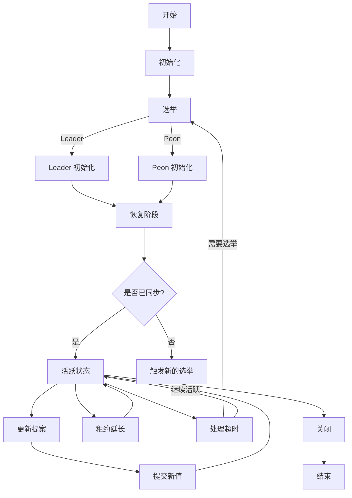

洞悉技术的本质，享受科技的乐趣 ，技术好的前提必然会高效沟通

# #一、Overview 

### 第一问题：你期望解决什么问题，核心问题是什么？

对于paxos小白来说就是高可用 三个节点，遇到故障，然后选出可用节点，然后使用相关产品足够用使用做项目了。

- 网上都说难，具体难何处不直到，到底解决什么问题不知道
- 网上都说好，具体好在哪里不清除，类似产品宣传都是99999然后不任何说明。
- 到这里根本看不下去了，根本不知道怎么用，解决什么问题。

### 第二个问题：通过看什么文章，阅读什么代码，经过真实cey

- *左耳朵耗子*  提供分布式入门相关资料

1. 首先，推荐的是 [@连城](https://www.zhihu.com/people/ab4aef6d6f80a7ccad3fd17da571edbd) 推荐的知行学社的《[分布式系统](https://zhida.zhihu.com/search?q=分布式系统&zhida_source=entity&is_preview=1)与Paxos算法视频课程》： ，视频讲的非常好，很适合入门，循序渐进慢慢推导，我自己看了不下5遍，视频讲解理解更深，推荐大家都看看，视频末尾说有后续介绍，一直没有找到，如果有哪位大侠找到了通知下我，不胜感激。

https://www.bilibili.com/video/BV1Lt411m7cW/

2. 推荐刘杰的《[分布式系统原理介绍](https://lrita.github.io/images/posts/distribution/%E5%88%86%E5%B8%83%E5%BC%8F%E5%8E%9F%E7%90%86%E4%BB%8B%E7%BB%8D.pdf)》 ，里面有关于paxos的详细介绍，例子非常多，也有包括paxos协议的证明过程，大而全，质量相当高的一份学习资料！

   

   

3. [@吴镝](https://www.zhihu.com/people/1353072704fa0f414d4c01068d5ec57d) 推荐的一份高质量ppt《可靠分布式系统基础 Paxos 的直观解释》，虽然是只是一份ppt没有讲解视频，但看ppt也能理解整个的paxos介绍和推导过程，写的很具体，配图很清晰明了；

   https://blog.openacid.com/algo/paxos/

https://drmingdrmer.github.io/tech/distributed/2015/11/11/paxos-slide.html

4. 微信的几篇公众号文章：《微信PaxosStore：深入浅出Paxos算法协议》（[微信PaxosStore：深入浅出Paxos算法协议](https://link.zhihu.com/?target=https%3A//mp.weixin.qq.com/s/aJoXSQo9-zmukN2RsiZ3_g) ）、《微信开源：生产级paxos类库PhxPaxos实现原理介绍》（[微信自研生产级paxos类库PhxPaxos实现原理介绍](https://link.zhihu.com/?target=https%3A//mp.weixin.qq.com/s/6VWUA5EDV2UIq4NqmQYWUA) ），文章写的都挺好，但是博文有个缺点是知识比较零散，不适合入门，需要有一定基础才好理解；

5. 技术类的东西怎么能只停留在看上面，肯定要看代码啊，推荐微信开源的phxpaxos：[https://github.com/tencent-wechat/phxpaxos，结合代码对协议理解更深，很多时候说了一大堆看代码就是一个if或者for循环，看了代码豁然开朗。](https://link.zhihu.com/?target=https%3A//github.com/tencent-wechat/phxpaxos%EF%BC%8C%E7%BB%93%E5%90%88%E4%BB%A3%E7%A0%81%E5%AF%B9%E5%8D%8F%E8%AE%AE%E7%90%86%E8%A7%A3%E6%9B%B4%E6%B7%B1%EF%BC%8C%E5%BE%88%E5%A4%9A%E6%97%B6%E5%80%99%E8%AF%B4%E4%BA%86%E4%B8%80%E5%A4%A7%E5%A0%86%E7%9C%8B%E4%BB%A3%E7%A0%81%E5%B0%B1%E6%98%AF%E4%B8%80%E4%B8%AAif%E6%88%96%E8%80%85for%E5%BE%AA%E7%8E%AF%EF%BC%8C%E7%9C%8B%E4%BA%86%E4%BB%A3%E7%A0%81%E8%B1%81%E7%84%B6%E5%BC%80%E6%9C%97%E3%80%82)

6. 如果英文可以的话，一定要看看paxos作者Lamport《paxos made simple》的论文

   

# 二 ceph 猜想验证

Ceph 的 Paxos 算法在实际应用中遇到了哪些挑战，又是如何克服这些挑战的？

Ceph 的 Paxos 算法在实际应用中遇到的挑战主要包括：

1. **成员变化（Membership Change）**：Ceph Paxos 需要处理集群成员的变化，包括节点的加入和移除。这需要一个称为 Probing 的阶段来发现并更新集群节点信息，同时处理节点之间的数据差异。在 Probing 状态下，Monitor 节点会相互发送 prob 消息来探测对方存在并生成交互 Monmap 信息。这个过程可能会影响服务的连续性，因为整个 Paxos 集群在 Probing 过程中会停止对外提供服务。

2. **日志截断（Log compaction）**：随着集群服务的进行，Paxos 的日志数据会不断增加，这不仅占用存储资源，还会增加日志回放的时间。为了解决这个问题，Ceph 引入了日志截断机制，通过删除旧的日志数据来节省空间。这个过程由参数 `paxos_min` 控制，默认保留的日志长度为 500。在需要恢复数据时，如果请求的数据版本小于 `first_committed`，则会在 Synchronizing 过程中进行数据的全同步。

3. **数据同步（Data Synchronization）**：当 Leader 和 Peon 之间的日志差距较大时，拉取并重放 Log 的时间会很长。为了减少这种延迟，Ceph Monitor 在选主之前通过 Synchronizing 阶段将所有参与 Paxos 节点的日志信息差距缩小到一个较小的区间，这个区间的长度由 `paxos_max_join_drift` 参数配置，默认为 10。

4. **性能与一致性的平衡**：Ceph Paxos 的实现中，为了简化 Recovery 逻辑，每次只能有一个提案在执行中，这可能会影响性能。但是，Ceph 通过上层的聚合提交等机制来减少对一致性协议执行的频率，从而在一定程度上弥补了性能的牺牲。

5. **容错和恢复（Fault Tolerance and Recovery）**：在分布式系统中，节点故障是常见问题。Ceph Paxos 需要能够在节点故障后正确恢复，同时保持数据的一致性。这涉及到复杂的 Recovery 逻辑，包括从 Peon 到 Leader 和 Leader 到 Peon 的双向数据恢复。

6. **网络分区和分区恢复**：在网络分区发生时，Ceph Paxos 需要能够处理这种情况，并在分区恢复后继续提供一致性服务。这可能需要额外的机制来检测分区并采取适当的恢复措施。

为了克服这些挑战，Ceph Paxos 采取了一系列措施，包括使用 Lease 机制来优化只读请求，以及在 Leader 和 Peon 之间进行存活检测，以确保在 Lease 超时或 Leader 收不到 Lease Ack 时触发新的 Election。此外，Ceph 还通过 State Machine System 来处理幂等操作，并在 commit 后真正写入到状态机，从而简化了一致性算法的实现。

文件：Paxos.h Paxos.cc

庖丁解Ceph之Paxos

https://www.jianshu.com/p/7302e79ab534

点击链接查看和 Kimi 智能助手的对话 https://kimi.moonshot.cn/share/cr7shc3df0jbga8amn50

Kimi: 这段代码是 Ceph 分布式文件系统的一部分，具体来说是实现了 Paxos 一致性算法的 C++ 代码。Ceph 使用 Paxos 算法来达成分布式环境中多个节点之间的一致性。下面是对代码实现原理的分析和一些推荐的相关文章或数据：

### 实现原理：

1. **Paxos 算法的变体**：代码实现了 Paxos 算法的一个变体，用于在分布式系统中达成一致性。它主要处理在分布式环境中如何安全地更新状态。

2. **状态机**：`Paxos` 类实现了一个状态机，其中包含多种状态（如 `STATE_RECOVERING`, `STATE_ACTIVE`, `STATE_UPDATING` 等），用于处理不同的操作阶段。

3. **版本控制**：通过 `version_t` 类型来控制版本，确保每个提案（proposal）都有一个唯一的版本号。

4. **读写操作**：代码处理了如何安全地进行读和写操作。在读操作中，系统需要检查是否有有效的租约（lease），在写操作中，系统需要确保当前节点是领导者（Leader）并且处于活动状态。

5. **消息传递**：代码中包含了多种消息类型（如 `OP_COLLECT`, `OP_BEGIN`, `OP_ACCEPT`, `OP_COMMIT` 等），用于在 Paxos 算法的不同阶段中节点之间通信。

6. **持久化存储**：通过 `MonitorDBStore` 类与键值存储进行交互，将提案的值持久化到磁盘。

7. **租约机制**：使用租约（lease）机制来优化读操作，避免每次都进行完整的 Paxos 算法流程。

8. **回调和事件**：使用 `Context` 类和条件变量来处理异步回调和事件，确保在特定条件下能够触发相应的操作。

### 推荐的相关文章或数据：

1. **Paxos 算法的详细介绍**：[Paxos Made Simple](https://www.cs.utexas.edu/users/lorenzo/corsi/fall2015/slides/paxos.pdf) - 这篇文章提供了 Paxos 算法的详细解释，有助于理解代码中的算法实现。

2. **Ceph 官方文档**：[Ceph Documentation](https://docs.ceph.com/en/latest/) - Ceph 的官方文档提供了关于如何配置和使用 Ceph 的详细信息，包括 Paxos 算法在 Ceph 中的应用。

3. **分布式一致性算法的比较**：[Distributed Consensus for Dummies](https://medium.com/@dgryski/distributed-consensus-for-dummies-71e4e6c6a65) - 这篇文章比较了不同的分布式一致性算法，包括 Paxos，有助于理解 Paxos 算法在更广泛的上下文中的位置。

4. **Ceph 源代码**：[Ceph GitHub Repository](https://github.com/ceph/ceph) - Ceph 的源代码仓库，可以查看完整的 Paxos 实现和其他相关组件。

5. **Paxos 算法的动画演示**：[The Secret Lives of Data](https://www.youtube.com/watch?v=s9yWVmPoLFs) - 这个视频通过动画形式展示了 Paxos 算法的工作原理，有助于直观理解算法流程。

通过阅读这些资料，可以获得更深入的理解 Paxos 算法在 Ceph 中的实现和应用。 

User: Ceph 的 Paxos 算法在实际应用中遇到了哪些挑战，又是如何克服这些挑战的？ 

Kimi: Ceph 的 Paxos 算法在实际应用中遇到的挑战主要包括：

1. **成员变化（Membership Change）**：Ceph Paxos 需要处理集群成员的变化，包括节点的加入和移除。这需要一个称为 Probing 的阶段来发现并更新集群节点信息，同时处理节点之间的数据差异。在 Probing 状态下，Monitor 节点会相互发送 prob 消息来探测对方存在并生成交互 Monmap 信息。这个过程可能会影响服务的连续性，因为整个 Paxos 集群在 Probing 过程中会停止对外提供服务。

2. **日志截断（Log compaction）**：随着集群服务的进行，Paxos 的日志数据会不断增加，这不仅占用存储资源，还会增加日志回放的时间。为了解决这个问题，Ceph 引入了日志截断机制，通过删除旧的日志数据来节省空间。这个过程由参数 `paxos_min` 控制，默认保留的日志长度为 500。在需要恢复数据时，如果请求的数据版本小于 `first_committed`，则会在 Synchronizing 过程中进行数据的全同步。

3. **数据同步（Data Synchronization）**：当 Leader 和 Peon 之间的日志差距较大时，拉取并重放 Log 的时间会很长。为了减少这种延迟，Ceph Monitor 在选主之前通过 Synchronizing 阶段将所有参与 Paxos 节点的日志信息差距缩小到一个较小的区间，这个区间的长度由 `paxos_max_join_drift` 参数配置，默认为 10。

4. **性能与一致性的平衡**：Ceph Paxos 的实现中，为了简化 Recovery 逻辑，每次只能有一个提案在执行中，这可能会影响性能。但是，Ceph 通过上层的聚合提交等机制来减少对一致性协议执行的频率，从而在一定程度上弥补了性能的牺牲。

5. **容错和恢复（Fault Tolerance and Recovery）**：在分布式系统中，节点故障是常见问题。Ceph Paxos 需要能够在节点故障后正确恢复，同时保持数据的一致性。这涉及到复杂的 Recovery 逻辑，包括从 Peon 到 Leader 和 Leader 到 Peon 的双向数据恢复。

6. **网络分区和分区恢复**：在网络分区发生时，Ceph Paxos 需要能够处理这种情况，并在分区恢复后继续提供一致性服务。这可能需要额外的机制来检测分区并采取适当的恢复措施。

为了克服这些挑战，Ceph Paxos 采取了一系列措施，包括使用 Lease 机制来优化只读请求，以及在 Leader 和 Peon 之间进行存活检测，以确保在 Lease 超时或 Leader 收不到 Lease Ack 时触发新的 Election。此外，Ceph 还通过 State Machine System 来处理幂等操作，并在 commit 后真正写入到状态机，从而简化了一致性算法的实现。

Kimi: 由于代码量较大，我将重点描述 Paxos 算法在 Ceph 中的主要流程，并提供一个简化的流程图。

### Paxos 算法在 Ceph 中的主要流程：

1. **初始化（Init）**：
   - 从稳定存储中加载 Paxos 变量。
   - 初始化性能计数器。

2. **选举（Election）**：
   - 确定 Leader 和 Peon。
   - Leader 初始化并开始恢复（Recovery）过程。

3. **恢复（Recovery）**：
   - Leader 发起 `collect` 阶段，向所有 Peon 发送 `OP_COLLECT` 消息。
   - Peon 响应 `OP_COLLECT` 消息，发送 `OP_LAST` 回复。
   - Leader 处理 `OP_LAST` 消息，同步数据，可能触发新的选举或进入活跃状态。

4. **活跃状态（Active State）**：
   - Leader 和 Peon 处理读写请求。
   - 定期延长租约（Lease）。

5. **更新（Updating）**：
   - Leader 提出新的值，进入 `STATE_UPDATING`。
   - Peon 接受新值，如果接受成功，发送 `OP_ACCEPT` 消息。
   - Leader 收到足够的 `OP_ACCEPT` 消息后，进入 `commit` 阶段。

6. **提交（Commit）**：
   - Leader 将新值提交到存储，并通知所有 Peon。
   - Peon 收到 `OP_COMMIT` 消息后，更新本地状态。

7. **租约延长（Lease Renewal）**：
   - Leader 定期发送 `OP_LEASE` 消息给 Peon，延长租约。
   - Peon 确认租约延长，发送 `OP_LEASE_ACK`。

8. **处理超时（Handle Timeouts）**：
   - 如果在预定时间内未收到足够的响应，可能触发新的选举。

9. **关闭（Shutdown）**：
   - 取消所有事件，释放资源。

### 流程图：

mermaid(美人鱼)，用文本语法来描述文档图形的工具

请注意，这个流程图是一个高层次的概述，实际的 Paxos 算法实现要复杂得多，涉及许多细节和错误处理。此外，Ceph 的 Paxos 实现还包括对日志截断、成员变化处理、数据同步和一致性检查的高级处理。 

### 沟通步骤

1. 准备一个图片，一段话，可以放在三页doc，三页ppt，或者文本计数器 描述清除

   一、这个技术出现的背景、初衷和要达到什么样的目标或是要解决什么样的问题

   二、这个技术的优势和劣势分别是什么

   三、这个技术适用的场景。任何技术都有其适用的场景，离开了这个场景

   四、技术的组成部分和关键点。

   五、技术的底层原理和关键实现

   六、已有的实现和它之间的对比

2. 反馈：鸡蛋里挑骨头，经过客户，领导 ，公司认证，做事情价值和意义。听到否定愤怒反对 说明自己对这个事情还不了解。

3. 最后融合别人建议，然后完善你项目

## 参考

