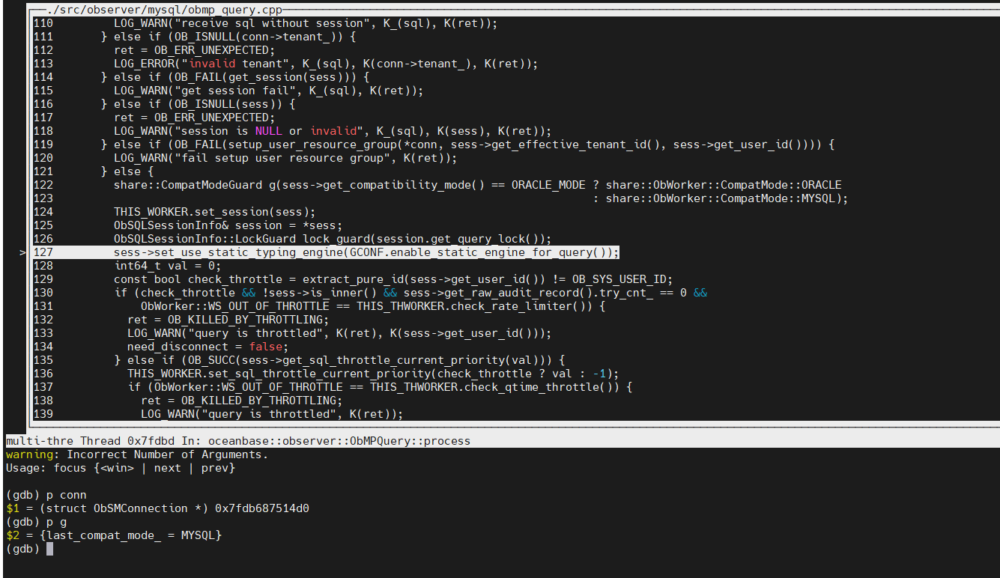
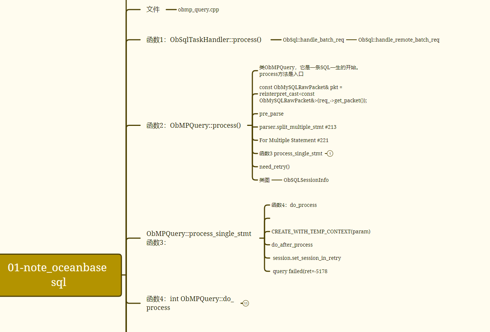
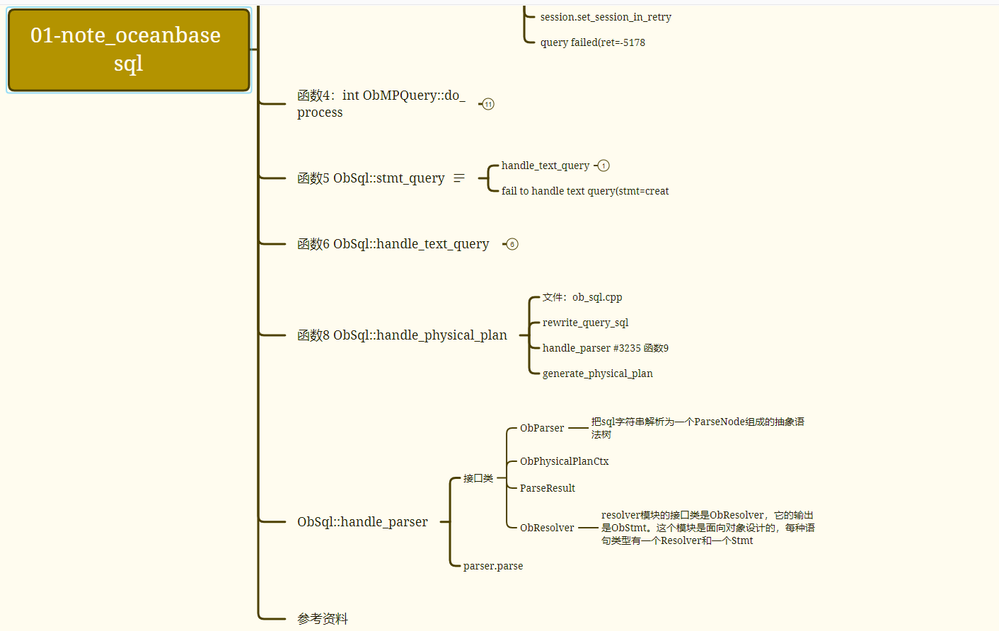

> 多看、多问、多总结


| 日期      | 内容  | 版本             |
| --------- | ----- | ---------------- |
| 2022-2-23 | day1: | v1  勉强可以用。 |
|           |       |                  |
|           |       |                  |

blog地址：https://wangcy6.github.io/post/oceanbase/day1_issue_oceanbase/


## day1: 阅读：[OceanBase开发者手册](https://github.com/oceanbase/oceanbase#developer-manual)


使用VSCode 远程链接功能阅读OceanBase代码


**我们经常遇到两个问题：**

1. 本地电脑存在瓶颈，单机性能有限，毕竟资金紧缺？
2. 一般电脑安装的都是 windows 或者 mac 图形支撑好的系统，而开发的项目又必须是 Linux 上编译运行？

如果本机直接用 vscode ，势必会遇到上面的问题。比如 Linux/OceanBase 代码量巨大，本机性能是 hold 不住，编辑器建立内存的索引非常庞大，既要吃内存又要吃 CPU 。对于编译，那就更麻烦了，涉及到手动的同步。

**我们经常怎么解决它？**

1. 纵向优化电脑，给自己电脑加个内存条，换个 cpu ，这个思路是可以的，但是它永远存在性能瓶颈。这还真不是钱的问题；
2. 对于平台依赖，以前的实践是 windows 下编辑，然后用 scp 或者其他同步工具，把代码同步到另外一台 Linux 下去编译，很麻烦；

**怎么才能彻底解决它？**


### 1.1 开发环境说明(极简版)

-  因为公司没有合适机器 4C12G ,上次偷偷使用一次导致服务器cpu利用过高被邮件告警，必须采取个人mac作为开发。

- 官方提供docker 4C10G,普通笔记本也无法使用，这里采用4C4G方式进行开发编译。

```shell
Make sure the available resources meet the requirements:
The logical CPU count is no less than 4.
The available memory is no less than 10G, and the docker container memory limit is no less than 10G.
The available disk space is no less than 10G.
请确保宿主机的可用资源满足下面要求：
逻辑 CPU 不少于4个
可用内存不少于 10G，并且 docker 容器内存限制不少于10G
空间不少于10G
https://hub.docker.com/r/obpilot/oceanbase-ce
```

> 小贴士：可以直接使用官方提供docker进行开发。

[实践练习一（必选）：OceanBase Docker 体验](https://www.mdnice.com/writing/fdb7307bd3d44275963567191b93c742)


### 1.2 macOS 下使用 Docker 搭建 centos 开发环境


- 参考： [《OceanBase开发者手册》之一 如何编译OceanBase源码](https://github.com/oceanbase/oceanbase/wiki/how_to_build)


~~~shell
## centos镜像
https://github.com/watchpoints/mydocker
docker pull oceanbase/centos7:latest

docker run -itd  -p 2881:2881 -p 22:22 --privileged=true  --name oceanbase-ce oceanbase/centos7 /bin/bash
docker exec -it oceanbase-ce bash

yum-config-manager --add-repo http://mirrors.aliyun.com/repo/Centos-7.repo
yum-config-manager --add-repo https://mirrors.aliyun.com/oceanbase/OceanBase.repo
ifconfig安装
yum install net-tools.x86_64
yum install m4


##SSH公钥认证方式远程登陆docker容器
vi /etc/ssh/sshd_config
PermitRootLogin yes ##允许root用户以任何认证方式登录（用户名密码认证和公钥认证）
#PermitRootLogin yes #允许root用户以任何认证方式登录（用户名密码认证和公钥认证）
#PermitRootLogin without-password #只允许root用公钥认证方式登录
#PermitRootLogin no #不允许root用户以任何认证方式登录

PasswordAuthentication yes
RSAAuthentication yes
PubkeyAuthentication yes #启用公钥私钥配对认证方式
#AuthorizedKeysFile .ssh/authorized_keys #公钥文件路径（和上面生成的文件同）
passwd root


登录操作：
docker attach  3346da816048
docker exec -it oceanbase-ce bash
service sshd restart
chkconfig sshd on
ssh root@10.2.131.60 -p 22 （ mac 网络方式变化 宿主机器IP）
ssh root@192.168.4.106 -p 22  （mac 网络方式变化 宿主机器IP）


## 编译


docker exec -it oceanbase-ce bash
service sshd restart
cat /root/.ssh/id_rsa.pub

git clone git@github.com:watchpoints/oceanbase.git （下载超慢!!!）
git config --global user.name "watchpoints"
git config --global user.email "wang_cyi@163.com"

debug mode
bash build.sh debug --init --make

# 执行build.sh脚本并传入init参数
sh build.sh init //更新依赖的第三方库。


# 在源码目录下执行debug版的预制构建命令
yum install m4
sh build.sh debug
# 进入生成的 debug 构建目录
cd build_debug
# 进行构建
make -j{N} observer (需要很长时间)
# 查看构建产物
stat src/observer/observer


--基于新镜像运行容器
docker run -d -p 10022:22 herong/centos7-ssh:latest /usr/sbin/sshd -D

~~~


> 遗留问题 缺点：每次重启 service sshd restart 因此 需要重新构造一个镜像。这里还没有实现。


> 遗留问题：将服务器目录与容器目录进行共享 这个可以设置。

### 1.3《OceanBase开发者手册》之二 如何设置IDE开发环境（done）

-  vscode --已经下载完毕
- clang-format是clang（一个面向C系语言的轻量级编译器）中一个工具，主要负责代码的格式化和排版工作 --已经设置完毕。
- /Users/wangchuanyi/code/src/oceanbase/[.clang-format](https://raw.githubusercontent.com/oceanbase/oceanbase/master/.clang-format) 已经存在不需要处理


## 1.4 vscode设置

- **vscode 远程连接主机主要是依赖于微软提供的插件 Remote-SSH。**


### 1.5 [《OceanBase开发者手册》之三 如何成为OceanBase Contributor](https://github.com/oceanbase/oceanbase/wiki/how_to_contribute)

> 如何去参与一个开源库的开发 提交doc 修改为例子

- 一个issue 一个分支

~~~shell
docker exec -it oceanbase-ce bash
service sshd restart
ssh root@10.2.131.60 -p 22 （宿主机器IP）

## 关联远程仓库，保证代码可以和远程更新和提交
git remote add oceanbase https://github.com/oceanbase/oceanbase.git
git remote -v
#把远程仓库最新的代码及分支拉取一下 
git fetch oceanbase 
git merge oceanbase/master
# git merge 远程仓库的别名/分支名 （一般不这样做）
git merge upstream/issue_557
git checkout -b issue_557 origin/issue_557

#查看远程分支
git branch -r 
git branch -a


## 本地创建分支，进行开发
git checkout -b issue_557
git checkout -b issue_558

## 提交
当前分支推送到自己的远程仓库
100%] Linking CXX static library liboceanbase_static.a
[100%] Built target oceanbase_static
[100%] Linking CXX executable observer

git commit -m "fix typos ocena->ocean #646"
git push -u  origin issue_558 //1.8.1

## 冲突解决
git reset --hard HEAD  （不建议）


https://github.com/oceanbase/oceanbase/issues/646 为例子 提交pr

~~~


### 1.6 [《OceanBase开发者手册》之五 如何debug OceanBase](https://github.com/oceanbase/oceanbase/wiki/how_to_debug)


- 1.6.1 准备工作 【开始 50】


一、小思考

Q: [How can I use a component of a specific version?](https://github.com/oceanbase/obdeploy)


最低配置是多少？

vscode 运行一个程序为什么需要launch文件？


二、过程

~~~shell

#1. 官方提供2C8G参考配置 https://github.com/oceanbase/oceanbase/pull/787(2C8G)

https://github.com/oceanbase/obdeploy
Your server has at least 8 GB of memory.
Your server has at least 2 CPU cores.

RUN sh build.sh debug --init \
    && sh build.sh --make -j4 \
    && cd build_debug \
    && make DESTDIR=. install \
    && obd mirror create -n oceanbase-ce -V 100.0.0 -p ./usr/local -t test -f
    
    
docker exec -it oceanbase-ce bash
service sshd restart
ssh root@10.2.131.60 -p 22 （宿主机器IP）


observer -r xxx.xxx.xxx.xxx:2882:2881 -o __min_full_resource_pool_memory=268435456,enable_syslog_recycle=True,enable_syslog_wf=True,max_syslog_file_count=4,memory_limit=69G,system_memory=27G,cpu_count=19,datafile_size=1029G,clog_disk_utilization_threshold=95,clog_disk_usage_limit_percentage=98 -z zone1 -p 2881 -P 2882 -n obcluster -c 1 -d /home/xxxxxxx/observer/store -i em1 -l INFO

https://gitee.com/oceanbase/obdeploy/blob/master/example/mini-local-example.yaml


obd cluster deploy obtest -c mini-local-example.yaml
obd cluster edit-config obtest
obd cluster redeploy obtest

obd cluster list
obd cluster display obtest
obd cluster start  obtest

obclient -uroot@sys -h127.0.0.1 -P2881 oceanbase

//
observer program health check x
[2022-02-25 02:30:19.076440] WARN  [SHARE] add_extra_config (ob_common_config.cpp:100) [1476][0][Y0-0000000000000000] [lt=20] Invalid config, value out of range(name="memory_limit", value="6G", ret=-4147)

const int64_t ObRunningModeConfig::MINI_MEM_LOWER = 8L << 30;
const int64_t ObRunningModeConfig::MINI_MEM_UPPER = 16L << 30;

Invalid config, value out of range(name="memory_limit", value="6G", ret=-4147)

int64_t ObRunningModeConfig::MINI_MEM_LOWER = 8L << 30;

obclient -uroot@sys -h127.0.0.1 -P2881 oceanbase

[root@3346da816048 ~]# obclient -uroot@sys -h127.0.0.1 -P2881 oceanbase
Reading table information for completion of table and column names
You can turn off this feature to get a quicker startup with -A

Welcome to the OceanBase.  Commands end with ; or \g.
Your MySQL connection id is 3221487661
Server version: 5.7.25 OceanBase 3.1.2 (r10000392021123010-d4ace121deae5b81d8f0b40afbc4c02705b7fc1d) (Built Dec 30 2021 02:47:29)

Copyright (c) 2000, 2018, Oracle, MariaDB Corporation Ab and others.

Type 'help;' or '\h' for help. Type '\c' to clear the current input statemen

捕获oceanbase 的启动参数 (通过‘ps -ef|grep observer’).

/root/observer/bin/observer -r 127.0.0.1:2882:2881 -o __min_full_resource_pool_memory=268435456,memory_limit=8G,system_memory=4G,stack_size=512K,cpu_count=16,cache_wash_threshold=1G,workers_per_cpu_quota=10,schema_history_expire_time=1d,net_thread_count=4,sys_bkgd_migration_retry_num=3,minor_freeze_times=10,enable_separate_sys_clog=0,enable_merge_by_turn=False,datafile_disk_percentage=20,enable_syslog_wf=False,enable_syslog_recycle=True,max_syslog_file_count=4 -z zone1 -p 2881 -P 2882 -c 1 -d /root/observer/store -i lo -l INFO


资料：https://github.com/oceanbase/oceanbase/wiki/how_to_debug

摘要：
remote ssh 连接远程机器
插件：
C/C++ GNU Global
C/C++

OB_SRC_DIR：
###########################
# 动态库  /etc/ld.so.conf
#####################
export LD_LIBRARY_PATH=$LD_LIBRARY_PATH:/usr/local/lib

###########################
#  环境变量
#####################
export OB_SRC_DIR=//app//oceanbase
export IP=127.0.0.1

###########################
#  别名
#####################
alias c="source ~/.bashrc"
alias cdcode="cd /home/work/dns_zhibo"


OBServer 启动失败
https://open.oceanbase.com/docs/tutorials-cn/V1.0.0/10000000000012304
~~~


- 配置:

  >  小贴士：
  >
  > 文档默认64G配置，不能直接拿来用，要改成自己的

 /root/observer/bin/observer -r 127.0.0.1:2882:2881 -o __min_full_resource_pool_memory=268435456,memory_limit=8G,system_memory=4G,stack_size=512K,cpu_count=16,cache_wash_threshold=1G,workers_per_cpu_quota=10,schema_history_expire_time=1d,net_thread_count=4,sys_bkgd_migration_retry_num=3,minor_freeze_times=10,enable_separate_sys_clog=0,enable_merge_by_turn=False,datafile_disk_percentage=20,enable_syslog_wf=False,enable_syslog_recycle=True,max_syslog_file_count=4 -z zone1 -p 2881 -P 2882 -c 1 -d /root/observer/store -i lo -l INFO


~~~
{
    // Use IntelliSense to learn about possible attributes.
    // Hover to view descriptions of existing attributes.
    // For more information, visit: https://go.microsoft.com/fwlink/?linkid=830387
    "version": "0.2.0",
    "configurations": [
    
        {
            "name": "observer",
            "type": "cppdbg",
            "request": "launch",
            "program": " /root/observer/build_debug/src/observer/observer",
            "args": ["-r", "127.0.0.1:2882:2881", "-o", "__min_full_resource_pool_memory=268435456,memory_limit=8G,system_memory=4G,stack_size=512K,cpu_count=16,cache_wash_threshold=1G,workers_per_cpu_quota=10,schema_history_expire_time=1d,net_thread_count=4,sys_bkgd_migration_retry_num=3,minor_freeze_times=10,enable_separate_sys_clog=0,enable_merge_by_turn=False,datafile_disk_percentage=20,enable_syslog_wf=False,enable_syslog_recycle=True,max_syslog_file_count=4", "-z", "zone1", "-p", "2881", "-P", "2882", "-n", "obcluster", "-c", 1, "-d", "/root/observer/store", "-i", "lo", "-l", "INFO"],
            "stopAtEntry": true,
            "cwd": " /root/observer",
            "environment": [],
            "externalConsole": false,
            "MIMode": "gdb",
            "setupCommands": [
                {
                    "description": "Enable pretty-printing for gdb",
                    "text": "-enable-pretty-printing",
                    "ignoreFailures": true
                },
                {
                    "description": "将反汇编风格设置为 Intel",
                    "text": "-gdb-set disassembly-flavor intel",
                    "ignoreFailures": true
                }
            ]
        }
    ]
}

{
    // 使用 IntelliSense 了解相关属性。 
    // 悬停以查看现有属性的描述。
    // 欲了解更多信息，请访问: https://go.microsoft.com/fwlink/?linkid=830387
    "version": "0.2.0",
    "configurations": [
        {
            "name": "(gdb) 启动",
            "type": "cppdbg",
            "request": "launch",
            "program": "输入程序名称，例如 ${workspaceFolder}/a.out",
            "args": [],
            "stopAtEntry": false,
            "cwd": "${fileDirname}",
            "environment": [],
            "externalConsole": false,
            "MIMode": "gdb",
            "setupCommands": [
                {
                    "description": "为 gdb 启用整齐打印",
                    "text": "-enable-pretty-printing",
                    "ignoreFailures": true
                },
                {
                    "description": "将反汇编风格设置为 Intel",
                    "text": "-gdb-set disassembly-flavor intel",
                    "ignoreFailures": true
                }
            ]
        }
    ]
}
~~~


- clion 本地调试【遗留问题】

  据说它的源码索引效率优于sourceInsight几倍。这里没有使用

https://www.jetbrains.com/zh-cn/clion/


- 直接用gdb 本地调试 [ 在linx 环境下运行 done]


1. 登录remote 机器, 并进入${OB_SRC_DIR} 源码目录
2. 参考之前文章 介绍 《如何编译OceanBase源码》
3. 修改 用户目录下的.gdbinit, 添加下面一行, 其中${OB_SRC_DIR}需要换成OB 源码根目录

```
add-auto-load-safe-path ${OB_SRC_DIR}/.gdbinit
```

1. vi ${OB_SRC_DIR}/.gdbinit

```
file build_debug/src/observer/observer
set args "-r", "127.0.0.1:2882:2881", "-o", "___min_full_resource_pool_memory=268435456,memory_limit=8G,system_memory=4G,stack_size=512K,cpu_count=16,cache_wash_threshold=1G,workers_per_cpu_quota=10,schema_history_expire_time=1d,net_thread_count=4,sys_bkgd_migration_retry_num=3,minor_freeze_times=10,enable_separate_sys_clog=0,enable_merge_by_turn=False,datafile_disk_percentage=20,enable_syslog_wf=False,enable_syslog_recycle=True,max_syslog_file_count=4","-z", "zone1", "-p", "2881", "-P", "2882", "-n", "obcluster", "-c", 1, "-d", "/root/observer/store", "-i", "lo", "-l", "INFO"
b main
r
```

备注: 这个里面有args的参数来自于第一步的准备工作中获取的启动参数, 每台机器有每台机器的配置, 笔者的参数如下, 其中:

```
1. ${OB_SRC_DIR} 为源码目录, ${IP} 为observer 的绑定ip
2. 需要设置“cwd”, 为${OB_SRC_DIR}
3. 当前的工作目录必须是${OB_SRC_DIR}
4. 在args 参数中, 其中 -d 设置的目录 "/home/xxxxx/observer/store", 需要设置为真实的参数
5. 在args 参数中, 其中-i 设置的设备名称 "em1", 为ip 对应的设备名称
```

1. 推荐使用tui tui是gdb自带的图形界面，比较直观，这里简单说一下切换方法和常用命令

```
1、gdb -tui + (可执行程序)  直接进入tui图形界面

2、gdb进入后，使用命令focus进入tui图形界面，或者使用快捷键：Ctl+x+a (注意按键顺序，记忆：x：focus，a：another)

3、在tui中使用相同的快捷键Ctl+x+a返回到gdb原生界面

4、在gdb中↑和↓切换上一个命令和下一个命令，但是在tui中只是控制代码视图。想达到切换命令的目的，使用Ctl+n （记忆：next）和Ctl+p（记忆：previous），这其实就是gdb的原生快捷键
```

1. 在源码目录下, 敲入gdb 即可启动gdb debug

```
/root/.obd/repository/oceanbase-ce/3.1.1/f19f8bfb67723712175fb0dfd60579196b3168f1/bin/observer


gdb 

gdb进入后，使用命令focus进入tui图形界面，或者使用快捷键：Ctl+x+a (注意按键顺序，记忆：x：focus，a：another)
在tui中使用相同的快捷键Ctl+x+a返回到gdb原生界面


替换：
obd cluster stop test
cd /app/oceanbase/build_debug/src/observer
cp observer /root/.obd/repository/oceanbase-ce/3.1.1/f19f8bfb67723712175fb0dfd60579196b3168f1/bin/observer


问：[如何设置断点跟踪](https://open.oceanbase.com/answer/detail?id=20400433)

答：

- gdb Function  not defined. 是因为自己设置符号不存在。
- 改为thread apply all break obmp_query.cpp:84 解决


dbgui：基于浏览器的gdb前端（gnu调试器）。 使用C，C ++，Go，Rust和F

obclient -uroot@tpcc -h127.0.0.1 -P2881 -p123456 -Dtpcc
obclient -uroot@tpcc -h127.0.0.1 -P2881 -p123456 -Dtpcc


obclient -uroot@tpcc -h127.0.0.1 -P2881 -p123456 -Dtpcc
gdb设置代码目录
dir /app/oceanbase/ //No such file or directory.

(gdb) delete
Delete all breakpoints? (y or n) y

thread apply all break ob_sql.cpp:1139

直接用gdb 本地调试

/app/data/observer/bin/observer -r 127.0.0.1:2882:2881 -o __min_full_resource_pool_memory=268435456,memory_limit=10G,system_memory=4G,stack_size=512K,cpu_count=12,cache_wash_threshold=1G,workers_per_cpu_quota=10,schema_history_expire_time=1d,net_thread_count=4,sys_bkgd_migration_retry_num=3,minor_freeze_times=10,enable_separate_sys_clog=0,enable_merge_by_turn=False,datafile_disk_percentage=20,enable_syslog_recycle=True,max_syslog_file_count=4,clog_disk_utilization_threshold=10 -z zone1 -p 2881 -P 2882 -c 1 -d /app/data/observer/store -i lo -l WARN


vi ${OB_SRC_DIR}/.gdbinit

file build_debug/src/observer/observer
set args "-r", "127.0.0.1:2882:2881", "-o", "__min_full_resource_pool_memory=268435456,memory_limit=10G,system_memory=4G,stack_size=512K,cpu_count=12,cache_wash_threshold=1G,workers_per_cpu_quota=10,schema_history_expire_time=1d,net_thread_count=4,sys_bkgd_migration_retry_num=3,minor_freeze_times=10,enable_separate_sys_clog=0,enable_merge_by_turn=False,datafile_disk_percentage=20,enable_syslog_recycle=True,max_syslog_file_count=4,clog_disk_utilization_threshold=10", "-z","zone1","-p", "2881", "-P", "2882", "-n", "obcluster", "-c", 1, "-d", "/app/data/observer/store", "-i", "lo", "-l", "INFO"
b main
r
add-auto-load-safe-path /app/oceanbase/.gdbinit

export OB_SRC_DIR=//app//oceanbase
export IP=127.0.0.1
////测试不通过

build_debug/src/observer/observer -r 127.0.0.1:2882:2881 -o __min_full_resource_pool_memory=268435456,memory_limit=10G,system_memory=4G,stack_size=512K,cpu_count=12,cache_wash_threshold=1G,workers_per_cpu_quota=10,schema_history_expire_time=1d,net_thread_count=4,sys_bkgd_migration_retry_num=3,minor_freeze_times=10,enable_separate_sys_clog=0,enable_merge_by_turn=False,datafile_disk_percentage=20,enable_syslog_recycle=True,max_syslog_file_count=4,clog_disk_utilization_threshold=10 -z zone1 -p 2881 -P 2882 -c 1 -d /app/data/observer/store -i lo -l WARN


## 设置断点
## PROCESS
dir /app/oceanbase/ 
set pagination off
thread apply all break obmp_query.cpp:100

## handle_physical_plan （(这个断点不能设置)）
thread apply all break ob_sql.cpp:1200
//thread apply all break ob_sql.cpp:3160 （(这个断点不能设置)）
int ObSql::handle_physical_plan

thread apply all break ob_sql.cpp:3217(这个断点不能设置)
else if (OB_FAIL(generate_physical_plan(parse_result, &pc_ctx, context, result))) {

create table sex (sex bit(60) primary key,name bit(60)) partition by hash(sex) partitions 4;

```


阅读：[配置gdb init文件](https://wizardforcel.gitbooks.io/100-gdb-tips/content/config-gdbinit.html) 10分钟 ✅

- 当gdb启动时，会读取HOME目录和当前目录下的的配置文件，执行里面的命令。这个文件通常为“.gdbinit”。

阅读：[gdb中查看stl容器内容 1](https://blog.csdn.net/nancygreen/article/details/17789677)0分钟 ✅


[单元测试](https://github.com/oceanbase/oceanbase/wiki/how_to_test)  完成。


```c++
cd build_debug/unittest/
make -j 4
./run_tests.sh
  
整个过程, 需要1个小时 太慢了。又优化吗？（mac不舍得 编译太慢，用其他liunx机器代替）
```


三 、 结论

- docker弹性伸缩 ： 开发环境 2C2G ，配置至少12G（4G其他用，8G observer用）

   int64_t ObRunningModeConfig::MINI_MEM_LOWER = 8L << 30;

- 更好的调试工具 clion 和gdb（界面） 这个做课下作业 没有尝试。后于遇到问题在尝试。


## day2: 阅读 Roadmap


gdb 调试 observer


~~~shell

## 设置代码目录
gdb -p xx
dir /app/oceanbase/ 
## 设置断点
## PROCESS
thread apply all break obmp_query.cpp:100

## handle_physical_plan
thread apply all break ob_sql.cpp:1200
thread apply all break ob_sql.cpp:3160
thread apply all break ob_sql.cpp:3217


## tui图形界面
gdb进入后，使用命令focus进入tui图形界面，
或者使用快捷键：Ctl+x+a (注意按键顺序，记忆：x：focus，a：another)
在tui中使用相同的快捷键Ctl+x+a返回到gdb原生界面

## dbgui：基于浏览器的gdb前端（gnu调试器）。 使用C，C ++，Go，Rust和F
~~~




sql 入口为例子




