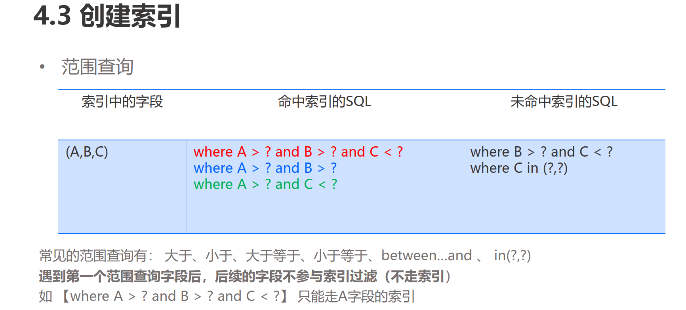
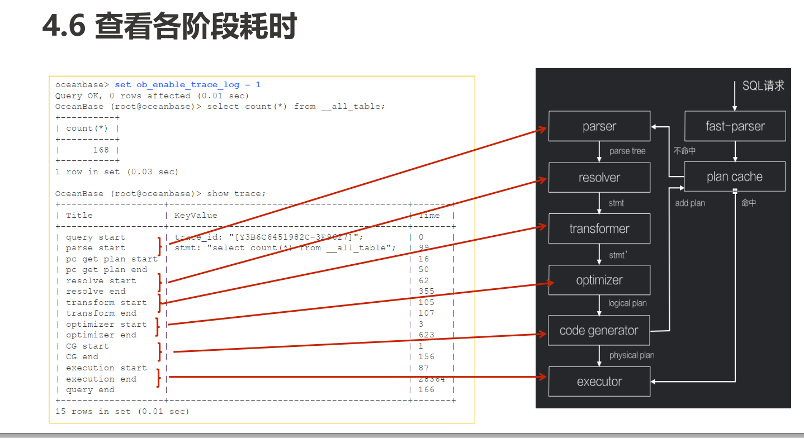

> 多看、多问、多总结，肯定是可以攻克的。

## 环境说明

- 单机单节点部署

~~~shell
obd cluster display test
+---------------------------------------------+
|                   observer                  |
+-----------+---------+------+-------+--------+
| ip        | version | port | zone  | status |
+-----------+---------+------+-------+--------+
| 127.0.0.1 | 3.1.1   | 2881 | zone1 | active |
+-----------+---------+------+-------+--------+

 /etc/sysctl.conf 
 fs.aio-max-nr = 1048576 ##文件系统最大异步io
 fs.file-max = 6815744 ##文件系统中文件的最大个数
~~~

## 实验5 sql调优

~~~mysql
create table t_p_hash (c1 varchar(20),c2 int, c3 varchar(20)) partition by hash(c1) partitions 3;
ERROR 1659 (HY000): Field 'c1' is of a not allowed type for this type of partitioning
create table t_p_hash (c1 varchar(20), c2 int,c3 varchar(20) ) partition by hash(c2+1) partitions 3;

create table t1 (c1 int primary key, c2 int) partition by key() partitions 5;

create table t2 (c1 int, c2 int) partition by list(c1)
(partition p0 values in (1,2,3),
partition p1 values in (5, 6)，
partition p2 values in (default));

delimiter //
create procedure bulk_insert_hash()
begin
declare i int;
set i=1;
while i<10001 do
insert INTO t_p_hash (c1,c2 ,c3) values ('a',i,i);
set i=i+1;
end while;
end
//
delimiter ;

drop table t_p_key;
create table t_p_key (c1 varchar(20),c2 int,c3 varchar(20)) partition by key (c2);

create table t3 (c1 int, c2 int) partition by list(c1) (partition p0 values in (1,2,3),partition p1 values in (5, 6)，
partition p2 values in (default));

CREATE TABLE `info_t`(id INT, gmt_create TIMESTAMP, info VARCHAR(20), PRIMARY KEY (gmt_create))
PARTITION BY RANGE(UNIX_TIMESTAMP(gmt_create))
(PARTITION p0 VALUES LESS THAN (UNIX_TIMESTAMP('2015-01-01 00:00:00')),
PARTITION p1 VALUES LESS THAN (UNIX_TIMESTAMP('2016-01-01 00:00:00')),
PARTITION p2 VALUES LESS THAN (UNIX_TIMESTAMP('2017-01-01 00:00:00')));
select * from info_t;	

create table t2(c1 int primary key, c2 int, c3 int) partition by hash(c1) partitions 5;

explain select * from t1 partition(p4);
explain select * from t1 where c1 = 5 or c1 = 4;

select * from t_p_hash where c2<15 order by c2;
update t_p_hash set c1='special' where c2=10;
explain extended select c1, c2 from t_p_hash where c1='special' ;
create index idx_t_p_hash_c1 on t_p_hash (c1) local;
create index idx_t_p_hash_c3 on t_p_hash (c3) local ;

explain select * from t1 order by c1 desc;

create table t_p_key (c1 varchar(20),c2 int,c3 varchar(20)) partition by key (c2) partitions 3;

create unique index idx_t_p_key_c3_g on t_p_key (c3) global partition by key (c3) partitions 3;

explain extended select c1,c2 from t_p_key where c3='66'; //is_index_back=false

create table t_p_key1 (c1 varchar(20),c2 int,c3 varchar(20)) partition by key (c2) partitions 3;
create index idx_t_p_hash_c11 on t_p_key1 (c1) local;
create index idx_t_p_hash_c31 on t_p_key1 (c3) local ;
explain extended select c1,c2 from t_p_key1 where c3='66' ;

create unique index idx_t_p_hash_c3 on t_p_key1 (c3) local ;

ERROR 1503 (HY000): A UNIQUE INDEX must include all columns in the table's partitioning function
create unique index idx_t_p_hash_c3 on t_p_key1 (c3,c2) local ;

explain extended select c1,c2 from t_p_key where c3='66';

create table h1(c1 int, c2 int, key idx_h1_c1(c1));
create table h2(c1 int, c2 int, key idx_h1_c1(c1));
explain select h1.c1,h2.c2 from h1 ,h2 where h1.c1=h2.c1 ;

| =================================================
|ID|OPERATOR   |NAME         |EST. ROWS|COST    |
-------------------------------------------------
|0 |HASH JOIN  |             |98010000 |58381710|
|1 | TABLE SCAN|h1(idx_h1_c1)|100000   |47311   |
|2 | TABLE SCAN|h2           |100000   |64066   |
=================================================

explain select /*+index(h2 idx_h2_c1)*/  h1.c1, h2.c2 from h1 ,h2 where h1.c1=h2.c1;

 create table t5(a int primary key, b int, c int);
create outline ol_1 on select/*+max_concurrent(0)*/ * from t5 where b =1 and c = 1;
select * from t5 where b =1 and c = 1;

 set ob_enable_trace_log = 1;
 select count(*) from __all_table;
~~~

~~~
select/*+ parallel(15)*/ SQL_ID, count(*) as QPS, avg(t1.elapsed_time)/1000 RT_MS,sum(t1.elapsed_time)/1000 Total_MS
from oceanbase.gv$sql_audit t1
where IS_EXECUTOR_RPC = 0
and request_time > (time_to_usec(now()) - 600000000)
and request_time < time_to_usec(now())
group by t1.sql_id
order by Total_MS desc
limit 10;

mysql> Select * from oceanbase.gv$sql_audit where sql_id=’XXXXXXXXXXXXXXXXXXXXXXXXXXXXXX’ \G;

select * from oceanbase.gv$plan_cache_plan_stat where sql_id=’xxxxxxxxxxxxxxxxx’;

show parameters like 'trace_log_slow%';
fgrep '[slow query]' observer.log |sed -e 's/|/\n/g' | more <--åçóòôöN7 slow query
grep “<trace_id>” observer.log |sed -e 's/|/\n/g' | more <---() trace_id åõú3 slow query .

产品模块原理系列 | OceanBase SQL 引擎的模块介绍和调优实践分享
https://open.oceanbase.com/blog/1100200?currentPage=undefined
https://open.oceanbase.com/docs/videoCenter/5900015
select * from oceanbase.gv$plan_cache_plan_stat；
~~~

## 第五章 事务

## 一、提问：

- 多个节点一致性读取如何的？
- 事务和快照 ？

### 二 、准备：

- 阅读：[OceanBase 开源教程 OBCP 知识测试参考答案解析](https://open.oceanbase.com/answer/detail?id=20400080&search=obcp&pageNum=1)

- 阅读：[OceanBase 开源教程 OBCP 知识测试2参考答案解析](https://open.oceanbase.com/answer/detail?id=20400296&search=obcp&pageNum=1)

  

  

### 三、结果

关于事务的特性，总结如下：

1）两阶段提交（下文简称 2PC ）协议，极致优化；

2）全局快照；

3）外部一致性；

4）巧妙解决：分布式事务领域的读半提交、事务提交与查询并发产生的读原子性问题

### 四、实验

~~~sql
obclient -uroot@tpcc -h127.0.0.1 -P2881 -p123456 -Dtpcc

create table test_account_range (name varchar(20), money int) partition by range (money)
(partition p0 values less than (100),
partition p1 values less than (200),
partition p2 values less than (300));

insert into test_account_range values ('zhangsan', 66), ('lisi', 166), ('wangwu' ,266);

select * from test_account_range;
select * from test_account_range partition(P2);

obclient -uroot@sys -h127.0.0.1 -P2881 oceanbase

select tenant.tenant_name,meta.table_id, tab.table_name, partition_id,zone,svr_ip,
case
when role=1 then 'leader'
when role=2 then 'follower'
else NULL
end as role,
tab.primary_zone
from
__all_virtual_meta_table meta inner join __all_tenant tenant on
meta.tenant_id=tenant.tenant_id
inner join __all_virtual_table tab on meta.tenant_id=tab.tenant_id and
meta.table_id=tab.table_id
where
tenant.tenant_id=1002
and  table_name ='test_account_range'
order by tenant.tenant_name,table_name,partition_id,zone ;

set @@session.ob_query_timeout = 900000000;
set @@session.ob_trx_timeout = 900000000;
set @@session.ob_trx_idle_timeout = 300000000;
set @@session.autocommit = off;

begin
insert into test_account_range values ('smith',77), ('john',177) ;
rollback

begin
insert into test_account_range values ('tom',188),('jerry',288);
update test_account_range set money=99 where name='zhangsan';
commit;

~~~

