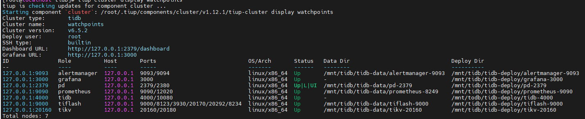

文章地址

- http://localhost:1313/post/tidb/2022/tidb_01/

- https://wangcy6.github.io/post/tidb/2022/tidb_01/

  


## 管理配置

### tiup

- 拓扑结构

https://docs.pingcap.com/zh/tidb/stable/minimal-deployment-topology/

```bash
curl --proto '=https' --tlsv1.2 -sSf https://tiup-mirrors.pingcap.com/install.sh | sh
source .bash_profile
tiup install cluster
https://github.com/pingcap/docs-cn/tree/master/config-templates

lsblk
mkfs.ext4 /dev/nvme0n2 
mount /dev/nvme0n2  /mnt/tidb
df -h

tiup cluster deploy watchpoints v6.5.2 ./topology.yaml -uroot -p123456


Cluster type:    tidb
Cluster name:    watchpoints
Cluster version: v6.5.2
Role          Host       Ports                            OS/Arch       Directories
----          ----       -----                            -------       -----------
pd            127.0.0.1  2379/2380                        linux/x86_64  /mnt/tidb/tidb-deploy/pd-2379,/mnt/tidb/tidb-data/pd-2379
tikv          127.0.0.1  20160/20180                      linux/x86_64  /mnt/tidb/tidb-deploy/tikv-20160,/mnt/tidb/tidb-data/tikv-20160
tidb          127.0.0.1  4000/10080                       linux/x86_64  /mnt/todb/tidb-deploy/tidb-4000
tiflash       127.0.0.1  9000/8123/3930/20170/20292/8234  linux/x86_64  /mnt/tidb/tidb-deploy/tiflash-9000,/mnt/tidb/tidb-data/tiflash-9000
prometheus    127.0.0.1  9090/12020                       linux/x86_64  /mnt/tidb/tidb-deploy/prometheus-9090,/mnt/tidb/tidb-data/prometheus-8249
grafana       127.0.0.1  3000                             linux/x86_64  /mnt/tidb/tidb-deploy/grafana-3000
alertmanager  127.0.0.1  9093/9094                        linux/x86_64  /mnt/tidb/tidb-deploy/alertmanager-9093,/mnt/tidb/tidb-data/alertmanager-9093

tiup cluster start watchpoints --init
tiup cluster display watchpoints

The root password of TiDB database has been changed.
The new password is: 'BW07-+5vE36q@b*9RA'.


tiup cluster display watchpoints
tiup is checking updates for component cluster ...
Starting component `cluster`: /root/.tiup/components/cluster/v1.12.1/tiup-cluster display watchpoints
Cluster type:       tidb
Cluster name:       watchpoints
Cluster version:    v6.5.2
Deploy user:        root
SSH type:           builtin
Dashboard URL:      http://127.0.0.1:2379/dashboard
Grafana URL:        http://127.0.0.1:3000
ID               Role          Host       Ports                            OS/Arch       Status   Data Dir                               Deploy Dir
--               ----          ----       -----                            -------       ------   --------                               ----------
127.0.0.1:9093   alertmanager  127.0.0.1  9093/9094                        linux/x86_64  Up       /mnt/tidb/tidb-data/alertmanager-9093  /mnt/tidb/tidb-deploy/alertmanager-9093
127.0.0.1:3000   grafana       127.0.0.1  3000                             linux/x86_64  Up       -                                      /mnt/tidb/tidb-deploy/grafana-3000
127.0.0.1:2379   pd            127.0.0.1  2379/2380                        linux/x86_64  Up|L|UI  /mnt/tidb/tidb-data/pd-2379            /mnt/tidb/tidb-deploy/pd-2379
127.0.0.1:9090   prometheus    127.0.0.1  9090/12020                       linux/x86_64  Up       /mnt/tidb/tidb-data/prometheus-8249    /mnt/tidb/tidb-deploy/prometheus-9090
127.0.0.1:4000   tidb          127.0.0.1  4000/10080                       linux/x86_64  Up       -                                      /mnt/todb/tidb-deploy/tidb-4000
127.0.0.1:9000   tiflash       127.0.0.1  9000/8123/3930/20170/20292/8234  linux/x86_64  Up       /mnt/tidb/tidb-data/tiflash-9000       /mnt/tidb/tidb-deploy/tiflash-9000
127.0.0.1:20160  tikv          127.0.0.1  20160/20180                      linux/x86_64  Up       /mnt/tidb/tidb-data/tikv-20160         /mnt/tidb/tidb-deploy/tikv-20160
Total nodes: 7

安装 MySQL 客户端并连接
yum install mysql -y
OceanBase性能测试 https://juejin.cn/post/7203523120988717114
```

连接到 TiDB 集群：

```sh
mysql --comments -h 127.0.0.1 -P 4000 -u root -pBW07-+5vE36q@b*9RA
show database;
```




http://74.120.174.137:2379/dashboard/#/overview

- tiup cluster list

~~~
Name       User  Version  Path                                            PrivateKey
----       ----  -------  ----                                            ----------
tidb-test  tidb  v5.0.2   /root/.tiup/storage/cluster/clusters/tidb-test  /root/.tiup/storage/cluster/clusters/tidb-test/ssh/id_rsa
root@money:~#

~~~
- tiup cluster start tidb-test 
- mysql -h 127.0.0.1 -P 4000 -u root -D test
- 检查部署的 TiDB 集群情况
 tiup cluster display watchpoints

~~~
Cluster type:       tidb
Cluster name:       tidb-test
Cluster version:    v5.0.2
Deploy user:        tidb
SSH type:           builtin
Dashboard URL:      http://127.0.0.1:2379/dashboard
ID               Role        Host       Ports        OS/Arch       Status   Data Dir                                   Deploy Dir
--               ----        ----       -----        -------       ------   --------                                   ----------
127.0.0.1:3000   grafana     127.0.0.1  3000         linux/x86_64  Up       -                                          /data/tidb/tiup/tidb-deploy/grafana-3000
127.0.0.1:2379   pd          127.0.0.1  2379/2380    linux/x86_64  Up|L|UI  /data/tidb/tiup/tidb-data/pd-2379          /data/tidb/tiup/tidb-deploy/pd-2379
127.0.0.1:9090   prometheus  127.0.0.1  9090         linux/x86_64  Up       /data/tidb/tiup/tidb-data/prometheus-9090  /data/tidb/tiup/tidb-deploy/prometheus-9090
127.0.0.1:4000   tidb        127.0.0.1  4000/10080   linux/x86_64  Up       -                                          /data/tidb/tiup/tidb-deploy/tidb-4000
127.0.0.1:20170  tikv        127.0.0.1  20170/20180  linux/x86_64  Up       /data/tidb/tiup/tidb-data/tikv-20170       /data/tidb/tiup/tidb-deploy/tikv-20170
Total nodes: 5

~~~


## 调试技巧

- 启动 mdb后，客户度连接

## 优化器
- 子查询相关的优化
~~~
mysql> explain select * from t1 where exists (select * from t2);
+-----------------------+----------+-----------+---------------+--------------------------------+
| id                    | estRows  | task      | access object | operator info                  |
+-----------------------+----------+-----------+---------------+--------------------------------+
| TableReader_10        | 10000.00 | root      |               | data:TableFullScan_9           |
| └─TableFullScan_9     | 10000.00 | cop[tikv] | table:t1      | keep order:false, stats:pseudo |
+-----------------------+----------+-----------+---------------+--------------------------------+
2 rows in set (0.01 sec)


~~~

- 谓词下推

~~~
create table t12(id int primary key, a int);
explain select * from t12 where a < 1;

~~~

### 逻辑优化


阅读资料 


~~~
Max/Min 函数消除规则
https://docs.pingcap.com/zh/tidb/stable/max-min-eliminate
explain select max(a) from t12; TopN_19

https://docs.pingcap.com/zh/tidb/stable/predicate-push-down

~~~


### 物理优化

1.     优化器会为逻辑执行计划中的每个算子选择具体的物理实现 

​       https://docs.pingcap.com/zh/tidb/stable/sql-physical-optimization


- 索引的选择
~~~

CREATE TABLE t13(a INT PRIMARY KEY, b INT, c INT, UNIQUE INDEX idx_b(b));
EXPLAIN  SELECT b, c FROM t13 WHERE b = 3 OR b = 6;
EXPLAIN  SELECT * FROM t13 USE index(PRIMARY);
EXPLAIN  SELECT * FROM t13 USE index(idx_b);
SHOW WARNINGS;
一个表只能有一个PRIMARY KEY，但可以有多个UNIQUE KEY 
SHOW INDEX FROM t13;

TableReader_5
CREATE TABLE t14(a INT PRIMARY KEY, b INT, c INT, d INT, e INT, INDEX idx_b(b), INDEX idx_b_c(b, c), INDEX idx_e(e));

EXPLAIN  SELECT * FROM t14 WHERE b = 2 AND c > 4;

create table t15(id int primary key, a int not null);

//执行
EXPLAIN ANALYZE SELECT * FROM t USE INDEX(a);

CREATE TABLE t16 (id INT NOT NULL PRIMARY KEY AUTO_INCREMENT, c1 INT NOT NULL);
INSERT INTO t16 (c1) VALUES (1), (2), (3);
EXPLAIN ANALYZE SELECT * FROM t16 WHERE id = 1 \G;

~~~


同城两中心

Data Replication Auto Synchronous，简称 DR Auto-Sync。


### Q2同城两中心 采用raft 复制存在的问题是？


~~~~gas
5副本：
[replication-mode]
replication-mode = "dr-auto-sync"
[replication-mode.dr-auto-sync]
label-key = "zone"
primary = "east"
dr = "west"
primary-replicas = 2

dr-replicas = 1
wait-store-timeout = "1m"
wait-sync-timeout = "1m"

https://asktug.com/t/topic/212812
同步切异步
https://docs.pingcap.com/zh/tidb/dev/two-data-centers-in-one-city-deployment/

DR（Disaster Recovery），代指同城容灾数据中心

sync：同步复制，此时 DR 与 Primary 至少有一个节点与 Primary 同步，Raft 保证每条 log 按 label 同步复制到 DR

async：
异步复制，此时不保证 DR 与 Primary 完全同步，
Raft 使用经典的 majority 方式复制 log

sync-recover：恢复同步，此时不保证 DR 与 Primary 完全同步，Raft 逐步切换成 label 复制，切换成功后汇报给 PD


~~~~


- [tidb server 异常OOM](https://asktug.com/t/topic/153778)

  

  go tool pprof -http 127.0.0.1:4008 heap2021-09-23T02:56:34Z

  

- [DM 升级到 v2.0.7 后占用 CPU 非常高](https://asktug.com/t/topic/275264)


- [tikv节点cpu高IO高OOM排查](https://asktug.com/t/topic/513121)
