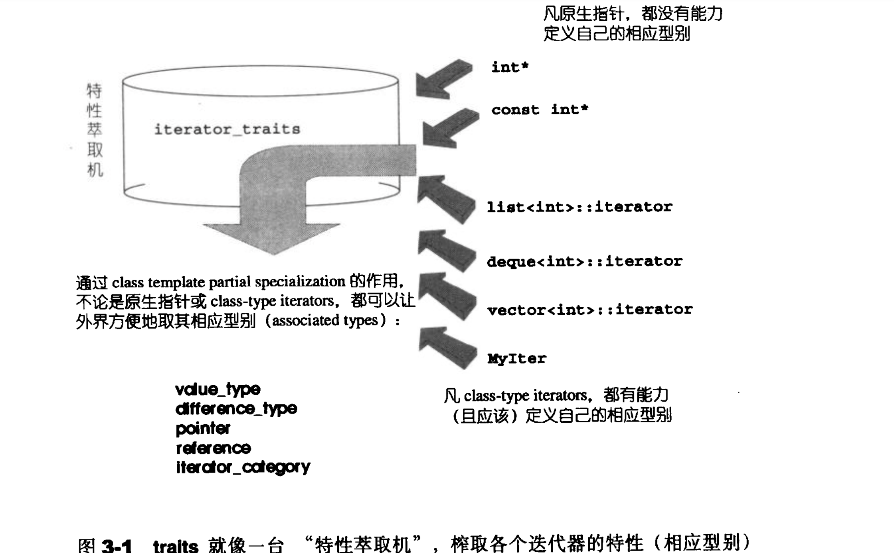

# 准备工作

## 资源

- STL源码剖析简体中文完整版(清晰扫描带目录
- https://app.yinxiang.com/shard/s39/nl/8226829/d31d2a4a-9376-4093-984b-d0c805ab763c/
- https://github.com/steveLauwh/SGI-STL/tree/master/The%20Annotated%20STL%20Sources%20V3.3/iterator
- 【视频】https://www.youtube.com/playlist?list=PLTcwR9j5y6W2Bf4S-qi0HBQlHXQVFoJrP

## 好的问题是成功的一半？必须意识到问的存在

- 老掉牙问题，每次回答不对 ，谈谈你对 vector， map 和hashmap理解 或者去不,局限在给出这几个字概念上，不懂背后设计东西。stl标准
- 删除 或者添加操作vecotr 和 map 管用iteraotr失效怎办
- vector 扩容，是倍数扩容吗

- 数据mdb 采用什么结构设计比较好呢 list，还是hash，为什么这2个结合起来？redis的key只用的词典。

 https://www.jianshu.com/p/f921122ba125 

## 初级回答：

- 如果回答vecotr连续空间，你感觉全部回答了，结果根本不行

  1. 用栈上对象管理堆上对象这，连续空间不是在stack上 。sizeof（vecotr）大小固定的。 设计堆栈区别 值传递，  

     内存管理--智能指针方向

  

  2. 只有一个成员变量吗？迭代器 不懂 ，移动。 【迭代器设计模式和特点 移动方式】

  ​    

- vecotr 扩容是2本扩容？这看网上book大难，你理解 它如何判断长度和容量关系？这个怎么计算的迭代器设计模 

  1. a-b =size 这这个类型，如果指针怎么操作。

  2. vector容器存储的一个类，或者类的指针，这个类默认怎么拷贝【浅拷贝】【大量的元素拷贝，对象的copy】

     vector< class >

     # 浅拷贝引发的问题（以vector为例）

     https://www.jianshu.com/p/b2b3b0a9f58a

  3. # tl中push_back和浅拷贝和深拷贝的问题

     

  https://blog.csdn.net/u012501459/article/details/44132147

  在记忆中 int int* class* 都没有问题，但是插入一个普通的类。

  4. 如何新增一个类型，该怎么办？

     你根本没有回答： 为这个类增加一个函数对象类comare（2个实现，你说一个就说这个，你纠结用其中那个的），c语法方式过时了，不考虑。甚至lmaber代码是。

     

     你根本没有; key 表现值寓意，深度拷贝 ，普通的类成员是指针这根本没想道。

     

     - 这更设涉及一个 一个普通的类如何实现拷贝，一个继承的类如何实现拷贝 你根本就不懂

-  容器与拷贝 一片空白？更别想普通的类如果不实现深度拷贝，值传递过程发生什么？一个继承的类如何实现copy

1. 指针和引用区别？ 相当于常量指针不同类型?指针是也是值传递,初始化

2. new T（*t） 问题吗？virtal clones()函数你不懂呀

3.  

   **STL容器只支持“实值语意”**（value semantic），不支持“引用语意”（reference semantics），因此下面这样的无法通过编译：
   vector<Shape&> v;

4. 实战c++中的vector系列--可怕的迭代器失效（vector重新申请内存） 这个更加蒙蔽了。原来东西失效了。

   【原来的失效】 https://dabaojian.blog.csdn.net/article/details/50334297?utm_medium=distribute.pc_relevant.none-task-blog-BlogCommendFromMachineLearnPai2-3.control&dist_request_id=7a5ce338-479b-4c70-8d5c-72945fa92887&depth_1-utm_source=distribute.pc_relevant.none-task-blog-BlogCommendFromMachineLearnPai2-3.control

   vector给我们提供了很多的方便，但是偶尔也会有陷阱。当不注意的时候，就掉入其中。说到底，还是对vector的机制不够彻底掌握。

   

   5

   

   选几个数据分析一下：
   0-1-2-3-4-6-9-13-19-28-42-63-94-141

   从第二项开始：
   2/2+2=3
   3/2+3=4
   4/2+4=6
   6/2+6=9
   9/2+9=13
   13/2+13=19
   19/2+19=28
   28/2+28=42
   42/2+42=63
   63/2+63=94
   94/2+94=141

   **每次扩容50%**

   

-  扩容就是拷贝？

  > 点评：完全靠记忆，记忆可能是错误的，没有体现任何细节。

C.130: For making deep copies of polymorphic classes prefer a virtual clone function instead of copy construction/assignment

C.130:实现多态类的深拷贝时，虚clone函数要比拷贝构造函数/赋值运算符好。‍

##  一句话 解释（ 中级回答）

- 智能指针采用move语义的拷贝默认是浅拷贝。
- 实现多态类的深拷贝时，请选择虚clone函数代替拷贝构造函数/赋值运算符

# 开始章节内容

## 迭代器

### 容器和它有什么关系？

- list

  ~~~c++
  https://github.com/steveLauwh/SGI-STL/blob/master/The%20Annotated%20STL%20Sources%20V3.3/container/sequence%20container/list/stl_list.h
  
  // 双向链表
  struct _List_node_base {
    _List_node_base* _M_next;
    _List_node_base* _M_prev;
  };
  
  // list 节点
  template <class _Tp>
  struct _List_node : public _List_node_base {
    _Tp _M_data; // 节点存储的值
  };
  
  
  // List 迭代器基类
  struct _List_iterator_base {
    typedef size_t                     size_type;
    typedef ptrdiff_t                  difference_type;
    typedef bidirectional_iterator_tag iterator_category;  // 双向移动迭代器
  
    _List_node_base* _M_node; // 迭代器内部当然要有一个普通指针，指向 list 的节点
  
    _List_iterator_base(_List_node_base* __x) : _M_node(__x) {}
    _List_iterator_base() {}
  
    void _M_incr() { _M_node = _M_node->_M_next; }  // 前驱
    void _M_decr() { _M_node = _M_node->_M_prev; }  // 后继
  
    // 比较两个容器操作
    bool operator==(const _List_iterator_base& __x) const {
      return _M_node == __x._M_node;
    }
    bool operator!=(const _List_iterator_base& __x) const {
      return _M_node != __x._M_node;
    }
  };  
  
  ~~~

  

- vecotr

~~~c++
// 默认走这里，vector base 构造函数和析构函数
// vector 继承 _Vector_base
template <class _Tp, class _Alloc> 
class _Vector_base {
public:
  typedef _Alloc allocator_type;
  allocator_type get_allocator() const { return allocator_type(); }
  
  // 初始化
  _Vector_base(const _Alloc&)
    : _M_start(0), _M_finish(0), _M_end_of_storage(0) {}
  
  // 初始化，分配空间 
  _Vector_base(size_t __n, const _Alloc&)
    : _M_start(0), _M_finish(0), _M_end_of_storage(0) 
  {
    _M_start = _M_allocate(__n);
    _M_finish = _M_start;
    _M_end_of_storage = _M_start + __n;
  }
  
  // 释放空间
  ~_Vector_base() { _M_deallocate(_M_start, _M_end_of_storage - _M_start); }

protected:
  _Tp* _M_start;  // 表示目前使用空间的头
  _Tp* _M_finish; // 表示目前使用空间的尾
  
  
  // alloc 是 SGI STL 的空间配置器
template <class _Tp, class _Alloc = __STL_DEFAULT_ALLOCATOR(_Tp) >
class vector : protected _Vector_base<_Tp, _Alloc> 
{
  // requirements:

  __STL_CLASS_REQUIRES(_Tp, _Assignable);

private:
  typedef _Vector_base<_Tp, _Alloc> _Base;
public:
  // vector 的嵌套类型定义
  typedef _Tp value_type;
  typedef value_type* pointer;  
  
  typedef value_type* iterator; // vector 的迭代器是普通指针//!!!!!!!!!!!!!!!!!
  
  
  typedef const value_type* const_iterator;
  typedef value_type& reference;
  typedef const value_type& const_reference;
 
~~~

### std::inserter实现？[失效问题 和算法copy]

https://en.cppreference.com/w/cpp/iterator/inserter

~~~c++
std::vector<int> d {100, 200, 300};
std::vector<int> l {1, 2, 3, 4, 5};
 
// when inserting in a sequence container, insertion point advances
// because each std::insert_iterator::operator= updates the target iterator
 std::copy(d.begin(), d.end(), std::inserter(l, std::next(l.begin())));
~~~

- 哈哈哈
- 

## ref

- https://blog.csdn.net/u012501459/article/details/44132147?utm_medium=distribute.pc_relevant_bbs_down.none-task-blog-baidujs-1.nonecase&depth_1-utm_source=distribute.pc_relevant_bbs_down.none-task-blog-baidujs-1.nonecase

- ## [从一道面试题看深拷贝、浅拷贝构造函数问题](https://www.cnblogs.com/wly603/archive/2012/04/11/2441927.html)

- # 浅拷贝引发的问题（以vector为例）

https://www.zhihu.com/question/43513150

https://blog.csdn.net/weixin_42674696/article/details/104528174

- 设计模式之 原型(Prototype)模式(使用智能指针避免浅拷贝时内存泄露)

https://www.cnblogs.com/qionglouyuyu/p/4620714.html

- vector是值语义，默认是浅拷贝

  https://www.zhihu.com/question/395813343