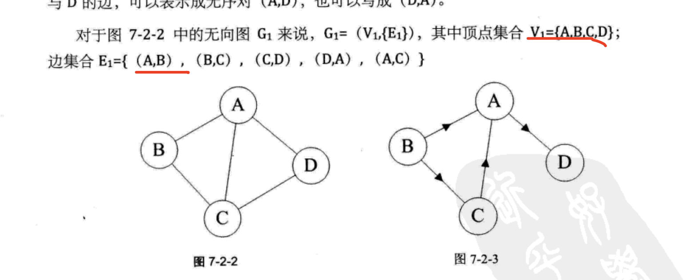
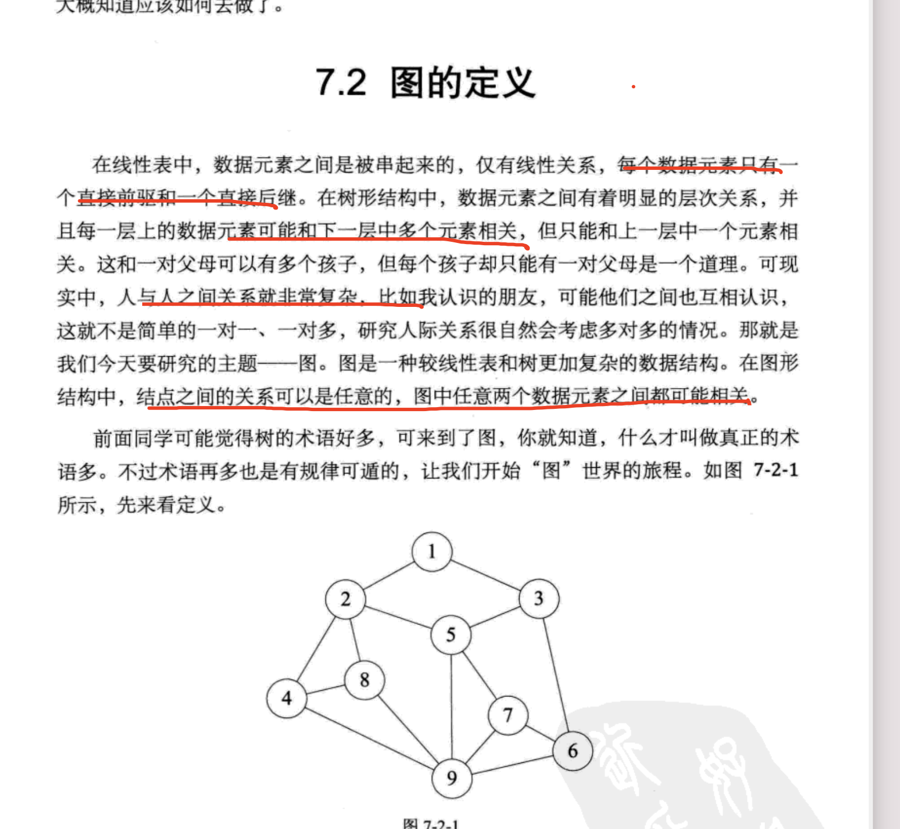

# LeetCode 每日一题 Daily Challenge 54

Qwer@12345

大家好。我是IT届一个小学生，这么简单题目 耗时 xx番茄次数，累计 分钟。

让我们寻找一下，究竟什么地方 卡住这么长时间。


| 题目                                                         | 第一天回顾                              | 第三天回顾 | 第五天回顾 |
| :----------------------------------------------------------- | --------------------------------------- | ---------- | ---------- |
| [Daily Challenge 207. 课程表 （c++）](https://mp.weixin.qq.com/s/nf5MdVzLnAorP2zgBHNYIg) | ok：图定义忘记了                        |            |            |
| [面试题 08.02. 迷路的机器人](https://leetcode-cn.com/problems/robot-in-a-grid-lcci/) | ok：为什么标记，会重复走2次吗？多个可能 |            |            |






###  一、题目


https://www.nowcoder.com/questionTerminal/7edf70f2d29c4b599693dc3aaeea1d31

给定一个m x n大小的矩阵（m行，n列），按螺旋的顺序返回矩阵中的所有元素。


关联企业：


## 刷题时候只有一个技巧：关闭浏览器,很简单，人人都做到。即使要总结发表也要关闭 。如果画图解题请在纸上绘制。


- 刷题时候，当作考试一样 开启倒计时。关闭浏览器，关闭浏览器，关键浏览器。查看别人答案就是浮躁表现，自己迷惑地方还是迷惑。【看别人思路自己抓不住重点，它能帮助解决问题吗？】
- ​     每个题目都重要，按照编号从小到大刷题就行，忘记那个是热门，那个高频，这个太难，太容易被考想法，心态要稳，这样才不会浮躁。【不听网上搜索答案这浪费时间更多，它能帮助解决问题吗？】
- 总结发表 写各种体验 都是虚假成功，你大脑放松警惕，真以为自己懂了。
- 画图解题，其他各种draw工具我不会，我只会在纸绘制。
- 边总结边写代码 不行，放弃写总结。完成比完美更重要。

### 二、思路

> 我选择重视第一感觉，我放弃选择自己看不懂奇淫技巧
>
> 因为巧妙方法我不会，我只会最笨方法。
>
> 
>
> 第一个感觉和奇异技巧相结合
>
> 只会让你头重脚轻，畏首畏尾。
>
> 最后想半天也做不出来
>
> 失去做题的乐趣。
>
> 如果陷入思维困境，例如 逻辑判断，奇特规律 你不清楚，
>
> 继续在想，请马上放弃。
>
> 这说明这个算法 你遗漏地方，
>
> 用空间换时间。


## 第一感觉：一共7个关口,看看卡在哪里


### 题目目的：

https://leetcode-cn.com/problems/spiral-matrix/

### 计算机问题：蛮力攻击

 

- 暴力破解是计算机一个重要应用 

  

- 走迷宫 撞墙法，递归回溯（dfs）

- 约束条件： 《模仿游戏》中艾伦·图灵是如何破译英格玛的

​       能减少判断的次数 ，

- 马其诺防线


###  图解分析：

### 存储结构：

#### 算法描述：

- 判断边界 我只会递归回溯，判断一个矩阵的长度和宽度 固定边界。然后利用dfs 四个方向。

  这里遇到了。一圈，有一圈 边界发生变化。在这里被K.O了。（白银：别人知道，我不知道）

- 递归回溯中，为了避免重复遍历 或者障碍物不能走情况，扩展不到这里 在这里被K.O了


- 机器人存在障碍，从一个位置到另外一个存在多个路径。但是这里不知道终点在哪里，该怎么办呢？

  这里只有一个路径。采取while循环。非递归。（青铜大家都可以想到）

- 递归回溯，可以用非递归实现（我竟然不知道）

 #### 复杂度：

- 时间复杂度：O(mn) 其中 m 和 n 分别是输入矩阵的行数和列数。矩阵中的每个元素都要被访问一次。

- 空间复杂度：O(mn)。需要创建一个大小为 m×n 的矩阵  visited 记录每个位置是否被访问过。


### 换个马甲也要会在，必须克服拦路虎，最重点地方是：


 //我马上想到的是 二维矩阵 按照行列 遍历,这里不符合要求。因此你想其他方法

​    //根据题意，构造顺时针遍历的轨迹。

​    //第二次遍历 我控制不了 ko,

​    //我思路还是一定有方法控制

- 递归回溯方法在这里失效了。

- 如果遇到复杂的边界控制，这说明你方法不正确，而不是不奢想去控制边界。

  因为这容易处所，用空间换时间方式去操作。

- 这个和单词搜索和dfs遍历 都是按照一定顺序 具体有什么区别？为什么你想套用缺失败了。

https://leetcode-cn.com/problems/word-search/solution/zai-er-wei-ping-mian-shang-shi-yong-hui-su-fa-pyth/


- 这里感觉可以用递归回溯，但是我实现不了，别人实现俩https://leetcode-cn.com/problems/spiral-matrix/solution/hui-su-di-gui-shi-xian-by-nemo_-2-gqi0/

  


###  三、 代码


> 完成比完美更重要


~~~
/*
 * @lc app=leetcode.cn id=54 lang=cpp
 *
 * [54] 螺旋矩阵
 */
// @lc code=start
struct Point
{
    int x;
    int y;
    Point(int a, int b)
    {
        x = a;
        y = b;
    }
};

class Solution
{
public:
    //采取深度优先搜索：递归回溯
    //这里重点是如何回溯
    //因为路径只有一个，采取非递归实现
    //定义三个位置
    //当前位置，下一个位置，下个位置包括（错误需要回溯，正确位置）
    //约束条件：
    vector<int> spiralOrder(vector<vector<int>> &matrix)
    {
        //01 定义数据结构
        vector<int> path;

        int rows = matrix.size();
        if (0 == rows)
        {
            return path;
        }
        int cols = matrix[0].size();
        int total = rows * cols;
        path.resize(total);
        
        vector<vector<bool>> visited(rows, vector<bool>(cols, false)); //!!!


        //02 开始位置 0,0,结束位置 ,全部元素遍历一遍（不重复遍历）结束
        int x = 0;
        int y = 0;
        int position = 0; // 0 right  down 1 left 2 up 3

        for (int i = 0; i < total; i++)
        {
            //step01
            visited[x][y] = true;
            path[i] = matrix[x][y];

            //规律：一个节点 最多2个方向
            Point wrongNext = move(position, x, y);
            //!!!
            if (wrongNext.x < 0 || wrongNext.x >= rows || wrongNext.y < 0 || wrongNext.y <= cols || visited[x][y] == true)
            {
                position = (position + 1) % 4;
            }

            Point rightNext = move(position, x, y);
            x = rightNext.x;
            y = rightNext.y;
        }

        return path;

        //规律：一个坐标其实只有2个方向
        //一个是合法的，一个非法的。
    }

    //right ,down ,left ,up
    // static constexpr int directions[4][2] = {{0, 1}, {1, 0}, {0, -1}, {-1, 0}};
    Point move(int direction, int x, int y)
    {
        Point next(x, y);
        switch (direction)
        {
        case 0:
            /* code */
            next.y++;
            break;

        case 1:
            /* code */
            next.x++;
            break;
        case 2:
            /* code */
            next.y--;
            break;
        case 3:
            next.x--;
            break;
        }

        return next;
    }
};
~~~


### 四、 举一反三

> 我我关心是同样问题，换个马甲有不会了,
>
> 再次验证放弃巧妙方法，看来最 关键一点还是没有看明白

## 思考 图和tree和数组遍历最大区别是什么，

- 图为了防止环，避免重复遍历 需要visted标记 【三个节点组成死循环】

- tree为了减少重复判断 需要要visted标记，避免重复计算。
- 矩阵递归回溯 ，一个路径标记完毕，最后是恢复到原来状态的。【2个节点组成死循环】

遍历真谛 不重复不遗漏 还是不懂呀，感觉刷了一遍都懂了，还是不懂。


## 行动：

#### [54. 螺旋矩阵](https://leetcode-cn.com/problems/spiral-matrix/)

#### [79. 单词搜索](https://leetcode-cn.com/problems/word-search/)

#### [329. 矩阵中的最长递增路径](https://leetcode-cn.com/problems/longest-increasing-path-in-a-matrix/)

#### [79. 单词搜索](https://leetcode-cn.com/problems/word-search/)

https://leetcode-cn.com/problems/word-search/solution/shen-du-you-xian-sou-suo-yu-hui-su-xiang-jie-by-ja/


#### [212. 单词搜索 II](https://leetcode-cn.com/problems/word-search-ii/)

#### [面试题 04.01. 节点间通路](https://leetcode-cn.com/problems/route-between-nodes-lcci/)

#### [140. 单词拆分 II](https://leetcode-cn.com/problems/word-break-ii/)

#### [630. 课程表 III](https://leetcode-cn.com/problems/course-schedule-iii/)

【here】

#### [46. 全排列](https://leetcode-cn.com/problems/permutations/)

【是否被占用也标记一下。】

#### [200. 岛屿数量](https://leetcode-cn.com/problems/number-of-islands/)

https://leetcode-cn.com/problems/number-of-islands/solution/dao-yu-lei-wen-ti-de-tong-yong-jie-fa-dfs-bian-li-/


- 如果看到网格，马上意识到 这个是图，遍历存在重复遍历情况，避免环【必须掌握这个技能】

- 快速判断 当前节点和邻接关系，或者其他节点和我的关系【题目给出约束条件】

  

#### 如何避免重复遍历

网格结构的 DFS 与二叉树的 DFS 最大的不同之处在于，遍历中可能遇到遍历过的结点。这是因为，网格结构本质上是一个「图」，我们可以把每个格子看成图中的结点，每个结点有向上下左右的四条边。

在图中遍历时，自然可能遇到重复遍历结点。

这时候，DFS 可能会不停地「兜圈子」，永远停不下来，如下图所示：

如何避免这样的重复遍历呢？答案是标记已经遍历过的格子。

以岛屿问题为例，我们需要在所有值为 1 的陆地格子上做 DFS 遍历。

每走过一个陆地格子，就把格子的值改为 2，这样当我们遇到 2 的时候，就知道这是遍历过的格子了。也就是说，每个格子可能取三个值：

0 —— 海洋格子
1 —— 陆地格子（未遍历过）
2 —— 陆地格子（已遍历过）

作者：nettee
链接：https://leetcode-cn.com/problems/number-of-islands/solution/dao-yu-lei-wen-ti-de-tong-yong-jie-fa-dfs-bian-li-/
来源：力扣（LeetCode）
著作权归作者所有。商业转载请联系作者获得授权，非商业转载请注明出处。

#### [130. 被围绕的区域](https://leetcode-cn.com/problems/surrounded-regions/) ok


#### [剑指 Offer 13. 机器人的运动范围](https://leetcode-cn.com/problems/ji-qi-ren-de-yun-dong-fan-wei-lcof/) ok

超时：https://leetcode-cn.com/submissions/detail/162179917/testcase/


## Daily Challenge 207. 课程表 （c++）

https://mp.weixin.qq.com/s/nf5MdVzLnAorP2zgBHNYIg


```apache
curl  -X GET -d '{"user": "admin", "passwd":"12345678"}' https://www.gome.com.cn/
```


| 489  | [扫地机器人](https://leetcode-cn.com/problems/robot-room-cleaner) | https://www.cnblogs.com/lightwindy/p/9739158.html            |
| ---- | ------------------------------------------------------------ | ------------------------------------------------------------ |
|      | [面试题 08.02. 迷路的机器人](https://leetcode-cn.com/problems/robot-in-a-grid-lcci/) | 1 结束位置是清楚的 2 边界是清楚的 3障碍物时清楚的 4一个位置不走2次这个我不知道!!!递归缺点。https://leetcode-cn.com/submissions/detail/162179917/testcase/ |


**Note:**


> 分享最实用的经验 ， 希望每一位来访的朋友都能有所收获！
https://github.com/watchpoints/daily-interview/
>大家也可以关注我的公众号《程序猿思维》，获取更多资料
> 如果有疑问请联系我，一起探讨，进步。