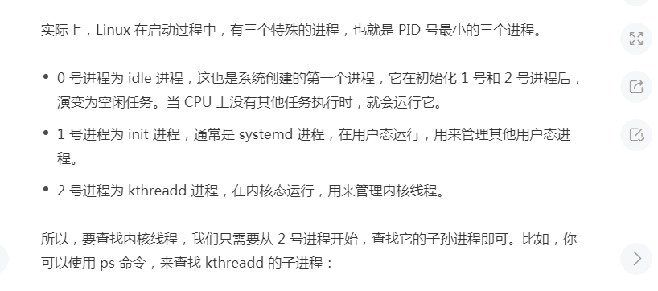

# 知识卡(redis.5.0)


 

### 源码阅读  参考redis-3.0-annotated-huangz1990


# 内容


## 对象的类型和编码


~~~c

typedef struct redisObject {
  unsigned type : 4;
  unsigned encoding : 4;
  int refcount;
  void *ptr;
} robj;


类型常量	对象的名称
REDIS_STRING 字符串对象
REDIS_LIST	列表对象
REDIS_HASH	哈希对象
REDIS_SET	集合对象
REDIS_ZSET	有序集合对象
    

/* Objects encoding. Some kind of objects like Strings and Hashes can be
 * internally represented in multiple ways. The 'encoding' field of the object
 * is set to one of this fields for this object. */
#define OBJ_ENCODING_RAW 0        /* Raw representation */
#define OBJ_ENCODING_INT 1        /* Encoded as integer */
#define OBJ_ENCODING_HT 2         /* Encoded as hash table */
#define OBJ_ENCODING_ZIPMAP 3     /* Encoded as zipmap */
#define OBJ_ENCODING_LINKEDLIST 4 /* No longer used: old list encoding. */
#define OBJ_ENCODING_ZIPLIST 5    /* Encoded as ziplist */
#define OBJ_ENCODING_INTSET 6     /* Encoded as intset */
#define OBJ_ENCODING_SKIPLIST 7   /* Encoded as skiplist */
#define OBJ_ENCODING_EMBSTR 8     /* Embedded sds string encoding */
#define OBJ_ENCODING_QUICKLIST 9  /* Encoded as linked list of ziplists */
#define OBJ_ENCODING_STREAM 10    /* Encoded as a radix tree of listpacks */


char *rdb_type_string[] = {
    "string",
    "list-linked",
    "set-hashtable",
    "zset-v1",
    "hash-hashtable",
    "zset-v2",
    "module-value",
    "","",
    "hash-zipmap",
    "list-ziplist",
    "set-intset",
    "zset-ziplist",
    "hash-ziplist",
    "quicklist",
    "stream"
};


~~~


| 对象所使用的底层数据结构             | 编码常量                    | OBJECT ENCODING 命令输出 |
| :----------------------------------- | :-------------------------- | :----------------------- |
| 整数                                 | `REDIS_ENCODING_INT`        | `"int"`                  |
| `embstr` 编码的简单动态字符串（SDS） | `REDIS_ENCODING_EMBSTR`     | `"embstr"`               |
| 简单动态字符串                       | `REDIS_ENCODING_RAW`        | `"raw"`                  |
| 字典                                 | `REDIS_ENCODING_HT`         | `"hashtable"`            |
| 双端链表                             | `REDIS_ENCODING_LINKEDLIST` | `"linkedlist"`           |
| 压缩列表                             | `REDIS_ENCODING_ZIPLIST`    | `"ziplist"`              |
| 整数集合                             | `REDIS_ENCODING_INTSET`     | `"intset"`               |
| 跳跃表和字典                         | `REDIS_ENCODING_SKIPLIST`   | `"skiplist"`             |


### zset有序集合对象

> 有序集合的编码可以是 `ziplist` 或者 skiplist 。 


 `type page_rank`
`zset`


`object encoding page_rank`
`"ziplist"`

`object encoding page_rank`
`"skiplist"`


#### 编码的转换

当有序集合对象可以同时满足以下两个条件时， 对象使用 `ziplist` 编码：

1. 有序集合保存的元素数量小于 `128` 个；
2. 有序集合保存的所有元素成员的长度都小于 `64` 字节；

不能满足以上两个条件的有序集合对象将使用 `skiplist` 编码

- 验证：

~~~c
127.0.0.1:6379>  ZADD page_rank 9 baidu.com 8 bing.com
(integer) 2
127.0.0.1:6379> ZADD page_rank 10 google.com
(integer) 0
127.0.0.1:6379> ZRANGE page_rank 0 -1 WITHSCORES
1) "bing.com"
2) "8"
3) "baidu.com"
4) "9"
5) "google.com"
6) "10"

127.0.0.1:6379> type page_rank
zset
object encoding page_rank
"ziplist"

    
127.0.0.1:6379> ZADD page_rank 2.0 oooooooooooooooooooooooooooooooooooooooooooooooooooooooooooooooooo
(integer) 1
127.0.0.1:6379> type page_rank
zset
object encoding page_rank
"skiplist"
    
 ############################### ADVANCED CONFIG ###############################

# Hashes are encoded using a memory efficient data structure when they have a
# small number of entries, and the biggest entry does not exceed a given
# threshold. These thresholds can be configured using the following directives.
hash-max-ziplist-entries 512
hash-max-ziplist-value 64

# Lists are also encoded in a special way to save a lot of space.
# The number of entries allowed per internal list node can be specified
# as a fixed maximum size or a maximum number of elements.
# For a fixed maximum size, use -5 through -1, meaning:
# -5: max size: 64 Kb  <-- not recommended for normal workloads
# -4: max size: 32 Kb  <-- not recommended
# -3: max size: 16 Kb  <-- probably not recommended
# -2: max size: 8 Kb   <-- good
# -1: max size: 4 Kb   <-- good
# Positive numbers mean store up to _exactly_ that number of elements
# per list node.
# The highest performing option is usually -2 (8 Kb size) or -1 (4 Kb size),
# but if your use case is unique, adjust the settings as necessary.
list-max-ziplist-size -2


# Sets have a special encoding in just one case: when a set is composed
# of just strings that happen to be integers in radix 10 in the range
# of 64 bit signed integers.
# The following configuration setting sets the limit in the size of the
# set in order to use this special memory saving encoding.
set-max-intset-entries 512

# Similarly to hashes and lists, sorted sets are also specially encoded in
# order to save a lot of space. This encoding is only used when the length and
# elements of a sorted set are below the following limits:
zset-max-ziplist-entries 128
zset-max-ziplist-value 64
~~~

##### ziplist-连续空间折半

ziplist.c

~~~c++
The ziplist is a specially encoded dually linked list that is designed
 * to be very memory efficient. It stores both strings and integer values,
 * where integers are encoded as actual integers instead of a series of
 * characters. It allows push and pop operations on either side of the list
 * in O(1) time. However, because every operation requires a reallocation of
 * the memory used by the ziplist, the actual complexity is related to the
 * amount of memory used by the ziplist.
     
  ziplist是一个经过特殊编码的双向链表，它的设计目标就是为了提高存储效率。ziplist可以用于存储字符串或整数，其中整数是按真正的二进制表示进行编码的，而不是编码成字符串序列。它能以O(1)的时间复杂度在表的两端提供push和pop操作。

实际上，ziplist充分体现了Redis对于存储效率的追求。一个普通的双向链表，链表中每一项都占用独立的一块内存，各项之间用地址指针（或引用）连接起来。这种方式会带来大量的内存碎片，而且地址指针也会占用额外的内存。
  
     而ziplist却是将表中每一项存放在前后连续的地址空间内，一个ziplist整体占用一大块内存。它是一个表（list），但其实不是一个链表（linked list）。

另外，ziplist为了在细节上节省内存，对于值的存储采用了变长的编码方式，大概意思是说，对于大的整数，就多用一些字节来存储，而对于小的整数，就少用一些字节来存储。我们接下来很快就会讨论到这些实现细节
~~~

这个ziplist里存了4个数据项，分别为：

- 字符串: “name”
- 字符串: “tielei”
- 字符串: “age”
- 整数: 20

  

上图是一份真实的ziplist数据。我们逐项解读一下：

- 这个ziplist一共包含33个字节。字节编号从byte[0]到byte[32]。图中每个字节的值使用16进制表示。

- 头4个字节（0x21000000）是按小端（little endian）模式存储的``字段。什么是小端呢？就是指数据的低字节保存在内存的低地址中（参见维基百科词条[Endianness](https://en.wikipedia.org/wiki/Endianness)）。因此，这里``的值应该解析成0x00000021，用十进制表示正好就是33。

- 接下来4个字节（byte[4..7]）是``，用小端存储模式来解释，它的值是0x0000001D（值为29），表示最后一个数据项在byte[29]的位置（那个数据项为0x05FE14）。

- 再接下来2个字节（byte[8..9]），值为0x0004，表示这个ziplist里一共存有4项数据。

- 接下来6个字节（byte[10..15]）是第1个数据项。其中，prevrawlen=0，因为它前面没有数据项；len=4，相当于前面定义的9种情况中的第1种，表示后面4个字节按字符串存储数据，数据的值为”name”。

- 接下来8个字节（byte[16..23]）是第2个数据项，与前面数据项存储格式类似，存储1个字符串”tielei”。

- 接下来5个字节（byte[24..28]）是第3个数据项，与前面数据项存储格式类似，存储1个字符串”age”。

- 接下来3个字节（byte[29..31]）是最后一个数据项，它的格式与前面的数据项存储格式不太一样。其中，第1个字节prevrawlen=5，表示前一个数据项占用5个字节；第2个字节=FE，相当于前面定义的9种情况中的第8种，所以后面还有1个字节用来表示真正的数据，并且以整数表示。它的值是20（0x14）。

- 最后1个字节（byte[32]）表示``，是固定的值255（0xFF）。

   

  为什么需要 **Little-Endian** ，从左到右读取和从右到左读取有什么差别

   https://blog.erratasec.com/2016/11/how-to-teach-endian.html#.XdTZoJMzaUk 【没看懂】


##### zset --跳表类似 tree


~~~c

file :t_zset.c
    
    
typedef struct zset {
  dict *dict;//无需排列，单key查找
  zskiplist *zsl; //有序排列，范围查找
} zset;

typedef struct zskiplist {
  struct zskiplistNode *header, *tail;
  unsigned long length;
  int level; //tree的最大高度。
} 
typedef struct zskiplistNode {
  sds ele;                        //内容
  double score;                   //排序分值
  struct zskiplistNode *backward; //后面
  struct zskiplistLevel {
    struct zskiplistNode *forward;
    unsigned long span;
  } level[]; //前面
} zskiplistNode;
~~~

### set


~~~shel
127.0.0.1:6379> sadd numbers 1 2 3 4
(integer) 4
127.0.0.1:6379> object encoding numbers
"intset"

127.0.0.1:6379> sadd numbers 1111111111111111111111111111111111111111111111111111
(integer) 1
127.0.0.1:6379> object encoding numbers
"hashtable"
~~~


## 集群

### 无中心结构

### 哨兵模式


### 重要话题-脑裂 

 一、哨兵(sentinel)模式下的脑裂 

```
         +----+
         | M1 |
         | S1 | <- C1 (writes will be lost)
         +----+
            |
            /
            /
+------+    |    +----+
| [M2] |----+----| R3 |
| S2   |         | S3 |
+------+         +----+
       +----+
       | M1 |
       | S1 |
       +----+
          |
+----+    |    +----+
| R2 |----+----| R3 |
| S2 |         | S3 |
+----+         +----+


In this case a network partition isolated the old master M1, so the replica R2 is promoted to master. However clients, like C1, that are in the same partition as the old master, may continue to write data to the old master. This data will be lost forever since when the partition will heal, the master will be reconfigured as a replica of the new master, discarding its data set.


Configuration: quorum = 2
# It is possible for a master to stop accepting writes if there are less than
# N replicas connected, having a lag less or equal than M seconds.
#
# The N replicas need to be in "online" state.
#
# The lag in seconds, that must be <= the specified value, is calculated from
# the last ping received from the replica, that is usually sent every second.
#
# This option does not GUARANTEE that N replicas will accept the write, but
# will limit the window of exposure for lost writes in case not enough replicas
# are available, to the specified number of seconds.
#
# For example to require at least 3 replicas with a lag <= 10 seconds use:
#
# min-replicas-to-write 3
# min-replicas-max-lag 10
#
https://www.jianshu.com/p/beaaf76ebc01
要求至少3个slave节点，且数据复制和同步的延迟不能超过10秒。
否则master就拒绝读写，这样发生集群脑裂原先的master节点接收到写入请求就会拒绝

Highly Available Redis cluster with Sentinel
https://redis.io/topics/sentinel
```

 二、集群(cluster)模式下的脑裂 


```
       +----+         +----+
            | M1 |----+----| R1 |
            |    |    |    |    |
            +----+    |    +----+
                      |
         +------------+------------+
         |            |            |
         |            |            |
      +----+        +----+      +----+
      | C1 |        | C2 |      | C3 |
      | S1 |        | S2 |      | S3 |
      +----+        +----+      +----+

      Configuration: quorum = 2
      
      
      If the box where M1 and S1 are running fails, the failover will happen without issues, however it is easy to see that different network partitions will result in different behaviors. For example Sentinel will not be able to setup if the network between the clients and the Redis servers is disconnected, since the Redis master and replica will both be unavailable.
```


- *split brain condition*


-  **deploy at least three Sentinels in three different boxes** (至少三个节点)

- network partition（网络分区 mater 意识不到）

```
min-replicas-to-write 3
min-replicas-max-lag 10
```

- 部署方式 如果 redis和哨兵分开，redis集群和哨兵集群产生分区，这个时候出现问题了。

```
              ---+         +----+
            | M1 |----+----| R1 |
            |    |    |    |    |
            +----+    |    +----+
                      |
         +------------+------------+
         |            |            |
         |            |            |
      +----+        +----+      +----+
      | C1 |        | C2 |      | C3 |
      | S1 |        | S2 |      | S3 |
      +----+        +----+      +----+

      Configuration: quorum = 2
      Example 3: Sentinel in the client boxes

    Example 2: basic setup with three boxes
  
        +----+
         | M1 |
         | S1 | <- C1 (writes will be lost)
         +----+
            |
            /
            /
+------+    |    +----+
| [M2] |----+----| R3 |
| S2   |         | S3 |
+------+         +----+
```




*Sentinel acts as a configuration provider or a source of authority for clients service discovery.*

> 哨兵充当客户端服务发现的配置提供者或权威来源。

What does that means ? Simply, application clients connect to the Sentinels and Sentinels provide the latest Redis MASTER address to them.

这是什么意思？简单地说，应用程序客户端连接到 Sentinels，Sentinels 向它们提供最新的 Redis MASTER 地址。


Sentinel is a **robust distributed system**,


使 TCP backlog 设置(Max 连接)为511。您可以相应地设置该值(考虑您的服务器规范) ，步骤如下。

```

```

### 重要话题-复制

 asynchronous replication（不是绝对的）

https://medium.com/@amila922/redis-sentinel-high-availability-everything-you-need-to-know-from-dev-to-prod-complete-guide-deb198e70ea6


# 客户端

## 卡片

| 组件                                            | 功能                            | 版本 |
| ----------------------------------------------- | ------------------------------- | ---- |
| **[hiredis](https://github.com/redis/hiredis)** | Minimalistic C client for Redis |      |
|                                                 |                                 |      |
|                                                 |                                 |      |

小王疑问

- 客户端异步调用，但是怎么检测到返回，并且处理，不是写了函数他就会自动执行?

   肯定不是 你用库框架帮你实现了，怎么实现的


功能：

-  hiredis是redis官方库, 提供了同步与异步的接口.  

  > hiredis 异步是借助libevent ，libev 或者redis自己提供的[ae](https://youjiali1995.github.io/redis/hiredis/)库来实现异步的接口实现。 
  >
  > 

  

- Pub/Sub

  

使用方法

- 在连接初始化时候设置异步回调处理函数
- 事件通知完成时候，需要通过libevent 或者AE库检测完成，不然我什么时候知道你完成了。我有没有电话


～～～～～～～～～～～～～～～～～～～～～～华丽分隔符～～～～～～～～～～～～～～～～～～

~~~c
/* Context for an async connection to Redis */
typedef struct redisAsyncContext {
    /* Hold the regular context, so it can be realloc'ed. */
    redisContext c;

    /* Setup error flags so they can be used directly. */
    int err;
    char *errstr;

    /* Not used by hiredis */
    void *data;
    void (*dataHandler)(struct redisAsyncContext* ac);

    /* Event library data and hooks */
    struct {
        void *data;

        /* Hooks that are called when the library expects to start
         * reading/writing. These functions should be idempotent. */
        void (*addRead)(void *privdata);
        void (*delRead)(void *privdata);
        void (*addWrite)(void *privdata);
        void (*delWrite)(void *privdata);
        void (*cleanup)(void *privdata);
    } ev;

    /* Called when either the connection is terminated due to an error or per
     * user request. The status is set accordingly (REDIS_OK, REDIS_ERR). */
    redisDisconnectCallback *onDisconnect;

    /* Called when the first write event was received. */
    redisConnectCallback *onConnect;

    /* Regular command callbacks */
    redisCallbackList replies;

    /* Subscription callbacks */
    struct {
        redisCallbackList invalid;
        struct dict *channels;
        struct dict *patterns;
    } sub;
} redisAsyncContext;


class dns_down_getredis_time:public I_redis_connect
{
     //single_instance 
	 redisAsyncContext   * m_redisAsynHandler;
	 redisContext        *m_redisHandler;
}
//资源隔离
void  dns_down_redisconnect_mgr::start_new_redis(string &_strRedisIP, int _iRedisPort, string & _strAppName, int daIndex, int dropTimeout)
{
	//不同的资源
    if (_RedisHandler)
    {
		_RedisHandler->start(_strRedisIP.c_str(), _iRedisPort, _strAppName, daIndex, dropTimeout);
        //资源的管理
		m_MapredisConnectMgr[_strAppName] = _RedisHandler;

    }
}

void dns_down_getredis_time::start(const char *_redisIP, int _iRedisPort, string &_strAppName, int dbIndex, int dropTimeout)
{
	connect_redis_server(_redisIP, _iRedisPort);
}

int dns_down_getredis_time::connect_redis_server(const char *_redisIP, int _iRedisPort)
{
	asyn_connect_redis_server(_redisIP, _iRedisPort);
	return 0;

}
// 挖矿
int  dns_down_getredis_time::asyn_connect_redis_server(const char *_redisIP, int _iRedisPort)
{
	m_redisAsynHandler = redisAsyncConnect(_redisIP, _iRedisPort);
	m_redisAsynHandler->data = this;
 
	if (NULL == dns_down_getredis_time::ae_loop)
	{
		ae_loop = aeCreateEventLoop(64);
	}

 
	redisAeAttach(ae_loop, m_redisAsynHandler);
    //
	redisAsyncSetConnectCallback(m_redisAsynHandler, connectCallback);
	redisAsyncSetDisconnectCallback(m_redisAsynHandler, disconnectCallback);
	//asyn
	
	//this is a loop
	static pthread_t  tid = NULL;
	if (NULL == tid)
	{   
	  
		pthread_create(&tid, NULL, thread_event_run, NULL);
		
	}

}
//切换到指定的数据库
void connectCallback(const redisAsyncContext *c, int status) {

	dns_down_getredis_time *pthis = (dns_down_getredis_time *)c->data;
	if (pthis->m_redisAsynHandler)
	{
		redisAsyncCommand(pthis->m_redisAsynHandler, select_callback, NULL, "SELECT %d", pthis->m_dbIndex);

		REDIS_LOG_HEAD_FORTHREAD << "connect redis by asyn suc!";
	}
	

}


//订阅模式

void subCallback(redisAsyncContext *c, void *r, void *priv)
{
	dns_down *pthis = (dns_down*)c->data;

	redisReply *_reply = (redisReply *)r;
	char * _chFlag = (char *)priv;

	if (_reply->type == REDIS_REPLY_ARRAY && _reply->elements == 3)//sub
    {
		REDIS_LOG_HEAD_FORTHREAD << "get sub msg  channel: " << _reply->element[1]->str
			<< " context: " << _reply->element[2]->str << " flag: " << _reply->element[0]->str;


}
https://github.com/redis/hiredis/issues/55
~~~

strace  -T -tt -e trace=all -p 28900

～～～～～～～～～～～～～～～～～～～～～～华丽分隔符～～～～～～～～～～～～～～～～～～


## 数据

Redis 集群使用数据分片（sharding）而非一致性哈希（consistency hashing）来实现

Redis 集群包含 `16384` 个哈希槽（hash slot）， 数据库中的每个键都属于这 `16384` 个哈希槽的其中一个

redis-trib.rb

你只需要指定集群中其中一个节点的地址， `redis-trib` 就会自动找到集群中的其他节点。


# 参考

http://redisdoc.com/topic/cluster-tutorial.html  

[Redis 设计与实现](http://redisbook.com/index.html) 

 https://redis.io/topics/cluster-tutorial 

 http://www.redis.cn/topics/cluster-tutorial.html 

 https://cloud.tencent.com/developer/article/1367998 

 https://redis.io/topics/sentinel 

 https://www.cnblogs.com/yjmyzz/p/redis-split-brain-analysis.html 

- redis集群脑裂情况下SetNX同时成功的问题

 https://segmentfault.com/q/1010000015231012 


