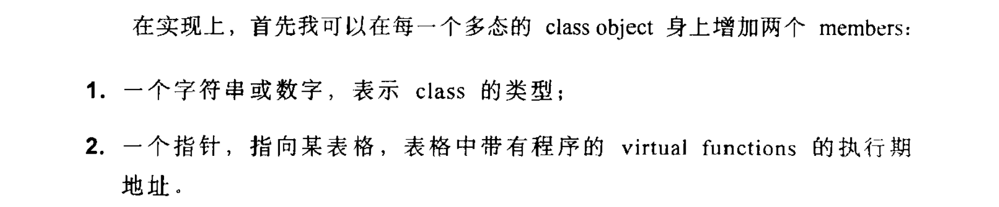
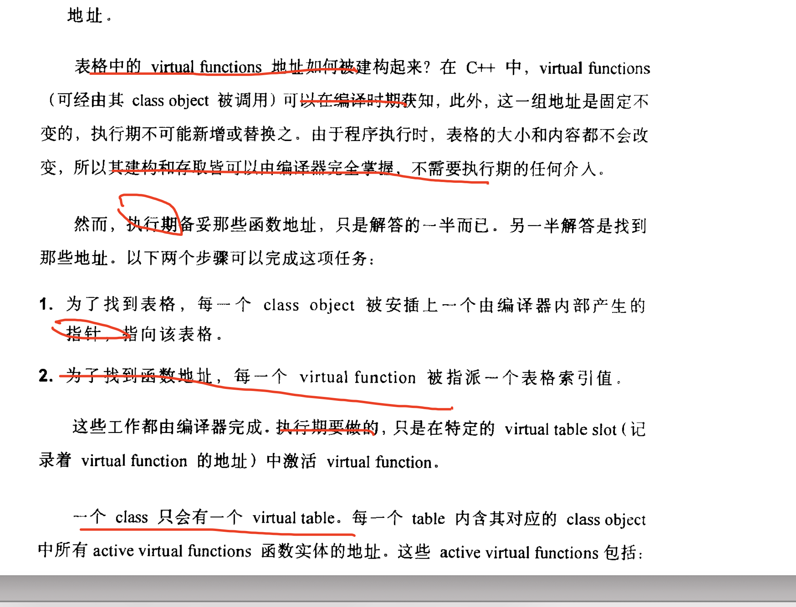
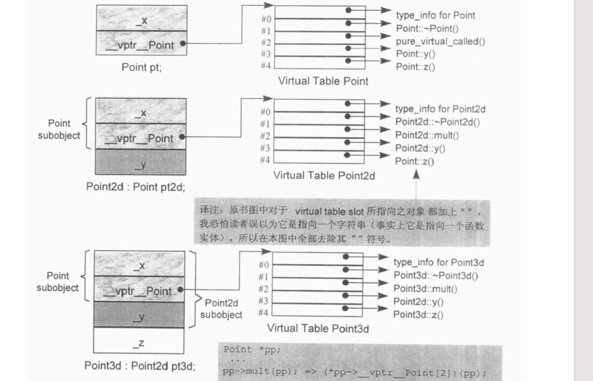
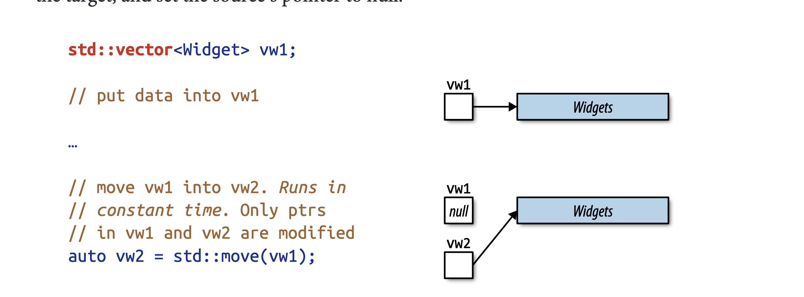
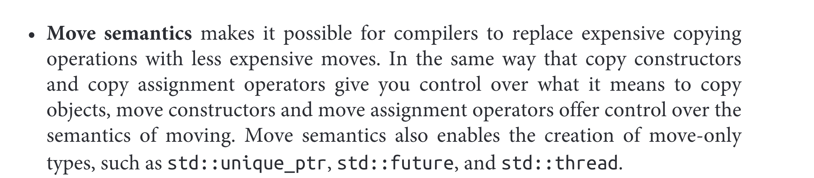
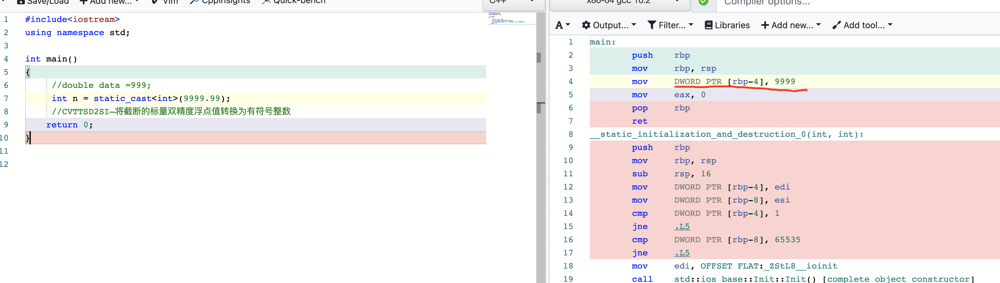

  

>  学C++一年了感觉还是停留在表层.没有深入 如何破？---程序员老王


 ####  问：什么左值？


**我的第一次回答：**

左值是一个没有地址的值？是一个临时对象，无法通过&获取地址

反问：真的没有地址吗？没有地址怎么被访问：


这说明：

不通过，一被反问 表示不通过


- rvalue则是一个临时变量，不存在于内存中，存在于CPU的寄存器或者指令的立即数中(immediate number)，因此我们不能改变它的值，不能取地址* 【汇编白看了】，非引用返回的临时变量、运算表达式产生的临时变量、 原始字面量、Lambda 表达式都属于纯右值 【从变量角度，遍历是地址的】
- **将亡值(xvalue, expiring value)**，是 C++11 为了引入右值引用而提出的概念（因此在传统 C++中， 纯右值和右值是同一个概念），也就是即将被销毁、却能够被移动的值
- 右值引用的声明让这个临时值的生命周期得以延长、只要变量还活着，那么将亡值将继续存活


```c++
A& operator=(A& src) //1 实现相同效果
A& operator=(A&& src) //2 实现相同效果
做了一个测试：&传递也能实现 && 移动赋值/构造效果
为啥大家一直强调 右值引用作用，不明白
  
  右值引用可以传右值,引用不行 需要const &,但是cosnt不变的意思。
  

```

## 我的第二次回答：

- 零时对象
- 无法获取地址
- 表达式：


面试官：摇头，你紧张，


### 用汇编编解释什么是右值，右值引用，零时对象


- 右值：存储在寄存器或者指令中变量，而不是存储在内存中变量。

> 一个变量存储位置，代码段指令中，寄存器 或者堆栈中
>
> 只要是活在寄存器里的变量，都是右值


- 右值引用延长了右值的生命周期

  > 右值被放到了一个变量里，那当然就是避免了被从寄存器里扔出去就消失的命运了，他已经是一个有内存空间的变量了
  >
  > 右值引用其实是开辟块空间。


演示：https://godbolt.org/z/Eq3srq


https://godbolt.org/z/1e59qn


- **6.3 Temporary Objects**


### 从汇编语言角度剖析右值引用和左值引用的本质


#### move


~~~
void TestRightReference()
{
    std::vector<int> tmp(2, 10);
    // tmp will be empty, and cpy has the resource of tmp
    std::vector<int> cpy = std::move(tmp);
}
~~~


## 我的第三次回答：


### 问题：unique_ptr 的原理是什么？

> 大海捞针无从回答，我根本不知道那个点，需要面试官提醒


**我的第一次回答：**

> 唯一性，不允许拷贝和构造。


- 面试官：15分钟过去了

直摇头，等着你继续说 他期望点，他期望什么我不会知道 慌张了，提示半天 我也没想出来，

一直不听说不允许拷贝和构造，你说没问题，他们期望其他的，你没考虑这个情况


```c++
namespace std {
    template <typename T, typename D = default_delete<T>>
    class unique_ptr
    {
    public:
        explicit unique_ptr(pointer p) noexcept;
        ~unique_ptr() noexcept;    

	T& operator*() const;
        T* operator->() const noexcept;

	unique_ptr(const unique_ptr &) = delete;
        unique_ptr& operator=(const unique_ptr &) = delete;

	unique_ptr(unique_ptr &&) noexcept;
	unique_ptr& operator=(unique_ptr &&) noexcept;
	// ...
    private:
        pointer __ptr;
    };
}

Item 18:Use std::unique_ptr for exclusive-ownershipresource management.
  std::unique_ptrs are thesame  size  as  raw  pointers
  std::unique_ptr   embodies   exclusive   ownership   semantics
  
  
  Moving  a  std::unique_ptr  transfersownership from the source pointer to the destination pointer. (The source pointer isset  to  null.)  
```


问：**auto_ptr的缺陷在哪里？为什么不应该用？**

https://www.zhihu.com/question/37351146

所有权：

std::unique_ptr实现了独享所有权的语义。一个非空的std::unique_ptr总是拥有它所指向的资源。转移一个std::unique_ptr将会把所有权也从源指针转移给目标指针（源指针被置空）。


拷贝一个std::unique_ptr将不被允许，因为如果你拷贝一个std::unique_ptr,那么拷贝结束后，这两个std::unique_ptr都会指向相同的资源，它们都认为自己拥有这块资源（所以都会企图释放）。因此std::unique_ptr是一个仅能移动（move_only）的类型


**第二次回答：**


move 就是swap

- 面试官：

直摇头


- 后记：

  Item 18:Use std::unique_ptr for exclusive-ownershipresource management.

​       Item 19:Use std::shared_ptr for shared-ownershipresource management


# 虚函数


### 第一次回答


> 疑问：既然虚函数表，在编译时候确定了，并且放到只读数据段，问题来了，如果继承重写需要修改里面函数地址给怎办？并且不同对象 this不一样，虚函数表 只读数据段 怎么确定 每个对象函数运行地址怎么共用呀？这不是自相矛盾？
>
> 
>
> 虚函数表又称为“虚表”，它在编译期间就已经确定，在程序运行时就会被装载到只读数据段，在整个程序运行期间都会一直存在。一个类实例化的多个对象，它们 的虚函数指针指向的是同一张虚表。
>
> 
>
> 但是对一个虚函数取地址的话，由于其地址在编译时期是不能确定的（多态），所以我们只能获得一个索引值。糊涂了一个说不变，一个说变


### 函数,函数指针, 成员函数指针,区别？与虚函数有什么关系


## 使用gdb探索 C++ 虚函数表 


- 不同对象，创建不同的虚指针吗？创建不同的虚函数表吗？，

  ~~~
  set print object on
  (gdb) n
  39	    Derived d; 
  (gdb) n
  40	    Derived d1; 
   
  (gdb) p d
  $1 = (Derived) {<Base> = {
      _vptr.Base = 0x555555755d48 <vtable for Derived+16>}, <No data fields>}
  (gdb) p d1
  $2 = (Derived) {<Base> = {
      _vptr.Base = 0x555555755d48 <vtable for Derived+16>}, <No data fields>}
  (gdb) 
  
  (gdb) p /a *((void**)0x555555755d48)
  (gdb) shel c++filt _ZTI7Derived
  typeinfo for Derived
  //other
  (gdb) source ~/checksymbol.py
  (gdb) checksymbol 0x555555557d90 32
  0x555555557d90 <_ZTV1A+16>: 	 0x0000555555555284 	 A::~A()
  0x555555557d98 <_ZTV1A+24>: 	 0x000055555555529e 	 A::~A()
  0x555555557da0 <_ZTV1A+32>: 	 0x00005555555551ce 	 A::test()
  0x555555557da8 <_ZTV1A+40>: 	 0x00005555555551da 	 A::fa()
  //other
  (gdb) x/32xb 0x555555557d90
  0x555555557d90 <_ZTV1A+16>:	0x84	0x52	0x55	0x55	0x55	0x55	0x00	0x00
  0x555555557d98 <_ZTV1A+24>:	0x9e	0x52	0x55	0x55	0x55	0x55	0x00	0x00
  0x555555557da0 <_ZTV1A+32>:	0xce	0x51	0x55	0x55	0x55	0x55	0x00	0x00
  0x555555557da8 <_ZTV1A+40>:	0xda	0x51	0x55	0x55	0x55	0x55	0x00	0x00
  0x0000555555555284就是A::～A()函数的地址.
  
  一个类可以创建多个对象
  在创建对象时，编译系统只为对象中的成员数据（成员变量）分配内存空间
  而同类对象的成员函数的代码却是共享的。
  
  内部的成员函数：
  普通函数：不占用内存。
  虚函数：要占用4个字节，用来指定虚函数的虚拟函数表的入口地址。所以一个类的虚函数所占用的地址是不变的.
  ~~~

  

  - ### 虚函数的间接调用

    > 只有对于通过指针或引用的方式调用虚函数才是间接调用
    >
    > 普通方法的调用是直接将地址写在调用位置的，称作**直接调用** ；
    >
    > 那在有了`virtual`关键字之后再通过**指针或引用调用** 时，编译器在编译时肯定不会直接写，因为它需要查表才能知道要调用哪个方法，所以称作**间接调用** ，需要注意，只有通过指针或引用来调用才会发生间接调用！

  ~~~c++
  从汇编角度分析g++编译器如何实现虚函数动态绑定
    
  g++ -S -g  class_virtaul_fuc.cpp 
  call    _ZN6ClassBC1Ev
  call    *%rdx
  
    main:
          .cfi_def_cfa_offset 16
          .cfi_offset 6, -16
          movq    %rsp, %rbp
          .cfi_def_cfa_register 6
          subq    $32, %rsp
          .loc 1 38 0
          movq    %fs:40, %rax
          movq    %rax, -8(%rbp)
          xorl    %eax, %eax
          .loc 1 39 0
          leaq    16+_ZTV7Derived(%rip), %rax
          movq    %rax, -24(%rbp)
          .loc 1 42 0
          leaq    -24(%rbp), %rax
          movq    %rax, -16(%rbp)
          .loc 1 46 0
          movq    -16(%rbp), %rax
            
          movq    (%rax), %rax
          movq    (%rax), %rax
          movq    -16(%rbp), %rdx
          movss   .LC1(%rip), %xmm0
          movq    %rdx, %rdi
          call    *%rax
    
  ~~~

  


问：系统自动合成的default copy assignment operator对虚函数有什么操作？

>A class does not exhibit bitwise copy semantics for the default copy assignment operator:

>When the class declares one or more virtual functions (we must not copy the vptr address of the right- hand class object, since it might be a derived class object)








编译期间确定了。

变化的ptr。

# 三.Rvalue References, Move Semantics,and Perfect Forwarding


### 3.1 使用场景


> 当你回忆一片空白时候，不要伤心，你感到高兴，你找到自己不会地方，赶紧高明白。
>
> 你感觉地方有宝，但是想不出来，一才会片空白，说明之前表面理解，不是记忆有问题，
>
> 而是思路 方式有问题。纠正正确理解问题，思考问题方式方法。
>
> 这才是 感觉到了，但是没有真正做到，只有一步之遥。
>
> 去解决之前没有完成的事情。


**表面理解就是错误的理解，你发现问题出在哪里**，**才能对症下药**。


- 你根本不知道唯一智能指针概念，更别说如何保证如何做到唯一，你不让拷贝，怎么对操作

- 你根本不知道智能指针就返回值，如果不能copy怎么用 唯一智能指。

- 全部智能指针都采用引用计数技术吗？

- 我是说dynamic_cast 为什么只能对类的指针或者引用 进行转换，不能对内置类型进行转换，static可以

- move函数就是swap，这个理解时错误的。

- ****

  static_cast 在编译期间完成了，不需要运行执行？

### 3.1.1 std::unique_ptr 代替auto_ptr,资源说有权（函数重载（move（object））


1. Moving  a  std::unique_ptr  transfersownership from the source pointer to the destination pointer. (The source pointer isset  to  null.)  


std::move unconditionally casts its argument to an rvalue







必须弄清楚static_cast用法

1. 左值到右值显式转换

2. 静态转换在编译期间直接转换，不需要到运行时在执行。 https://godbolt.org/z/cbrvWr

   任何问题在编译器能解决，尽量不要拖到运行期

   

   而所谓的编译期分配，大多存在static变量中，他们是写在程序代码中的。而c++的static的静态对象的构造函数，语言保证其在main函数之前调用。

   



必须弄清楚**dynamic_cast**` `**<**` new-type `**>**` `**(**` expression)用法

1. Safely converts pointers and references to classes up, down, and sideways along the inheritance hierarchy.
2. pointer to complete class type, reference to complete class type
3. 对类的指针或者引用才能转换,普通的变量不行 
4.  如果有继承必须有虚函数,typeid(x)在能识具体的类。


Item 25:Use std::move on rvalue references,std::forward on universal references.


Rvalue references bind only to objects that are candidates for moving


### 3.1.2

- It  may  have  to  use  more  memory
- std::shared_ptrs  offer  convenience  approaching  that  of  garbage  collectionfor the shared lifetime management of arbitrary resources


### 参考

  [1]  https://zhuanlan.zhihu.com/p/138210501

【2】 http://senlinzhan.github.io/2015/04/20/%E8%B0%88%E8%B0%88C-%E7%9A%84%E6%99%BA%E8%83%BD%E6%8C%87%E9%92%88/

【3】https://blog.csdn.net/yanglingwell/article/details/56682591

【4】https://www.zhihu.com/question/37351146

【5】https://blog.csdn.net/weixin_42205987/article/details/82947443?utm_medium=distribute.pc_relevant_t0.none-task-blog-BlogCommendFromMachineLearnPai2-1.control&depth_1-utm_source=distribute.pc_relevant_t0.none-task-blog-BlogCommendFromMachineLearnPai2-1.control

【6】为什么auto_ptr不可以作为STL标准容器的元素，而shared_ptr可以? 

https://blog.csdn.net/sinat_31275315/article/details/108256243?utm_medium=distribute.pc_relevant.none-task-blog-BlogCommendFromMachineLearnPai2-2.control&depth_1-utm_source=distribute.pc_relevant.none-task-blog-BlogCommendFromMachineLearnPai2-2.control

https://blog.csdn.net/messiran10/article/details/52269813

【6】https://blog.csdn.net/qq_36359022/article/details/81870219

[7] https://blog.csdn.net/qq_39755395/article/details/79751362?utm_medium=distribute.pc_relevant_t0.none-task-blog-BlogCommendFromMachineLearnPai2-1.control ok

【8】 https://maimai.cn/web/gossip_detail?gid=28548835&egid=f9572a925d4d11ebbb08801844e2d86c

【9】 https://blog.csdn.net/qq_39755395/article/details/79751362?utm_medium=distribute.pc_relevant_t0.none-task-blog-BlogCommendFromMachineLearnPai2-1.control 【good】

【9】 https://blog.csdn.net/iicy266/article/details/11906807【good 】

https://blog.csdn.net/haoel/article/details/1948051 C++ 虚函数表解析 【***\*陈皓\****  看10遍-】

https://blog.csdn.net/haoel/article/details/1948051【25*1】

【11】 [gdb查看虚函数表、函数地址](https://www.cnblogs.com/johnnyflute/p/3675630.html) https://www.cnblogs.com/johnnyflute/p/3675630.html 【good 0k】

【12】 使用gdb探索 C++ 虚函数表 —— 单继承https://blog.mengy.org/cpp-virtual-table-1/ 【ok】

【13】从汇编角度分析g++编译器如何实现虚函数动态绑定

https://blog.nowcoder.net/n/5faeb75c3f4d4754b2411bd32c1318e3?from=nowcoder_improve[没看懂]

【14】 https://kevins.pro/virtual_principle.html

【15】 https://en.cppreference.com/w/cpp/language/static_cast 

   lvalue-to-rvalue

【16】 https://www.zhihu.com/question/431196480/answer/1591931171 编译期间确定空间。


# Problem：


## Guru Questions 1（大师级问题）

既然智指针，能避免内存泄漏问题，

 能代替all场景的原始指针吗？，

为什么发明三个 而不是一个，来一统天下。


- unique_ptr 代替全部原始指针吗？
- shared_ptr 为什么不能一统天下？

答： 不是的，如果使用不当会造成 core 或者 不执行析构函数。


在类的成员，或者函数参数传递。


