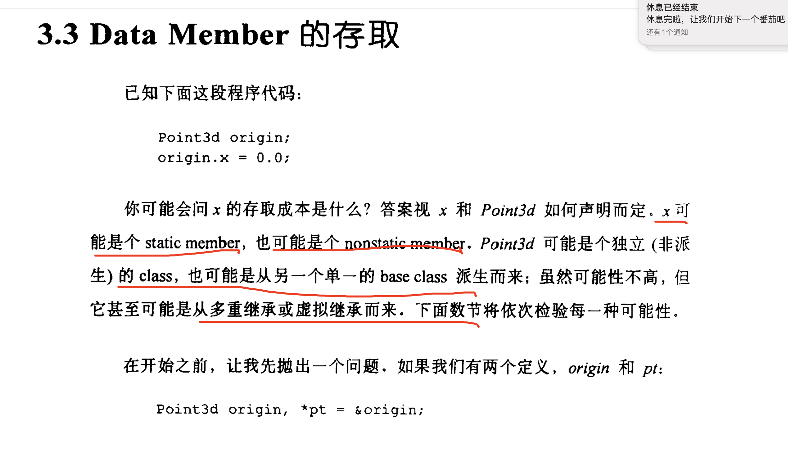
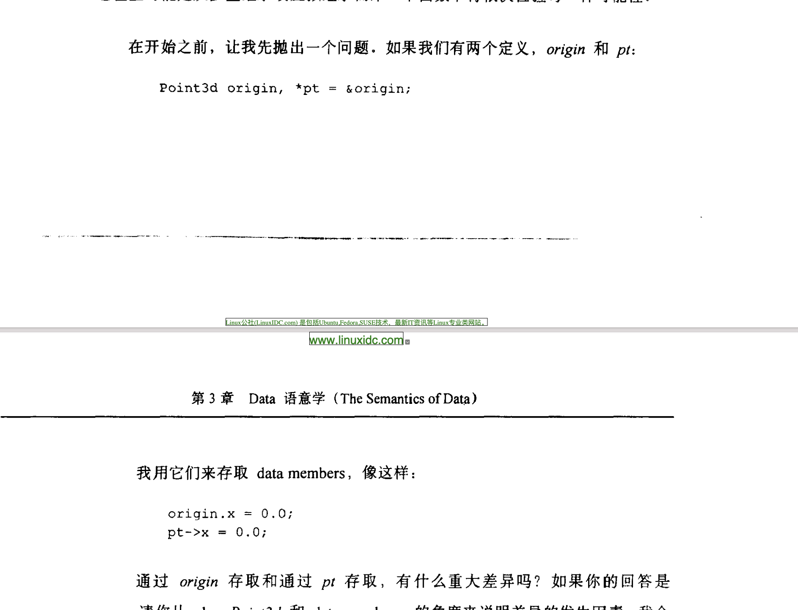

# C++核心准则（CppCoreGuidelines）边译边学


https://github.com/isocpp/CppCoreGuidelines/blob/master/CppCoreGuidelines.md

https://github.com/lynnboy/CppCoreGuidelines-zh-CN/blob/master/CppCoreGuidelines-zh-CN.md


## 任务

## C.hier: Class hierarchies (OOP)

A class hierarchy is constructed to represent a set of hierarchically organized concepts (only). Typically base classes act as interfaces. There are two major uses for hierarchies, often named implementation inheritance and interface inheritance.

Class hierarchy rule summary:

- [C.120: Use class hierarchies to represent concepts with inherent hierarchical structure (only)](https://github.com/isocpp/CppCoreGuidelines/blob/master/CppCoreGuidelines.md#Rh-domain)
- [C.121: If a base class is used as an interface, make it a pure abstract class](https://github.com/isocpp/CppCoreGuidelines/blob/master/CppCoreGuidelines.md#Rh-abstract)
- [C.122: Use abstract classes as interfaces when complete separation of interface and implementation is needed](https://github.com/isocpp/CppCoreGuidelines/blob/master/CppCoreGuidelines.md#Rh-separation)

Designing rules for classes in a hierarchy summary:

- [C.126: An abstract class typically doesn't need a constructor](https://github.com/isocpp/CppCoreGuidelines/blob/master/CppCoreGuidelines.md#Rh-abstract-ctor)
- [C.127: A class with a virtual function should have a virtual or protected destructor](https://github.com/isocpp/CppCoreGuidelines/blob/master/CppCoreGuidelines.md#Rh-dtor)
- [C.128: Virtual functions should specify exactly one of `virtual`, `override`, or `final`](https://github.com/isocpp/CppCoreGuidelines/blob/master/CppCoreGuidelines.md#Rh-override)
- [C.129: When designing a class hierarchy, distinguish between implementation inheritance and interface inheritance](https://github.com/isocpp/CppCoreGuidelines/blob/master/CppCoreGuidelines.md#Rh-kind)
- [C.130: For making deep copies of polymorphic classes prefer a virtual `clone` function instead of copy construction/assignment](https://github.com/isocpp/CppCoreGuidelines/blob/master/CppCoreGuidelines.md#Rh-copy)
- [C.131: Avoid trivial getters and setters](https://github.com/isocpp/CppCoreGuidelines/blob/master/CppCoreGuidelines.md#Rh-get)
- [C.132: Don't make a function `virtual` without reason](https://github.com/isocpp/CppCoreGuidelines/blob/master/CppCoreGuidelines.md#Rh-virtual)
- [C.133: Avoid `protected` data](https://github.com/isocpp/CppCoreGuidelines/blob/master/CppCoreGuidelines.md#Rh-protected)
- [C.134: Ensure all non-`const` data members have the same access level](https://github.com/isocpp/CppCoreGuidelines/blob/master/CppCoreGuidelines.md#Rh-public)
- [C.135: Use multiple inheritance to represent multiple distinct interfaces](https://github.com/isocpp/CppCoreGuidelines/blob/master/CppCoreGuidelines.md#Rh-mi-interface)
- [C.136: Use multiple inheritance to represent the union of implementation attributes](https://github.com/isocpp/CppCoreGuidelines/blob/master/CppCoreGuidelines.md#Rh-mi-implementation)
- [C.137: Use `virtual` bases to avoid overly general base classes](https://github.com/isocpp/CppCoreGuidelines/blob/master/CppCoreGuidelines.md#Rh-vbase)
- [C.138: Create an overload set for a derived class and its bases with `using`](https://github.com/isocpp/CppCoreGuidelines/blob/master/CppCoreGuidelines.md#Rh-using)
- [C.139: Use `final` on classes sparingly](https://github.com/isocpp/CppCoreGuidelines/blob/master/CppCoreGuidelines.md#Rh-final)
- [C.140: Do not provide different default arguments for a virtual function and an overrider](https://github.com/isocpp/CppCoreGuidelines/blob/master/CppCoreGuidelines.md#Rh-virtual-default-arg)

Accessing objects in a hierarchy rule summary:

- [C.145: Access polymorphic objects through pointers and references](https://github.com/isocpp/CppCoreGuidelines/blob/master/CppCoreGuidelines.md#Rh-poly)
- [C.146: Use `dynamic_cast` where class hierarchy navigation is unavoidable](https://github.com/isocpp/CppCoreGuidelines/blob/master/CppCoreGuidelines.md#Rh-dynamic_cast)
- [C.147: Use `dynamic_cast` to a reference type when failure to find the required class is considered an error](https://github.com/isocpp/CppCoreGuidelines/blob/master/CppCoreGuidelines.md#Rh-ref-cast)
- [C.148: Use `dynamic_cast` to a pointer type when failure to find the required class is considered a valid alternative](https://github.com/isocpp/CppCoreGuidelines/blob/master/CppCoreGuidelines.md#Rh-ptr-cast)
- [C.149: Use `unique_ptr` or `shared_ptr` to avoid forgetting to `delete` objects created using `new`](https://github.com/isocpp/CppCoreGuidelines/blob/master/CppCoreGuidelines.md#Rh-smart)
- [C.150: Use `make_unique()` to construct objects owned by `unique_ptr`s](https://github.com/isocpp/CppCoreGuidelines/blob/master/CppCoreGuidelines.md#Rh-make_unique)
- [C.151: Use `make_shared()` to construct objects owned by `shared_ptr`s](https://github.com/isocpp/CppCoreGuidelines/blob/master/CppCoreGuidelines.md#Rh-make_shared)
- [C.152: Never assign a pointer to an array of derived class objects to a pointer to its base](https://github.com/isocpp/CppCoreGuidelines/blob/master/CppCoreGuidelines.md#Rh-array)
- [C.153: Prefer virtual function to casting](https://github.com/isocpp/CppCoreGuidelines/blob/master/CppCoreGuidelines.md#Rh-use-virtual)


### C.67: A polymorphic class should suppress copying

##### Reason

A *polymorphic class* is a class that defines or inherits at least one virtual function.

 It is likely that it will be used as a base class for other derived classes with polymorphic behavior. 

If it is accidentally passed by value, with the implicitly generated copy constructor and assignment,

we risk slicing: only the base portion of a derived object will be copied, and the polymorphic behavior will be corrupted.

翻译：

多态：

如果一个类不是derived classes 直接assignment base class ，而是 base class（虽然指向派生类） assignment   base clas

这样失去多态行为，因为会出现切割行为（不同对象模型）


##### Example, bad

```
class B { // BAD: polymorphic base class doesn't suppress copying
public:
    virtual char m() { return 'B'; }
    // ... nothing about copy operations, so uses default ...
};

class D : public B {
public:
    char m() override { return 'D'; }
    // ...
};

void f(B& b)
{
    auto b2 = b; // oops, slices the object; b2.m() will return 'B'
}

D d;
f(d);
```

##### Example

```
class B { // GOOD: polymorphic class suppresses copying
public:
    B(const B&) = delete;
    B& operator=(const B&) = delete;
    virtual char m() { return 'B'; }
    // ...
};

class D : public B {
public:
    char m() override { return 'D'; }
    // ...
};

void f(B& b)
{
    auto b2 = b; // ok, compiler will detect inadvertent copying, and protest
}

D d;
f(d);
```

##### Note


If you need to create deep copies of polymorphic objects, use `clone()` functions: see [C.130](https://github.com/isocpp/CppCoreGuidelines/blob/master/CppCoreGuidelines.md#Rh-copy).

翻译：

例子2 只告诉你，不要使用默认操作，但是不提供拷贝行为，语法报错的，需要自己定义clone（）函数。

##### Exception

Classes that represent exception objects need both to be polymorphic and copy-constructible.

##### Enforcement

- Flag a polymorphic class with a non-deleted copy operation.
- Flag an assignment of polymorphic class objects.


### C.130: For making deep copies of polymorphic classes prefer a virtual `clone` function instead of copy construction/assignment

##### Reason

Copying a polymorphic class is discouraged due to the slicing problem, see [C.67](https://github.com/isocpp/CppCoreGuidelines/blob/master/CppCoreGuidelines.md#Rc-copy-virtual). If you really need copy semantics, copy deeply: Provide a virtual `clone` function that will copy the actual most-derived type and return an owning pointer to the new object, and then in derived classes return the derived type (use a covariant return type).

##### Example

```
class B {
public:
    virtual owner<B*> clone() = 0;
    virtual ~B() = default;

    B(const B&) = delete;
    B& operator=(const B&) = delete;
};

class D : public B {
public:
    owner<D*> clone() override;
    ~D() override;
};
```

Generally, it is recommended to use smart pointers to represent ownership (see [R.20](https://github.com/isocpp/CppCoreGuidelines/blob/master/CppCoreGuidelines.md#Rr-owner)). However, because of language rules, the covariant return type cannot be a smart pointer: `D::clone` can't return a `unique_ptr<D>` while `B::clone` returns `unique_ptr<B>`. Therefore, you either need to consistently return `unique_ptr<B>` in all overrides, or use `owner<>` utility from the [Guidelines Support Library](https://github.com/isocpp/CppCoreGuidelines/blob/master/CppCoreGuidelines.md#SS-views).


## C.126  C++核心准则（CppCoreGuidelines）边译边学

[C.126: An abstract class typically doesn't need a constructor](https://github.com/isocpp/CppCoreGuidelines/blob/master/CppCoreGuidelines.md#Rh-abstract-ctor)


### C.126: An abstract class typically doesn't need a constructor

##### Reason

An abstract class typically does not have any data for a constructor to initialize.

翻译：抽象类 只提供接口，不提供数据，如果提供数据，让子类去实现，这个和java ，go interface用法一致。

##### Example

```
???
```

##### Exception

- A base class constructor that does work, such as registering an object somewhere, might need a constructor.
- In extremely rare cases, you might find it reasonable for an abstract class to have a bit of data shared by all derived classes (e.g., use statistics data, debug information, etc.); such classes tend to have constructors. But be warned: Such classes also tend to be prone to requiring virtual inheritance.

##### Enforcement

Flag abstract classes with constructors.


## C.127  C++核心准则（CppCoreGuidelines）边译边学

### C.127: A class with a virtual function should have a virtual or protected destructor

析构函数为虚函数。

##### Reason

A class with a virtual function is usually (and in general) used via a pointer to base. Usually, the last user has to call delete on a pointer to base, often via a smart pointer to base, so the destructor should be public and virtual. 

Less commonly, if deletion through a pointer to base is not intended to be supported, the destructor should be protected and non-virtual; see [C.35](https://github.com/isocpp/CppCoreGuidelines/blob/master/CppCoreGuidelines.md#Rc-dtor-virtual).

##### Example, bad

```c++
struct B {
    virtual int f() = 0;
    // ... no user-written destructor, defaults to public non-virtual ...
};

// bad: derived from a class without a virtual destructor
struct D : B {
    string s {"default"};
};

void use()
{
    unique_ptr<B> p = make_unique<D>();
    // ...
} // undefined behavior, might call B::~B only and leak the string
//派生类析构函数函数没有执行


```

##### Note

There are people who don't follow this rule because they plan to use a class only through a `shared_ptr`: `std::shared_ptr<B> p = std::make_shared<D>(args);` 

Here, the shared pointer will take care of deletion, so no leak will occur from an inappropriate `delete` of the base. People who do this consistently can get a false positive, but the rule is important -- what if one was allocated using `make_unique`? 

It's not safe unless the author of `B` ensures that it can never be misused, such as by making all constructors private and providing a factory function to enforce the allocation with `make_shared`.


> 防不胜防：我就执行delete ptr，怎么程序这么多话题 成员绑定和函数绑定
> 一个全局函数式如何被调用的 //效率一样
> 一个类成员函数是如何被调用的。 //效率一样
> 一个类虚函数式如何被调用的.//稍微不不一样。
>
> 一个类成员是如何被调用的。
>
> 

##### Enforcement

- A class with any virtual functions should have a destructor that is either public and virtual or else protected and non-virtual.
- Flag `delete` of a class with a virtual function but no virtual destructor.





## C.128  C++核心准则（CppCoreGuidelines）边译边学


### C.128: Virtual functions should specify exactly one of `virtual`, `override`, or `final`

##### Reason

Readability. Detection of mistakes. Writing explicit `virtual`, `override`, or `final` is self-documenting and enables the compiler to catch mismatch of types and/or names between base and derived classes. 

However, writing more than one of these three is both redundant and a potential source of errors.

It's simple and clear:

- `virtual` means exactly and only "this is a new virtual function."
- `override` means exactly and only "this is a non-final overrider."
- `final` means exactly and only "this is a final overrider."

##### Example, bad

```
struct B {
    void f1(int);
    virtual void f2(int) const;
    virtual void f3(int);
    // ...
};

struct D : B {
    void f1(int);        // bad (hope for a warning): D::f1() hides B::f1()
    void f2(int) const;  // bad (but conventional and valid): no explicit override
    void f3(double);     // bad (hope for a warning): D::f3() hides B::f3()
    // ...
};
```

##### Example, good

```
struct Better : B {
    void f1(int) override;        // error (caught): Better::f1() hides B::f1()
    void f2(int) const override;
    void f3(double) override;     // error (caught): Better::f3() hides B::f3()
    // ...
};
```

#### Discussion

We want to eliminate two particular classes of errors:

- **implicit virtual**: the programmer intended the function to be implicitly virtual and it is (but readers of the code can't tell); or the programmer intended the function to be implicitly virtual but it isn't (e.g., because of a subtle parameter list mismatch); or the programmer did not intend the function to be virtual but it is (because it happens to have the same signature as a virtual in the base class)
- **implicit override**: the programmer intended the function to be implicitly an overrider and it is (but readers of the code can't tell); or the programmer intended the function to be implicitly an overrider but it isn't (e.g., because of a subtle parameter list mismatch); or the programmer did not intend the function to be an overrider but it is (because it happens to have the same signature as a virtual in the base class -- note this problem arises whether or not the function is explicitly declared virtual, because the programmer might have intended to create either a new virtual function or a new non-virtual function)

Note: On a class defined as `final`, it doesn't matter whether you put `override` or `final` on an individual virtual function.

Note: Use `final` on functions sparingly. It does not necessarily lead to optimization, and it precludes further overriding.

##### Enforcement

- Compare virtual function names in base and derived classes and flag uses of the same name that does not override.
- Flag overrides with neither `override` nor `final`.
- Flag function declarations that use more than one of `virtual`, `override`, and `final`.

翻译：


> 相同名字，不同参数可能出现 隐藏问题，因为虚函数解决不了隐藏问题。


`重载(overload)，覆盖(override),隐藏(hide）


重要例子：https://blog.csdn.net/u011857683/article/details/79937102

~~~c++
#include <iostream>
using namespace std;
 
 
class CB
{
public:
    //假设这个完全正确，后面也是用不了。
    virtual  void f(int)
    {
        cout << "CB::f(int)" << endl;
    }
};
 
 
class CD : public CB
{
public:
    void f(int,int)
    {
        cout << "CD::f(int,int)" << endl;
    }
    
    void test()
    {
        f(1);//报错
    }
};
 
 
int main(int argc, char* argv[])
{   
    CD d;
    //d.f(1); //隐藏了
    CB b=d;// 多态 跟普通对象没有关系，为什么？ 多态 关键是什么？
    b.f(1);  //不是多态
    
    CB* pb =&d;//多态 跟派生类 分配在 堆上和栈上 没有关系，为什么？ 多态 关键是什么？
    pb->f(1);
    
    CB* pb2 =&b;//多态 跟指针也没 没有关系，为什么？ 多态 关键是什么？boss任务
    pb2->f(1);

    return 0;
}
~~~


## C.128  C++核心准则（CppCoreGuidelines）边译边学


### C.129: When designing a class hierarchy, distinguish between implementation inheritance and interface inheritance

在设计类层次结构时，请区分实现继承和接口继承

##### Reason

Implementation details in an interface make the interface brittle; that is,

 make its users vulnerable to having to recompile after changes in the implementation. 

使其用户易于在实现更改后不得不重新编译。

Data in a base class increases the complexity of implementing the base and can lead to replication of code.


##### Note

Definition:

- interface inheritance is the use of inheritance to separate users from implementations, in particular to allow derived classes to be added and changed without affecting the users of base classes.

  接口继承是一种继承，用于将用户与实现分开，特别是允许在不影响基类用户的情况下添加和更改派生类。

- implementation inheritance is the use of inheritance to simplify implementation of new facilities by making useful operations available for implementers of related new operations (sometimes called "programming by difference").

  

A pure interface class is simply a set of pure virtual functions; see [I.25](https://github.com/isocpp/CppCoreGuidelines/blob/master/CppCoreGuidelines.md#Ri-abstract).

In early OOP (e.g., in the 1980s and 1990s), implementation inheritance and interface inheritance were often mixed and bad habits die hard. Even now, mixtures are not uncommon in old code bases and in old-style teaching material.


在早期的OOP中（例如，在1980年代和1990年代），实现继承和接口继承常常混合在一起，坏习惯也很难消亡。 即使到了现在，在旧的代码库和旧式的教材中，混合也是很常见的。


The importance of keeping the two kinds of inheritance increases

- with the size of a hierarchy (e.g., dozens of derived classes),
- with the length of time the hierarchy is used (e.g., decades), and
- with the number of distinct organizations in which a hierarchy is used (e.g., it can be difficult to distribute an update to a base class)

##### Example, bad

```
class Shape {   // BAD, mixed interface and implementation
public:
    Shape();
    Shape(Point ce = {0, 0}, Color co = none): cent{ce}, col {co} { /* ... */}

    Point center() const { return cent; }
    Color color() const { return col; }

    virtual void rotate(int) = 0;
    virtual void move(Point p) { cent = p; redraw(); }

    virtual void redraw();

    // ...
private:
    Point cent;
    Color col;
};

class Circle : public Shape {
public:
    Circle(Point c, int r) : Shape{c}, rad{r} { /* ... */ }

    // ...
private:
    int rad;
};

class Triangle : public Shape {
public:
    Triangle(Point p1, Point p2, Point p3); // calculate center
    // ...
};
```

Problems:

- As the hierarchy grows and more data is added to `Shape`, the constructors get harder to write and maintain.
- Why calculate the center for the `Triangle`? we might never use it.
- Add a data member to `Shape` (e.g., drawing style or canvas) and all classes derived from `Shape` and all code using `Shape` will need to be reviewed, possibly changed, and probably recompiled.

在类中添加Shape成员变量添，

所有从“ Shape”派生的类以及所有使用“ Shape”的代码都需要进行检查，可能更改并可能重新编译。


The implementation of `Shape::move()` is an example of implementation inheritance: we have defined `move()` once and for all for all derived classes. The more code there is in such base class member function implementations and the more data is shared by placing it in the base, the more benefits we gain - and the less stable the hierarchy is.

##### Example

This Shape hierarchy can be rewritten using interface inheritance:

```
class Shape {  // pure interface
public:
    virtual Point center() const = 0;
    virtual Color color() const = 0;

    virtual void rotate(int) = 0;
    virtual void move(Point p) = 0;

    virtual void redraw() = 0;

    // ...
};
```

Note that a pure interface rarely has constructors: there is nothing to construct.

```
class Circle : public Shape {
public:
    Circle(Point c, int r, Color c) : cent{c}, rad{r}, col{c} { /* ... */ }

    Point center() const override { return cent; }
    Color color() const override { return col; }

    // ...
private:
    Point cent;
    int rad;
    Color col;
};
```

The interface is now less brittle, but there is more work in implementing the member functions. For example, `center` has to be implemented by every class derived from `Shape`.

该接口现在不那么脆弱，但是在实现成员函数方面还有更多工作要做。 例如，“中心”必须由“形状”派生的每个类实现。


##### Example, dual hierarchy

How can we gain the benefit of stable hierarchies from implementation hierarchies and the benefit of implementation reuse from implementation inheritance? One popular technique is dual hierarchies. There are many ways of implementing the idea of dual hierarchies; here, we use a multiple-inheritance variant.

First we devise a hierarchy of interface classes:

```
class Shape {   // pure interface
public:
    virtual Point center() const = 0;
    virtual Color color() const = 0;

    virtual void rotate(int) = 0;
    virtual void move(Point p) = 0;

    virtual void redraw() = 0;

    // ...
};

class Circle : public virtual Shape {   // pure interface
public:
    virtual int radius() = 0;
    // ...
};
```

To make this interface useful, we must provide its implementation classes (here, named equivalently, but in the `Impl` namespace):

```
class Impl::Shape : public virtual ::Shape { // implementation
public:
    // constructors, destructor
    // ...
    Point center() const override { /* ... */ }
    Color color() const override { /* ... */ }

    void rotate(int) override { /* ... */ }
    void move(Point p) override { /* ... */ }

    void redraw() override { /* ... */ }

    // ...
};
```

Now `Shape` is a poor example of a class with an implementation, but bear with us because this is just a simple example of a technique aimed at more complex hierarchies.

```
class Impl::Circle : public virtual ::Circle, public Impl::Shape {   // implementation
public:
    // constructors, destructor

    int radius() override { /* ... */ }
    // ...
};
```

And we could extend the hierarchies by adding a Smiley class (:-)):

```
class Smiley : public virtual Circle { // pure interface
public:
    // ...
};

class Impl::Smiley : public virtual ::Smiley, public Impl::Circle {   // implementation
public:
    // constructors, destructor
    // ...
}
```

There are now two hierarchies:

- interface: Smiley -> Circle -> Shape
- implementation: Impl::Smiley -> Impl::Circle -> Impl::Shape

Since each implementation is derived from its interface as well as its implementation base class we get a lattice (DAG):

```
Smiley     ->         Circle     ->  Shape
  ^                     ^               ^
  |                     |               |
Impl::Smiley -> Impl::Circle -> Impl::Shape
```

As mentioned, this is just one way to construct a dual hierarchy.

The implementation hierarchy can be used directly, rather than through the abstract interface.

```
void work_with_shape(Shape&);

int user()
{
    Impl::Smiley my_smiley{ /* args */ };   // create concrete shape
    // ...
    my_smiley.some_member();        // use implementation class directly
    // ...
    work_with_shape(my_smiley);     // use implementation through abstract interface
    // ...
}
```

This can be useful when the implementation class has members that are not offered in the abstract interface or if direct use of a member offers optimization opportunities (e.g., if an implementation member function is `final`)

##### Note

Another (related) technique for separating interface and implementation is [Pimpl](https://github.com/isocpp/CppCoreGuidelines/blob/master/CppCoreGuidelines.md#Ri-pimpl).

##### Note

There is often a choice between offering common functionality as (implemented) base class functions and free-standing functions (in an implementation namespace). Base classes gives a shorter notation and easier access to shared data (in the base) at the cost of the functionality being available only to users of the hierarchy.

##### Enforcement

- Flag a derived to base conversion to a base with both data and virtual functions (except for calls from a derived class member to a base class member)
- ???


## C.130  C++核心准则（CppCoreGuidelines）[边译边学](https://github.com/lynnboy/CppCoreGuidelines-zh-CN/blob/master/CppCoreGuidelines-zh-CN.md#c130-%E5%A4%9A%E6%80%81%E7%B1%BB%E7%9A%84%E6%B7%B1%E6%8B%B7%E8%B4%9D%E4%BC%98%E5%85%88%E9%87%87%E7%94%A8%E8%99%9A%E5%87%BD%E6%95%B0-clone-%E6%9D%A5%E6%9B%BF%E4%BB%A3%E5%A4%8D%E5%88%B6%E6%9E%84%E9%80%A0%E8%B5%8B%E5%80%BC)

### C.130: For making deep copies of polymorphic classes prefer a virtual `clone` function instead of copy construction/assignment


深度拷贝 不采用拷贝构造 用clone代替，自定义的也不行。


浅拷贝：栈上的值拷贝

深拷贝：堆上对象拷贝

对于c++来说，一个类对象，可以存储在堆上，也可以存储在栈上。

对java来说，一个类对象，只存储在堆上，虽然没有指针但是处处是引用。


##### Reason

Copying a polymorphic class is discouraged due to the slicing problem, see [C.67](https://github.com/isocpp/CppCoreGuidelines/blob/master/CppCoreGuidelines.md#Rc-copy-virtual). 

## 54. Avoid slicing. Consider `Clone` instead of copying in base classes

由于切片问题，不建议使用复制运算符操作多态类。


If you really need copy semantics, copy deeply: 

Provide a virtual `clone` function that will copy the actual most-derived type and return an owning pointer to the new object, 、、

and then in derived classes return the derived type (use a covariant return type).

##### Example

```
class B {
public:
    virtual owner<B*> clone() = 0;
    virtual ~B() = default;

    B(const B&) = delete;
    B& operator=(const B&) = delete;
};

class D : public B {
public:
    owner<D*> clone() override;
    ~D() override;
};
```

Generally, it is recommended to use smart pointers to represent ownership (see [R.20](https://github.com/isocpp/CppCoreGuidelines/blob/master/CppCoreGuidelines.md#Rr-owner)). 

However, because of language rules, the covariant return type cannot be a smart pointer: 

通常，建议使用智能指针来表示所有权（请参阅[R.20]
但是，由于语言规则的原因，协变返回类型不能是智能指针

因为，智能指针不进行拷贝，而是move或者引用计数

https://www.thinbug.com/q/24334888

https://www.zhihu.com/question/52610176

https://www.codenong.com/16030081/

`D::clone` can't return a `unique_ptr<D>` //返回值是具体的类

 while `B::clone` returns `unique_ptr<B>`.//返回值是抽象的类。


 Therefore, you either need to consistently return `unique_ptr<B>` in all overrides, or use `owner<>` utility from the [Guidelines Support Library](https://github.com/isocpp/CppCoreGuidelines/blob/master/CppCoreGuidelines.md#SS-views).


> 防不胜防：
>
> unique_ptr 为了保证唯一是默认是禁止copy操作的，如果想需要采用 move拷贝，那么如何实现unique_ptr 智能指针的深度拷贝呢？其实copy就托管的类，这里类是多态呢


> 防不胜防：
>
> 既然你了解知道智能指针，他们直接区别是什么？具体来说使用场景区别
>
> C++中的浅拷贝、深拷贝、智能指针

~~~c++
struct Base
{
    //some stuff
    auto clone() const { return std::unique_ptr<Base>(clone_impl()); }
protected:
    virtual Base* clone_impl() const = 0;
};

struct Derived : public Base
{
    //some stuff
protected:
    virtual Derived* clone_impl() const override { return new Derived(*this); };                                                
};

struct Foo
{
    std::unique_ptr<Base> ptr;  //points to Derived or some other derived class
    //rule of five
    ~Foo() = default;
    Foo(Foo const& other) : ptr(other.ptr->clone()) {}
    Foo(Foo && other) = default;
    Foo& operator=(Foo const& other) { ptr = other.ptr->clone(); return *this; }
    Foo& operator=(Foo && other) = default;
};
https://stackoverflow.com/questions/5148706/copying-a-polymorphic-object-in-c
https://stackoverflow.com/questions/5148706/copying-a-polymorphic-object-in-c。
~~~


## C.132   C++核心准则（CppCoreGuidelines）边译边学


### C.132: Don't make a function `virtual` without reason

##### Reason

Redundant `virtual` increases run-time and object-code size. A virtual function can be overridden and is thus open to mistakes in a derived class. A virtual function ensures code replication in a templated hierarchy.

##### Example, bad

```
template<class T>
class Vector {
public:
    // ...
    virtual int size() const { return sz; }   // bad: what good could a derived class do?
private:
    T* elem;   // the elements
    int sz;    // number of elements
};
```

This kind of "vector" isn't meant to be used as a base class at all.

##### Enforcement

- Flag a class with virtual functions but no derived classes.
- Flag a class where all member functions are virtual and have implementations.

### C.132: 请勿无理由地使函数 `virtual`

##### 理由

多余的 `virtual` 会增加运行时间和对象代码的大小。 虚函数可以被覆盖，因此派生类中可能因此发生错误。

 虚函数保证会在模板化的层次中造成代码重复。

##### 示例，不好

```
template<class T>
class Vector {
public:
    // ...
    virtual int size() const { return sz; }   // 不好：派生类能得到什么好处？
private:
    T* elem;   // 元素
    int sz;    // 元素的数量
};
```

这种类型的“向量”并非是为了让人用作基类的。

##### 强制实施

- 对带有虚函数但没有派生类的类进行标记。
- 对所有成员函数都为虚函数并带有实现的类进行标记。

## C.133   C++核心准则（CppCoreGuidelines）边译边学

##### Reason

`protected` data is a source of complexity and errors. `protected` data complicates the statement of invariants. `protected` data inherently violates the guidance against putting data in base classes, which usually leads to having to deal with virtual inheritance as well.

##### Example, bad

```
class Shape {
public:
    // ... interface functions ...
protected:
    // data for use in derived classes:
    Color fill_color;
    Color edge_color;
    Style st;
};
```

Now it is up to every derived `Shape` to manipulate the protected data correctly. This has been popular, but also a major source of maintenance problems. In a large class hierarchy, the consistent use of protected data is hard to maintain because there can be a lot of code, spread over a lot of classes. The set of classes that can touch that data is open: anyone can derive a new class and start manipulating the protected data. Often, it is not possible to examine the complete set of classes, so any change to the representation of the class becomes infeasible. There is no enforced invariant for the protected data; it is much like a set of global variables. The protected data has de facto become global to a large body of code.

##### 理由

`protected` 数据是复杂性和错误的一种来源。 `protected` 数据会把不变式的陈述搞复杂。 `protected` 数据天生违反了避免把数据放入基类的指导原则，而这样通常还会导致不得不采用虚继承。

##### 示例，不好

```
class Shape {
public:
    // ... 接口函数 ...
protected:
    // 为派生类所使用的数据：
    Color fill_color;
    Color edge_color;
    Style st;
};
```

这样，由每个所定义的 `Shape` 来保证对受保护数据正确进行操作。 这样做一度很流行，但同样是维护性问题的一种主要来源。 在大型的类层次中，很难保持对受保护数据的一致性使用，因为代码可能有很多， 分散于大量的类之中。 能够触碰这些数据的类的集合是开放的：任何人都可以派生一个新的类并开始操作这些受保护数据。 检查这些类的完整集合通常是不可能做到的，因此对类的表示进行任何改动都是不可行的。 这些受保护数据上并没有强加的不变式；它们更像是一组全局变量。 受保护数据在大块代码中事实上成为了全局变量。


### C.135: Use multiple inheritance to represent multiple distinct interfaces

##### 

### C.135: 用多继承来表达多个不同的接口


### C.136: Use multiple inheritance to represent the union of implementation attributes

### C.136: 用多继承来表达一些实现特性的合并


### C.137: 用 `virtual` 基类以避免过于通用的基类

### C.137: Use `virtual` bases to avoid overly general base classes

  如果base类有成员，可以采取虚继承。


### C.138: 用 `using` 来为派生类和其基类建立重载集合

### C.138: Create an overload set for a derived class and its bases with `using`

##### Reason

Without a using declaration, member functions in the derived class hide the entire inherited overload sets.

##### Example, bad

```c++
#include <iostream>
class B {
public:
    virtual int f(int i) { std::cout << "f(int): "; return i; }
    virtual double f(double d) { std::cout << "f(double): "; return d; }
    virtual ~B() = default;
};
class D: public B {
public:
    int f(int i) override { std::cout << "f(int): "; return i + 1; }
};
int main()
{
    D d;
    std::cout << d.f(2) << '\n';   // prints "f(int): 3"
    std::cout << d.f(2.3) << '\n'; // prints "f(int): 3"
} //隐藏
```

##### Example, good

```
class D: public B {
public:
    int f(int i) override { std::cout << "f(int): "; return i + 1; }
    using B::f; // exposes f(double)
};
```

##### Note

This issue affects both virtual and non-virtual member functions

For variadic bases, C++17 introduced a variadic form of the using-declaration,

```
template<class... Ts>
struct Overloader : Ts... {
    using Ts::operator()...; // exposes operator() from every base
};
```

##### Enforcement

Diagnose name hiding

### C.139: 对类运用 `final` 应当保守

### C.139: Use `final` on classes sparingly

##### 


##### 理由

这会造成混乱：覆盖函数是不会继承默认参数的。

##### 示例，不好

```
class Base {
public:
    virtual int multiply(int value, int factor = 2) = 0;
    virtual ~Base() = default;
};

class Derived : public Base {
public:
    int multiply(int value, int factor = 10) override;
};

Derived d;
Base& b = d;

b.multiply(10);  // 这两次调用将会调用相同的函数，但分别
d.multiply(10);  // 使用不同的默认实参，因此获得不同的结果
```

##### 强制实施

对虚函数默认参数中，如果其在基类和派生类的声明中是不同的，则对其进行标记。


##### Reason

That can cause confusion: An overrider does not inherit default arguments.

##### Example, bad

```
class Base {
public:
    virtual int multiply(int value, int factor = 2) = 0;
    virtual ~Base() = default;
};

class Derived : public Base {
public:
    int multiply(int value, int factor = 10) override;
};

Derived d;
Base& b = d;

b.multiply(10);  // these two calls will call the same function but
d.multiply(10);  // with different arguments and so different results
```

##### Enforcement

Flag default arguments on virtual functions if they differ between base and derived declarations.

## C.hier-access: 对类层次中的对象进行访问


## C.hier-access: Accessing objects in a hierarchy

### 

## C.145   C++核心准则（CppCoreGuidelines）边译边学

##### 

### C.145: 通过指针和引用来访问多态对象

### C.145: Access polymorphic objects through pointers and references

##### 理由

如果类带有虚函数的话，你（通常）并不知道你所使用的函数是由哪个类提供的。

##### 示例

```
struct B { int a; virtual int f(); virtual ~B() = default };
struct D : B { int b; int f() override; };

void use(B b)
{
    D d;
    B b2 = d;   // 切片
    B b3 = b;
}

void use2()
{
    D d;
    use(d);   // 切片
}
```

两个 `d` 都发生了切片。

##### 例外

你可以安全地访问处于自身定义的作用域之内的具名多态对象，这并不会将之切片。

```
void use3()
{
    D d;
    d.f();   // OK
}
```

##### 另见

[多态类应当抑制复制操作](https://github.com/lynnboy/CppCoreGuidelines-zh-CN/blob/master/CppCoreGuidelines-zh-CN.md#Rc-copy-virtual)

##### 强制实施

对所有切片都进行标记。

##### Reason

If you have a class with a virtual function, you don't (in general) know which class provided the function to be used.

如果不是指针或者引用，根本无法发挥多态特点，但是java吧引用放到底层实现。原理不变。

指针不发生切割。大小是4 【特点】

##### Example

```
struct B { int a; virtual int f(); virtual ~B() = default };
struct D : B { int b; int f() override; };

void use(B b)
{
    D d;
    B b2 = d;   // slice
    B b3 = b;
}

void use2()
{
    D d;
    use(d);   // slice
}
//默认转变
```

Both `d`s are sliced.

##### Exception

You can safely access a named polymorphic object in the scope of its definition, just don't slice it.

```
void use3()
{
    D d;
    d.f();   // OK
}
```

##### See also

[A polymorphic class should suppress copying](https://github.com/isocpp/CppCoreGuidelines/blob/master/CppCoreGuidelines.md#Rc-copy-virtual)

##### Enforcement

Flag all slicing.


### C.146: 当无法避免在类层次上进行导航时应使用 `dynamic_cast`

##### 

### C.147: Use `dynamic_cast` to a reference type when failure to find the required class is considered an error

##### 

### C.147: 当查找所需类的失败被当做一种错误时，应当对引用类型使用 `dynamic_cast`


### C.149: Use `unique_ptr` or `shared_ptr` to avoid forgetting to `delete` objects created using `new`

##### 

### C.149: 用 `unique_ptr` 或 `shared_ptr` 来避免忘记对以 `new` 所创建的对象进行 `delete` 的情况


## C.over: 重载和运算符重载

## C.over: Overloading and overloaded operators


可以对普通函数，函数模板，以及运算符进行重载。 不能重载函数对象。

重载规则概览：

- [C.160: 定义运算符应当主要用于模仿传统用法](https://github.com/lynnboy/CppCoreGuidelines-zh-CN/blob/master/CppCoreGuidelines-zh-CN.md#Ro-conventional)
- [C.161: 对于对称的运算符应当采用非成员函数](https://github.com/lynnboy/CppCoreGuidelines-zh-CN/blob/master/CppCoreGuidelines-zh-CN.md#Ro-symmetric)
- [C.162: 重载的操作之间应当大体上是等价的](https://github.com/lynnboy/CppCoreGuidelines-zh-CN/blob/master/CppCoreGuidelines-zh-CN.md#Ro-equivalent)
- [C.163: 应当仅对大体上等价的操作进行重载](https://github.com/lynnboy/CppCoreGuidelines-zh-CN/blob/master/CppCoreGuidelines-zh-CN.md#Ro-equivalent-2)
- [C.164: 避免隐式转换运算符](https://github.com/lynnboy/CppCoreGuidelines-zh-CN/blob/master/CppCoreGuidelines-zh-CN.md#Ro-conversion)
- [C.165: 为定制点采用 `using`](https://github.com/lynnboy/CppCoreGuidelines-zh-CN/blob/master/CppCoreGuidelines-zh-CN.md#Ro-custom)
- [C.166: 一元 `&` 的重载只能作为某个智能指针或引用系统的一部分而提供](https://github.com/lynnboy/CppCoreGuidelines-zh-CN/blob/master/CppCoreGuidelines-zh-CN.md#Ro-address-of)
- [C.167: 应当为带有传统含义的操作提供运算符](https://github.com/lynnboy/CppCoreGuidelines-zh-CN/blob/master/CppCoreGuidelines-zh-CN.md#Ro-overload)
- [C.168: 应当在操作数所在的命名空间中定义重载运算符](https://github.com/lynnboy/CppCoreGuidelines-zh-CN/blob/master/CppCoreGuidelines-zh-CN.md#Ro-namespace)
- [C.170: 当想要重载 lambda 时，应当使用泛型 lambda](https://github.com/lynnboy/CppCoreGuidelines-zh-CN/blob/master/CppCoreGuidelines-zh-CN.md#Ro-lambda)


## R.smart: Smart pointers（部分）

## R.smart: 智能指针（部分）

### 

### R.20: Use `unique_ptr` or `shared_ptr` to represent ownership

##### 

### R.20: 用 `unique_ptr` 或 `shared_ptr` 表示所有权

### R.21: Prefer `unique_ptr` over `shared_ptr` unless you need to share ownership

##### 

### R.21: 优先采用 `unique_ptr` 而不是 `shared_ptr`，除非需要共享所有权

##### Reason

A `unique_ptr` is conceptually simpler and more predictable (you know when destruction happens) and faster (you don't implicitly maintain a use count).

##### Example, bad

This needlessly adds and maintains a reference count.

```c++
void f()
{
    shared_ptr<Base> base = make_shared<Derived>();
    // use base locally, without copying it -- refcount never exceeds 1
} // destroy base
```

##### Example

This is more efficient:

```
void f()
{
    unique_ptr<Base> base = make_unique<Derived>();
    // use base locally
} // destroy base
```

##### Enforcement

(Simple) Warn if a function uses a `Shared_pointer` with an object allocated within the function, but never returns the `Shared_pointer` or passes it to a function requiring a `Shared_pointer&`. Suggest using `unique_ptr` instead.


##### 理由

`unique_ptr` 概念上要更简单且更可预测（知道它何时会销毁），而且更快（不需要暗中维护引用计数）。

##### 示例，不好

这里并不需要维护一个引用计数。

```
void f()
{
    shared_ptr<Base> base = make_shared<Derived>();
    // 局部范围中使用 base，并未进行复制——引用计数不会超过 1
} // 销毁 base
```

##### 示例

这样更加高效：

```
void f()
{
    unique_ptr<Base> base = make_unique<Derived>();
    // 局部范围中使用 base
} // 销毁 base
```

##### 强制实施

【简单】 如果函数所使用的 `Shared_pointer` 的对象是函数之内所分配的，

而且既不会将这个 `Shared_pointer` 返回，也不会将其传递给其他接受 `Shared_pointer&` 的函数的话，就给出警告。

建议代之以 `unique_ptr`。


### R.24: 使用 `std::weak_ptr` 来打断 `shared_ptr` 的循环引用

##### 

##### 理由

`shared_ptr` 是基于引用计数的，而带有循环的结构中的引用计数不可能变为零，因此我们需要一种机制 来打破带有循环的结构。

##### 示例

```c++
#include <memory>

class bar;

class foo {
public:
  explicit foo(const std::shared_ptr<bar>& forward_reference)
    : forward_reference_(forward_reference)
  { }
private:
  std::shared_ptr<bar> forward_reference_;
};

class bar {
public:
  explicit bar(const std::weak_ptr<foo>& back_reference)
    : back_reference_(back_reference)
  { }
  void do_something()
  {
    if (auto shared_back_reference = back_reference_.lock()) {
      // 使用 *shared_back_reference
    }
  }
private:
  std::weak_ptr<foo> back_reference_;
};
```


### C.11: Make concrete types regular

##### Reason

Regular types are easier to understand and reason about than types that are not regular (irregularities requires extra effort to understand and use).

##### Example

```
struct Bundle {
    string name;
    vector<Record> vr;
};

bool operator==(const Bundle& a, const Bundle& b)
{
    return a.name == b.name && a.vr == b.vr;
}

Bundle b1 { "my bundle", {r1, r2, r3}};
Bundle b2 = b1;
if (!(b1 == b2)) error("impossible!");
b2.name = "the other bundle";
if (b1 == b2) error("No!");
```

In particular, if a concrete type has an assignment also give it an equals operator so that `a = b` implies `a == b`.

##### Note

Handles for resources that cannot be cloned, e.g., a `scoped_lock` for a `mutex`, resemble concrete types in that they most often are stack-allocated. However, objects of such types typically cannot be copied (instead, they can usually be moved), so they can't be `regular`; instead, they tend to be `semiregular`. Often, such types are referred to as "move-only types".


### C.20: If you can avoid defining default operations, do

##### Reason

It's the simplest and gives the cleanest semantics.

##### Example

```
struct Named_map {
public:
    // ... no default operations declared ...
private:
    string name;//stl
    map<int, int> rep;//st
};

Named_map nm;        // default construct
Named_map nm2 {nm};  // copy construct
https://en.cppreference.com/w/cpp/container/map/operator%3D
```

Since `std::map` and `string` have all the special functions, no further work is needed.

### C.32: 如果类中带有原始指针（`T*`）或者引用（`T&`），请考虑它是否是所有者

##### 理由

大量的代码都是和所有权无关的。

##### 示例

```
???
```

##### 注解

如果 `T*` 或 `T&` 是有所有权的，就将其标为 `owning`。如果 `T*` 没有所有权，考虑将其标为 `ptr`。 这将有助于文档和分析工作。

##### 强制实施

查看原始指针成员和引用成员的初始化，看看是否进行了分配操作。

### C.33: 如果类中带有所有权的指针成员，请定义析构函数

##### 理由

被拥有的对象，必须在拥有它的对象销毁时进行 `delete`。

##### 示例

指针成员可以表示某种资源。 [不应该这样使用 `T*`](https://github.com/lynnboy/CppCoreGuidelines-zh-CN/blob/master/CppCoreGuidelines-zh-CN.md#Rr-ptr)，但老代码中这是很常见的。 请把 `T*` 当作一种可能的所有者的嫌疑。

```
template<typename T>
class Smart_ptr {
    T* p;   // 不好: *p 的所有权含糊不清
    // ...
public:
    // ... 没有自定义的默认操作 ...
};

void use(Smart_ptr<int> p1)
{
    // 错误: p2.p 泄漏了（当其不为 nullptr 且未被其他代码所拥有时）
    auto p2 = p1;
}
```

注意，当你定义析构函数时，你必须定义或者弃置（delete）[所有的默认操作](https://github.com/lynnboy/CppCoreGuidelines-zh-CN/blob/master/CppCoreGuidelines-zh-CN.md#Rc-five)：

```
template<typename T>
class Smart_ptr2 {
    T* p;   // 不好: *p 的所有权含糊不清
    // ...
public:
    // ... 没有自定义的复制操作 ...
    ~Smart_ptr2() { delete p; }  // p 是所有者！
};

void use(Smart_ptr2<int> p1)
{
    auto p2 = p1;   // 错误: 双重删除
}
```

预置的复制操作仅仅把 `p1.p` 复制给了 `p2.p`，折导致对 `p1.p` 进行双重销毁。请明确所有权的处理：

```
template<typename T>
class Smart_ptr3 {
    owner<T*> p;   // OK: 明确了 *p 的所有权
    // ...
public:
    // ...
    // ... 复制和移动操作 ...
    ~Smart_ptr3() { delete p; }
};

void use(Smart_ptr3<int> p1)
{
    auto p2 = p1;   // OK: 未发生双重删除
}
```

##### 注解

通常最简单的处理析构函数的方式，就是把指针换成一个智能指针（比如 `std::unique_ptr`），

并让编译器来安排进行恰当的隐式销毁过程。

##### 注解

为什么不直接要求全部带有所有权的指针都是“智能指针”呢？ 这样做有时候需要进行不平凡的代码改动，并且可能会对 ABI 造成影响。

##### 强制实施

- 怀疑带有指针数据成员的类。
- 带有 `owner<T>` 的类应当定义其默认操作


### C.50: Use a factory function if you need "virtual behavior" during initialization

##### Reason

If the state of a base class object must depend on the state of a derived part of the object, we need to use a virtual function (or equivalent) while minimizing the window of opportunity to misuse an imperfectly constructed object.

##### Note

The return type of the factory should normally be `unique_ptr` by default; if some uses are shared, the caller can `move` the `unique_ptr` into a `shared_ptr`. However, if the factory author knows that all uses of the returned object will be shared uses, return `shared_ptr` and use `make_shared` in the body to save an allocation.

##### Example, bad

```
class B {
public:
    B()
    {
        /* ... */
        f(); // BAD: C.82: Don't call virtual functions in constructors and destructors
        /* ... */
    }

    virtual void f() = 0;
};
```

##### Example

```
class B {
protected:
    class Token {};

public:
    explicit B(Token) { /* ... */ }  // create an imperfectly initialized object
    virtual void f() = 0;

    template<class T>
    static shared_ptr<T> create()    // interface for creating shared objects
    {
        auto p = make_shared<T>(typename T::Token{});
        p->post_initialize();
        return p;
    }

protected:
    virtual void post_initialize()   // called right after construction
        { /* ... */ f(); /* ... */ } // GOOD: virtual dispatch is safe
};

class D : public B {                 // some derived class
protected:
    class Token {};

public:
    explicit D(Token) : B{ B::Token{} } {}
    void f() override { /* ...  */ };

protected:
    template<class T>
    friend shared_ptr<T> B::create();
};

shared_ptr<D> p = D::create<D>();  // creating a D object
```


If you need to create deep copies of polymorphic objects, use clone() functions: see C.130.

# 