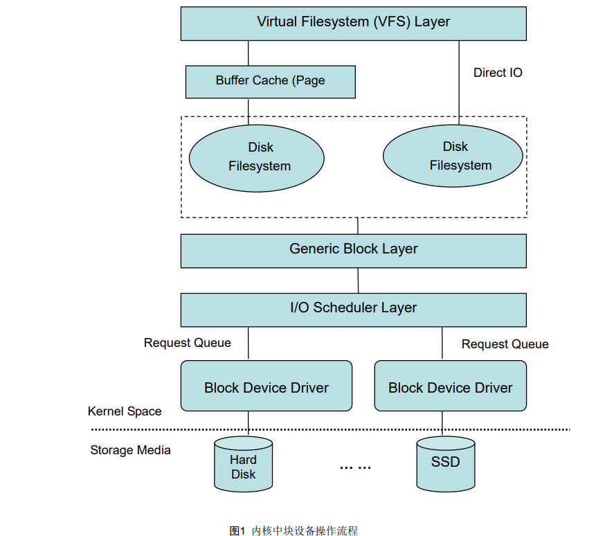

为什么这么设计（Why’s THE Design）是一系列关于计算机领域中程序设计决策的文章，

我们在这个系列的每一篇文章中都会提出一个具体的问题并从不同的角度讨论这种设计的优缺点

## 文件系统

**思考： 到底是如何抽象的**

- 磁盘和文件系统是怎么工作的呢？
- Linux 文件系统的工作原理？
- 磁盘I/O 的工作原理？

**采用什么方式解决上问题**

- Understanding the Linux Kernel, 3rd Edition.pdf 

   Chapter 14. Block Device Drivers

- Linux.Kernel.IO.Scheduler.

**主要观点：**

存储系统 I/O 的工作原理：文件系统层、通用块层和设备层构成的 Linux 存储系统 I/O 栈。

- 文件系统层，包括虚拟文件系统和其他各种文件系统的具体实现。它为上层的应用程序，提供标准的文件访问接口；对下会通过通用块层，来存储和管理磁盘数据。
- 通用块层，包括块设备 I/O 队列和 I/O 调度器。它会对文件系统的 I/O 请求进行排队，再通过重新排序和请求合并，然后才要发送给下一级的设备层。
- 设备层，包括存储设备和相应的驱动程序，负责最终物理设备的 I/O 操作

- 

> 通用块层是 Linux 磁盘 I/O 的核心。向上，它为文件系统和应用程序，提供访问了块设备的标准接口；
>
> 向下，把各种异构的磁盘设备，抽象为统一的块设备，并会对文件系统和应用程序发来的 I/O 请求，
>
> 进行重新排序、请求合并等，提高了磁盘访问的效率。

从进程角度查看io占用：
pidstat -d 10

从磁盘角度查看整体io：
iostat -d -x 10

字符设备和快设备的区别

在LINUX里面，设备类型分为：字符设备、块设备以及网络设备

-  是否支持随机访问

- 基本单位是字节还是512倍数

  .字符设备只能以字节为最小单位访问，而块设备以块为单位访问，例如512字节，1024字节等

#### bio

每个扇区是 512 个字节。

一块的大小是扇区大小的整数倍，默认是 4K。在格式化的时候，这个值是可以设定的。

inode 与块的存储

如果每次都读写 512 字节这么小的单位的话，效率很低。

所以，文件系统会把连续的扇区或页，组成逻辑块，然后以逻辑块作为最小单元来管理数据。

常见的逻辑块的大小是 4KB，也就是说，连续 8 个扇区，或者单独的一个页，都可以组成一个逻辑块。

### 作业

描述linux文件系统读写IO流程，从vfs到块设备层。

