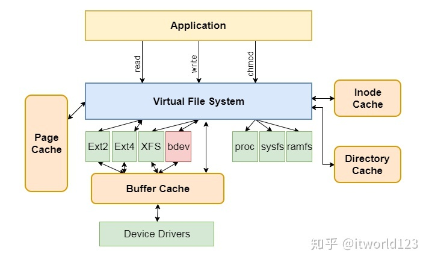

**lsblk命令** 用于列出所有可用块设备的信息，而且还能显示他们之间的依赖关系

- **mount 命令用来挂载设备里的文件**。使其**挂载后用户可以访问设备里的文件**，

- Loop设备是一种块设备，但是它并不指向硬盘或者光驱，而是指向一个文件块或者另一种块设备

- 回环设备（ 'loopback device'）允许用户以一个普通磁盘文件虚拟一个块设备

- **块设备也就是存储以“块”为单位数据的设备，比较典型的如磁盘设备、光盘或者优盘**

- ## Linux系统中磁盘的本质

- 在Linux操作系统磁盘设备是基于一个称为`bdev`的伪文件系统来管理的，bdev文件系统是一个在内存中的伪文件系统（在内存的文件系统，无持久化的数据），位置与Ext4等文件系统相同

- 

- NVMe还具有超宽的车道，意思是同一时间可以跑更多的数据在上面，不光跑得快，货还拉得多；
- 

### 带宽


查看网口带宽
ethtool ens17f3
可以看到是千兆带宽
Speed: 1000Mb/s

scp -l 716800 -v 文件  192.168.42.122:/root/
-l 716800 限速700M
-v 显示速度

[libpcap](https://so.csdn.net/so/search?q=libpcap&spm=1001.2101.3001.7020)是一个网络数据包捕获函数库，功能非常强大，Linux下著名的tcpdump就是以它为基础的


[yum](https://so.csdn.net/so/search?q=yum&spm=1001.2101.3001.7020) install flex byacc  libpcap ncurses ncurses-devel libpcap-devel

wget http://www.ex-parrot.com/pdw/iftop/download/iftop-1.0pre2.tar.gz


1. 安装perf

```
yum list perf
yum -y install perf.x86_64
```

1. 由于需要到github下载可视化分析工具FlameGraph，所以要先安装git

```
yum list git
yum -y install git.x86_64
git clone https://github.com/JaxYoun/FlameGraph.git
mv FlameGraph fg  //方便起见，重命名FlameGraph目录
```

1. 采集、转换、可视化【root权限】

```
perf record -F 99 -p 18733 -g -- sleep 30
perf script -i perf.data &> perf.unfold
fg/stackcollapse-perf.pl perf.unfold &> perf.folded
fg/flamegraph.pl perf.folded > perf.svg
```


### 